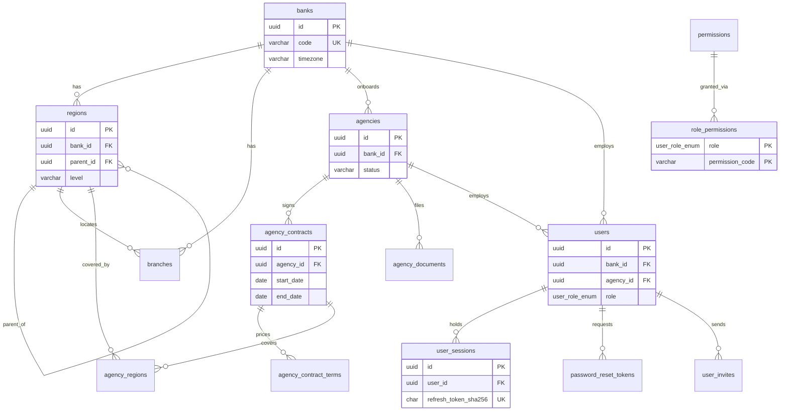
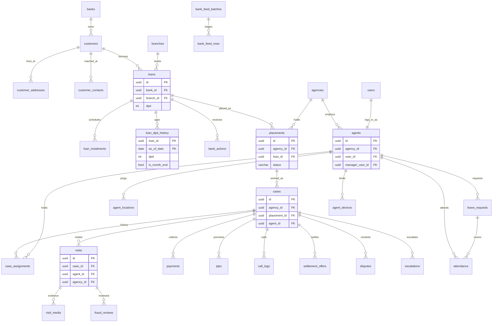
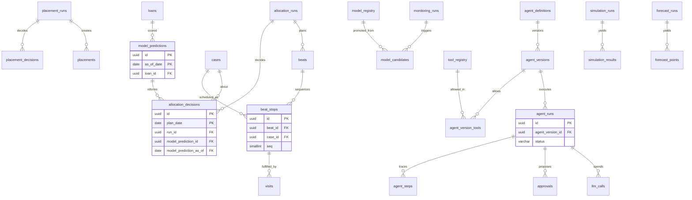

# TIQCollect Data Model v2 — schema design (task B01)

**Status:** agreed 2026-09-24, and the ORM half is BUILT on branch
`standalone-p1` (B02–B10). Where the build departs from this design, §0.1
lists it. No Alembic migration exists yet (B11): the models run on SQLite in
the test suite and nowhere else. This document implements
[STANDALONE-PRODUCT-PLAN.md](STANDALONE-PRODUCT-PLAN.md) §2 (roles, tenancy),
§3 (identity) and §4 (data platform).

*(This paragraph read "design for review … **No code, model or migration has
changed.** … No migration for B02–B21 is written until this document is
agreed." It was true when written and stopped being true the same day. It is
corrected rather than deleted, because a reader who trusts "no code changed"
will look for the old schema and not find it.)*

**How it was built.** Every statement about today's schema comes from one of these:
- the model files in `backend/app/models/`, cited as `file.py:line`;
- the 18 Alembic revisions in `backend/alembic/versions/`;
- the DDL inside the committed dump `backend/fixtures/fieldops-demo.dump`, which
  is the schema that actually runs (alembic `a1c3e5f7b9d2`);
- the fixture CSVs in `backend/fixtures/tables/`, profiled on 2026-09-24.
  *(That was the 09-24 profiling source. The CSVs were deleted in `6a91f2d`
  (B18, 2026-09-28: they carried the published passwords' hashes, and nothing
  read them); retrieve one with `git show d158d95:backend/fixtures/tables/<table>.csv`.)*

Where the dump and the models disagree, both are quoted (§1.3).

Notation used throughout:
- `TSTZ` is `TIMESTAMPTZ` and `DOUBLE` is `DOUBLE PRECISION`.
- `Money` is `NUMERIC(14,2)`.
- `★` marks a new table or column.
- "std" is the standard column set in §2.1.
- **v1** is today's schema. **v2** is this design.

---

## 0. Summary

| | v1 (measured) | v2 (this design) |
|---|---|---|
| Schemas | `public` only | 10 domain schemas + `public` (infrastructure and enum types) |
| Tables | 24 (22 mapped, plus `alembic_version` and `demo_baseline`) | **80** tables, 19 views and materialized views |
| Columns | 476 (dump DDL) | every one accounted for in §9.3 |
| Native enums | 28 | the same 28, all kept; `user_role_enum` and `audit_action_enum` gain values |
| PK type | `VARCHAR` holding a UUID string | native `UUID` |
| Money | `double precision` | `NUMERIC(14,2)` |
| String dates | 13 columns | `DATE` / `TIMESTAMPTZ` |
| JSON | `json` on 26 columns, `jsonb` on 3 | `jsonb` everywhere |
| FKs with no `ON DELETE` | 24 of 47 (dump DDL) | none: every FK states its policy (§2.8) |
| Partitioned tables | 0 | 5 (§7) |
| RLS | none | policy template for every tenant table (§8), enabled only after A12 |

Tables per schema:

| Schema | Existing | New ★ | Total |
|---|---|---|---|
| `tenancy` | 2 | 13 | **15** |
| `lending` | 2 | 10 | **12** |
| `collections` | 6 | 7 | **13** |
| `workforce` | 4 | 2 | **6** |
| `planning` | 4 | 6 | **10** |
| `ml` | 3 | 3 | **6** |
| `ai` | 0 | 8 | **8** |
| `strategy` | 0 | 6 | **6** |
| `audit` | 1 | 0 | **1** |
| `analytics` | 0 | 1 (plus 19 views) | **1** |
| `public` | 2 | 0 | **2** |
| **Total** | **24** | **56** | **80** |

**Where this document departs from the plan.** Each is argued where it
appears, and each is also an open question in §10.
- **Beat leave moves to attendance.** Leave days move from `beats` to
  `workforce.attendance`. The leave type reuses the existing native
  `leave_type_enum` instead of a new lookup table, so one vocabulary keeps one
  type (§4.4, Q5).
- **Four tables the plan did not list:**
  - `agency_contract_terms` — the commission slab and product/bucket
    authorisation, as rows so SQL can read them;
  - `agent_version_tools` — the tool allowlist, with FK integrity;
  - `analytics.mv_refresh_log` — data freshness;
  - `permissions` — the capability catalog the plan mentions but did not name.
- **Existing tables the plan's §4.1 map did not place:**
  - `fraud_reviews` → `collections`;
  - `used_quick_login_tokens` → `tenancy`;
  - `demo_baseline` and `alembic_version` stay in `public`.
- **`placement_decisions` is partition-ready but not partitioned.** It is
  designed with the partition key in its PK, but the plan's partition list does
  not include it (Q9).

### 0.1 Where the build departs from this design (B02–B10, 2026-09-24)

Each item is decided, built and tested on `standalone-p1`. Items marked
DEFERRED are not built and are tracked as tasks.

- **Branch FK is a natural key.** `lending.loans` keeps `branch_code` and
  carries a composite FK `(bank_id, branch_code) → tenancy.branches(bank_id,
  branch_code)`, instead of the surrogate `branch_id` + read-only
  `branch_code` property proposed in §4.2. Same integrity; every reader of
  `branch_code` (the ML adapter among them) is untouched. A feed row naming an
  unknown branch is QUARANTINED (`lending.bank_feed_rows`), never inserted.
- **`cases.placement_id` is nullable in P1.** A case must still have an
  agency (`agency_id NOT NULL`), and every new case is opened through
  `services/placement_service.py`, which opens one only on a placement made
  against a contract in force. The nullable column carries v1 cases through
  the transform; B15 decides whether it becomes NOT NULL.
- **The tenant listener refuses, it does not only fill.** §2.5 is implemented
  in `models/tenancy_listener.py`: it fills a child's tenant columns from the
  first declared parent and raises `TenantMismatchError` when ANY declared
  parent disagrees, on INSERT and on an UPDATE that changes a tenant column or
  a parent FK. One IN query per parent class per flush (5,000 visits: 0.87 s,
  against 0.76 s with the tenant given).
- **Relationships over composite FKs join on `id` only.** Inferred joins
  compared the tenant column too, which made `loan.customer` silently `None`
  on a mismatch. Pinned: `configure_mappers()` raises zero SAWarnings.
- **Two FK cycles use `use_alter`:** `cases.closed_by_bank_action_id` and
  `ml.model_predictions.case_id`.
- **SQLite enforces foreign keys in the suite** (`PRAGMA foreign_keys=ON` in
  `tests/_db.make_engine`); the test bank carries the branch codes fixtures use.
- **Ids from outside are validated in one place,** `app/core/ids.py`:
  `UUIDPath`/`UUIDQuery` answer a malformed path/query id with the same 404 a
  missing row gets; `UUIDStr` makes a malformed body id a 422. No malformed id
  reaches Postgres as a `DataError` 500.
- **Sessions:** `tenancy.user_sessions.revoked_reason` gains `DEVICE_RESET`
  (the manager's reset, audit gate 3). Refresh rotation is a compare-and-swap
  UPDATE.
- **`audit_action_enum` gains** `VOICE_CALL_PLACED`, `VOICE_CALL_REFUSED` and
  `DEVICE_RESET`, each with a write site.
- **Placement quarantine reasons** (`bank_feed_rows.dq_errors[].reason`):
  `NO_AGENCY`, `AGENCY_NOT_ACTIVE`, `NO_CONTRACT_IN_FORCE`, `NOT_AUTHORISED`,
  `CONTRACT_FULL`, `PLACED_ELSEWHERE`, `UNKNOWN_BRANCH`, `NOT_COVERED`.
  `NOT_COVERED` is the coverage gate (coordinator ruling Q1, 2026-09-29).
  - The loan's branch region `path` must match, by path SEGMENT, one of the `agency_regions` rows of the contract in force.
    A covered region covers itself and its subtree: `NORTH.HR` covers `NORTH.HR.GGN`, and never `NORTH.HRX`.
  - Paths are dot-joined in the data (`demo/world.py`); the `regions.path` model comment shows `/a/b/`. `path_covers` accepts both.
  - The gate applies to FEED, MANUAL and ENGINE placements alike.
  - It fails closed: a contract with no coverage rows covers nothing, and a loan whose branch has no region is never covered.
- **`strategy.simulation_runs` carries the engine's honesty fields** (E02,
  engine `mc-1.1.0`): `calibrated_by_backtest BOOLEAN`, `synthetic_inputs
  BOOLEAN`, `synthetic_warning TEXT NULL` (`SYNTHETIC: …` / `UNCALIBRATED: …`),
  `calibration JSONB NULL` (engine_version, origin, horizon_months, nominal,
  coverage, passes, synthetic), `assumptions JSONB` (list), `numpy_version`,
  `chunk_paths`. The warning clears only for a passing, non-synthetic
  backtest on the same engine version.
- **DEFERRED (B23):** `customer_addresses` / `customer_contacts`,
  `visit_media`, `beat_stops`, `attendance` (and the leave move),
  `escalations`, `case_assignments`, and `fcm_token` → `agent_devices`. The
  columns stay where v1 had them until their ~50 readers move, so there is
  never a second source of truth for one address.
- **Correction pending in §9.2/§9.3/Q1/Q4:** those sections still name the
  transform's output tenant "ABC Bank"/"ABC Collections". Appendix C is the
  decision (invented, realistic names; no placeholders); B15 follows
  Appendix C.

---

## 1. Where v1 stands (measured, 2026-09-24)

### 1.1 Facts that shape the design

- **24 tables and 476 columns in the dump**, which matches `fixtures/README.md`.
  The 22 mapped tables are imported in `models/__init__.py:1-21`.
  - `demo_baseline` is created at runtime by raw DDL (`services/demo_service.py:64-70`).
  - `alembic_version` is Alembic's own table.
- **The Alembic baseline is empty.** `d7a84c5a710f_baseline_schema.py:19-22` is
  `pass`. 17 revisions follow it and the head is `a1c3e5f7b9d2`. Every core
  table therefore exists only because `create_all` built it.
- **Primary keys come from one mixin:** `base.py:21-22`,
  `id: Mapped[str] = mapped_column(primary_key=True, default=lambda: str(uuid.uuid4()))`.
  - In the dump this is unbounded `character varying`, except `VARCHAR(36)` on
    `model_predictions`, `model_candidates` and `leave_requests`.
  - Every `id` and `*_id` value in the 17 fixture CSVs parses as a UUID:
    0 exceptions, measured.
  - Two columns hold something else and must stay text:
    - `audit_logs.entity_id` holds `'POST /api/v1/agent/checkin'` on 2 rows
      (entity_type `Route`);
    - `model_candidates.monitoring_run_id` is an event digest (`model_candidate.py:117`).
- **Money is `Float` (double precision) on 25 columns**, including
  `loan.py:85-90,109-110,114`, `case.py:97-99,117`, `payment.py:55`,
  `ptp.py:25,27`, `beat.py:30,37`, `agent.py:73,107`, `allocation_run.py:44`
  and `repayment_snapshot.py:153,207-209`.
- **13 date/time columns are strings.**
  - The plan said "14+". The count is 13 (corrected below, rather than quoting
    the plan's figure):
    - `users.date_of_birth`, `.last_login_at`, `.locked_until` (`user.py:19,30,32`);
    - `agents.last_location_update`, `.sos_triggered_at` (`agent.py:69,80`);
    - `agent_performance.month` (`agent.py:104`, `'YYYY-MM'`);
    - `customers.date_of_birth` (`customer.py:20`);
    - `loans.disbursement_date`, `.maturity_date`, `.last_payment_date`,
      `.next_due_date` (`loan.py:93-96`);
    - `cases.allocation_date`, `.bank_ptp_date` (`case.py:102,116`).
  - Formats were profiled on the fixture and are 100% regular:
    - the `DATE`-like columns are all `YYYY-MM-DD`;
    - the timestamps are all ISO-8601 with a `+00:00` offset
      (`last_login_at` 14/14 non-empty, `last_location_update` 18/18);
    - `month` is `YYYY-MM` on 108/108 rows.
- **`ALTER TYPE … ADD VALUE` has run in three migrations, adding five
  values.** The plan says "four times". The migrations are
  `d5a72c1e9b40:54`, `b6c14e83af27:118-120` (three values) and
  `a5f8c31d7e40:74`. The conclusion is the same: new extensible vocabularies
  do not become native enums.
- **Hard deletes the app performs today** (these drive the `ON DELETE`
  policy in §2.8):
  - `planner_service.py:617` and `:837` delete PLANNED beats on re-plan or
    rollback;
  - `leave_service.py:293` deletes leave beats;
  - `demo_service.py:174` deletes demo residue (payments, PTPs, call logs and
    visits of one case);
  - `repayment_service.py:1156` prunes unlabelled snapshots;
  - `location_retention.py:43` prunes non-SOS locations.
  - Nothing deletes a user, agency, customer, loan, case or payment in normal
    operation.
- **Demo book profile** (fixture CSVs):
  - 1,698 cases on 1,371 loans. Up to 6 cases per loan, and 92 loans carry
    more than one *open* case. 107 loans have no case.
  - 3,069 beats carrying 5,474 `ordered_case_ids` entries (max 24 per beat,
    0 dangling ids, 0 duplicates), of which 95 are leave beats.
  - 2,400 visits, and **none** references a photo, recording or signature key.
  - 21 users, of whom 8 carry a stored refresh-token hash.

### 1.2 Code paths the design must not break

These were read on 2026-09-24. §9.5 turns them into the ML risk list.

- **`ml_scoring_service.py` reads string dates through a coercer.**
  `_as_date` (`:180-210`) handles `disbursement_date`, `last_payment_date`,
  `date_of_birth` and `verbal_payment_date`, and it already accepts a `date`
  (`:205-206`). Every money read is wrapped in `float()` (`:249-260`, `:429-431`,
  `:467-511`, `:541`, `:748-749`).
- **`materialise.py` writes non-UUID string ids** into every table it loads:
  `"u-mgr"` (`:114`), ledger ids `L0000001` / `B0000001` (`simulator.py:430-431`),
  and `f"C-{loan_id}"` (`:187`). It also writes string dates (`:151-152`,
  `:175-179`, `:350-352`), `agency_id="AG"` (`:129`) and `bank_name="HDFC"` (`:167`).
- **`Beat.ordered_case_ids` has 58 references in 17 files.** Most are
  membership tests of the form `case_id in b.ordered_case_ids`
  (`agent.py:488`, `payment_service.py:82`, `visit_service.py:105`,
  `case_service.py:564`).
- **Several callers compare or assign string dates.** Examples:
  - `manager.py:1203-1205` compares against request strings, and `:1264`
    relies on lexicographic ordering;
  - `allocator.py:117` compares, and `:162` assigns;
  - `planner_service.py:758` compares, and `:770` assigns;
  - `performance_snapshot.py:40-41` compares.
- **The Pydantic schemas declare these fields `Optional[str]`**
  (`schemas/agent.py:366,368,416`). Pydantic 2.10 does not coerce a `date` to
  `str`, so they must become `date`.

### 1.3 Model/DB drift to reconcile (plan §4.2 "Model/DB drift")

| # | Drift | Evidence | v2 resolution |
|---|---|---|---|
| 1 | Partial index `ix_agents_gender` exists only in a migration | `c8e4a1b06f37:25-26`. Not in `agent.py`, and **not in the dump either** | declared in the model as `(agency_id, gender) WHERE gender IS NOT NULL` |
| 2 | Model indexes that were never created | `ix_payment_agent_date`, `ix_payment_agent_status` and `ix_payments_agent_id` (`payment.py:53,84-85`) and `ix_visit_check_in_time` (`visit.py:165`) are all absent from the dump | created in the baseline, rebuilt tenant-leading (§4.3) |
| 3 | Duplicate indexes on one column | `ix_audit_created_at` and `ix_audit_logs_created_at` both cover `audit_logs(created_at)` (`audit_log.py:45,70`) | one index |
| 4 | 19 single-column indexes that are left prefixes of a composite index | e.g. `ix_visits_agent_id` ⊂ `ix_visit_agent_date`, `ix_ptps_committed_date` ⊂ `ix_ptp_committed_date`, `ix_cases_agent_id` ⊂ `ix_case_agent_status` (full list in each table's "v1 → v2" line) | dropped |
| 5 | Id width differs by table | `VARCHAR` vs `VARCHAR(36)` vs `VARCHAR(40)` (`f7d3e91a45c2:45`) | all `UUID` |
| 6 | DDL outside Alembic | `scripts/migrate_allocation_schema.py:22-25` (raw `ALTER TABLE beats`); `demo_service.py:64-70` (runtime `CREATE TABLE`); `call_log.py:6-7` says a column was "applied by hand" | Alembic is the only schema authority. `demo_baseline` becomes a mapped model |
| 7 | Server default present in the DB only | `leave_requests.status` has `server_default 'REQUESTED'` (`a1c3e5f7b9d2:35`), but the model has a Python default only | declared in both |
| 8 | Feed width | `loan.py:135` says the bank feed "carries 45 columns". `scripts/sample_daily_feed.csv` has **46** | `bank_feed_rows.raw` stores whatever arrives. Noted here so the comment gets corrected when `loan.py` is next edited |

---

## 2. Principles

### 2.1 One database, ten domain schemas

- The ten schemas are `tenancy`, `lending`, `collections`, `workforce`,
  `planning`, `ml`, `ai`, `strategy`, `audit` and `analytics`.
- **`public` holds infrastructure only:** `alembic_version`, `demo_baseline`
  and the 28 existing native enum types.
  - The enums stay in `public` under their current names because several are
    shared across schemas: `loan_type_enum`, `dpd_bucket_enum`,
    `risk_category_enum`, `borrower_disposition_enum` and `agent_tier_enum`.
  - Putting a shared type in one domain schema would make the others depend
    on it.
- **Standard columns ("std")**, on every table unless its entry says otherwise:
  - `id UUID PK`, with server default `gen_random_uuid()` and Python default
    `uuid4()`;
  - `created_at TSTZ NOT NULL DEFAULT now()`;
  - `updated_at TSTZ NOT NULL DEFAULT now()`, set on update by the ORM.
- **Exceptions to "std":**
  - Append-only tables carry `created_at` only (e.g. `agent_steps`).
  - `audit_logs`, `agent_locations`, `model_predictions` and
    `repayment_score_snapshots` keep their v1 timestamp columns.

### 2.2 Identifiers

- **Native `UUID`.** The ORM type is `sqlalchemy.Uuid(as_uuid=False)`, so
  Python values stay `str`. This was chosen because:
  - every `Mapped[str]` id annotation, JSON payload, f-string and dict key
    keeps working;
  - so do the id membership tests on `ordered_case_ids` (§1.2);
  - `as_uuid=True` would make `str_id in {uuid_obj}` silently `False`.
- **Measured on SQLAlchemy 2.0.45** (the repo pins 2.0.36; re-check in B02):
  - SQLite stores `Uuid` as 32-character hex with no dashes and returns it
    dashed.
  - A non-UUID string such as `"u-mgr"` is **accepted on insert, stored
    mangled** (`umgr`), and **raises `ValueError: badly formed hexadecimal
    UUID string` on read**. Postgres rejects it at insert.
  - Consequence: fixtures that use literal ids fail under both engines, but
    differently. A pattern scan finds about 148 non-UUID literal ids across
    21 test files, plus `materialise.py`.
  - B02 must supply a `test_id("name")` helper (`uuid5` over a fixed
    namespace), so readable test ids stay deterministic.
- **Text keys that stay text:**
  - `used_quick_login_tokens.jti` (a JWT jti);
  - `model_candidates.monitoring_run_id` (an event digest);
  - `audit_logs.entity_id` (polymorphic);
  - lookup-table `code` columns;
  - `permissions.code`.

### 2.3 Types

| Kind | v2 type | ORM type | Why |
|---|---|---|---|
| Money | `NUMERIC(14,2)`; aggregates `NUMERIC(18,2)` | `Numeric(14,2, asdecimal=False)` | stored exactly, but Python keeps getting `float` in P1 (reason below) |
| Rates | `interest_rate NUMERIC(6,3)`, `commission_pct NUMERIC(5,2)` | as money | percentages |
| Scores, probabilities, coordinates, distances, ratios | `DOUBLE` | `Float` | not money |
| Dates | `DATE`; a month is `DATE` = first of the month | `Date` | |
| Instants | `TIMESTAMPTZ`; sessions run `SET timezone='UTC'` (`core/database.py:19-22`) | `DateTime(timezone=True)` | |
| JSON | `JSONB` | one shared `JsonDoc = JSON().with_variant(JSONB, "postgresql")` | the pattern `repayment_snapshot.py:81-86` already uses |
| Short state machines, code-owned | `VARCHAR(n)` + named `CHECK` | `String` | changed transactionally and works on SQLite |
| Extensible business vocabularies | FK to a lookup table with a natural `code VARCHAR PK` | `String` | Python keeps seeing the same strings, so no call site changes |
| Existing native enums | unchanged | `SAEnum(..., schema="public")` | plan §4.2: "existing enums stay" |

**Why money uses `asdecimal=False` in P1.**
- `Decimal + float` raises `TypeError`, and every existing money arithmetic
  site is float arithmetic.
  - For example, `outcomes.py:278` computes `0.8 * min(baseline[...])`, and
    `planner_service.py:692` rounds a float sum.
- Money aggregates built with SQL `SUM` stay exact inside Postgres.
- A later pass may switch module by module to `asdecimal=True`.
- **Measured on SQLite:** `NUMERIC(14,2)` is stored as `REAL`, and `1234.567`
  round-trips *unrounded*. Rounding to 2 dp is therefore provable only by the
  `tests/pg` suite (B19).

**Business day.**
- A "day" is the bank's calendar day in `banks.timezone`
  (default `Asia/Kolkata`), not a UTC date. This repeats the lesson of commit
  `4bff733` (the 00:10 IST task naming yesterday).
- One SQL function defines it, `analytics.business_date(ts, tz)`, and every
  `*_daily` view uses it.

### 2.4 Vocabularies: one type per vocabulary

- **The 28 native enums stay.** Two gain values:
  - `user_role_enum` gains 5: `PLATFORM_ADMIN`, `BANK_ADMIN`, `BANK_ANALYST`,
    `BANK_TECHOPS`, `SERVICE`;
  - `audit_action_enum` gains the §3.2 actions (§4.9).
- **Lookup tables** for the plan §4.2 domains, plus the bank's other
  extensible vocabularies:
  - `legal_statuses`, `settlement_statuses`, `bank_action_types`;
  - `collection_stages`;
  - `allocation_outcomes`, `allocation_objectives`, `placement_outcomes`.
- **Every lookup has the same shape:**
  - `code VARCHAR(40) PK`, `label VARCHAR(100) NOT NULL`, `description TEXT`;
  - `sort_order SMALLINT NOT NULL DEFAULT 0`;
  - `is_terminal BOOL NOT NULL DEFAULT false`;
  - `is_active BOOL NOT NULL DEFAULT true`.
  - They are global (not per bank) and seeded by migration.
- **Open code-owned vocabularies stay unconstrained `VARCHAR`,** exactly as
  today and for the reason already recorded at `repayment_snapshot.py:53-56`:
  - `fraud_reviews.finding_type`;
  - `repayment_score_snapshots.outcome`;
  - `model_predictions.outcome_status`.
- **Leave type is not a lookup.** Plan §4.2 lists `beats.leave_type` for one,
  but that vocabulary already has a native type: `leave_type_enum`
  (`leave_request.py:30-34`). The beat column is a string copy of it
  (`leave_request.py:16-19`). v2 uses the enum wherever a leave type is stored
  (§4.4).

### 2.5 Tenant columns, denormalised on purpose, and unable to drift

- **`bank_id UUID NOT NULL`** is on every tenant row. The exception is
  `users.bank_id`, which is NULL only for `PLATFORM_ADMIN`.
- **`agency_id UUID NOT NULL`** is on every agency-owned row:
  - placements, cases, case_assignments, visits, visit_media, payments, PTPs,
    call_logs;
  - fraud_reviews, settlement_offers, disputes, escalations;
  - agents, agent_performance, agent_locations, attendance, leave_requests,
    agent_devices;
  - allocation_runs, allocation_decisions, allocation_settings, beats,
    beat_stops.
- **Composite foreign keys enforce the denormalisation.** Each parent carries
  `UNIQUE (id, bank_id)` and/or `UNIQUE (id, agency_id)`, and each child
  references `(parent_id, agency_id)`. A child's `agency_id` therefore cannot
  differ from its parent's. The same device gives two structural guarantees
  for free:
  - `visits (agent_id, agency_id) → agents` and `visits (case_id, agency_id)
    → cases` make it **impossible to record a visit by one agency's agent on
    another agency's case**. That is leak 3 of plan §1, closed in the schema
    and not only in `scope.py`.
  - `cases (agent_id, agency_id) → agents` makes it impossible to assign a
    case across agencies.
- **Invariants this requires. They are written down because the FKs depend on
  them:**
  - `cases.agency_id` and `agents.agency_id` never change.
  - Re-placing a loan with another agency ends the old placement and case and
    creates a **new** placement and case.
  - Moving an agent to another agency means a new agent row. Transfer between
    managers *within* an agency (plan §10) is an ordinary update.
- **How the ORM fills tenant columns.** A single `before_flush` listener in
  `app/models/tenancy.py` fills `bank_id`/`agency_id` from the declared parent
  when they are not given explicitly. It raises if an explicit value disagrees
  with the parent, which the composite FK would reject anyway.
  - This is the one place the denormalisation rule lives.
  - It is also what keeps roughly 250 constructor sites working (tests: 31
    `Case(`, 36 `User(`, 22 `Customer(`, 22 `Loan(`, 24 `PTP(`, 18 `Payment(`).
  - `Customer`, `Loan`, `Agent` and `User` must still be given their tenant
    explicitly. They are roots.

### 2.6 Indexes lead with the tenant

- Hot indexes lead with the tenant: `(agency_id, status, …)`,
  `(bank_id, as_of_date, …)`. These are the queries `scope.py` generates.
- Left-prefix duplicates are dropped.
- Every FK column has an index, either its own or as the leading column of a
  composite.
- **Partial indexes are declared for both dialects** (`postgresql_where` and
  `sqlite_where`). A partial *unique* index declared for Postgres only becomes
  a **full** unique index on SQLite, and would break any test that creates a
  second, closed row (e.g. `case_assignments`).

### 2.7 Naming convention

```python
NAMING_CONVENTION = {
    "pk": "pk_%(table_name)s",
    "fk": "fk_%(table_name)s_%(column_0_N_name)s_%(referred_table_name)s",
    "uq": "uq_%(table_name)s_%(column_0_N_name)s",
    "ix": "ix_%(table_name)s_%(column_0_N_name)s",
    "ck": "ck_%(table_name)s_%(constraint_name)s",
}
```

- **Names already referenced by code or tests keep their explicit names:**
  - `uq_repayment_snapshot_grain` (tested by name at `tests/test_repayment_task.py:125`);
  - `ix_beat_agent_date` (quoted in `planner_service.py:952`, and the 409
    behaviour CLAUDE.md documents);
  - `uq_candidate_monitoring_event` (`lifecycle.py:98`);
  - `uq_fraud_review_visit_type`;
  - `ix_perf_agent_month`.
- **Long names are handled deterministically.** SQLAlchemy truncates
  convention names over 63 bytes with a stable hash suffix.
- **Index names must be unique across the whole database,** not per schema.
  SQLite, which has no schemas under the translate map, needs this. Table
  names are unique (Appendix A) and every convention name embeds the table
  name, which satisfies it.

### 2.8 Foreign keys: `ON DELETE` policy

**Business rows are never hard-deleted.** Users, banks, agencies, customers,
loans, cases, visits, payments and PTPs are deactivated or archived through
status columns. The policy, in order:

1. **`RESTRICT` (declared as `NO ACTION`) is the default.** A cascade that
   silently removes money, evidence or who-approved-what is the failure this
   rule prevents.
2. **`CASCADE` only for pure components**, meaning children with no meaning
   apart from their parent. These are:
   - `beat_stops → beats` (PLANNED beats *are* deleted on re-plan:
     `planner_service.py:617`, `:837`, `leave_service.py:293`);
   - `visit_media → visits` and `fraud_reviews → visits` (visits are deleted
     only by the demo reset, `demo_service.py:174`);
   - `agency_contract_terms` and `agency_regions → agency_contracts`;
   - `user_sessions` and `password_reset_tokens → users`;
   - `bank_feed_rows → bank_feed_batches`;
   - `loan_instalments → loans`;
   - `role_permissions → permissions`;
   - `agent_version_tools → agent_versions`, `agent_steps → agent_runs`;
   - `simulation_results → simulation_runs`, `forecast_points → forecast_runs`.
3. **`SET NULL` only where the parent is legitimately deleted:**
   - `visits.beat_stop_id` (a planned stop can vanish on re-plan);
   - `bank_actions.feed_row_id` (staging rows are pruned);
   - `(model_prediction_id, model_prediction_as_of)` pairs, when a prediction
     partition is dropped under retention (§7).
4. **Actor references become `RESTRICT`, not `SET NULL`.** This covers
   `decided_by`, `verified_by`, `reviewed_by`, `requested_by` and similar.
   - v1 uses `SET NULL` on six of them: `fraud_review.py:51-52`,
     `leave_request.py:73-74`, `model_candidate.py:150` and `audit_log.py:47`.
   - Since users are never deleted, `SET NULL` could only ever erase the
     record of who approved a payment or promoted a model.
   - `audit_logs.user_id` especially: its immutability trigger (§7.4) would
     block a `SET NULL` cascade in any case.

**v1 FKs that change** (24 of 47 have no `ON DELETE` today, from the dump):

| v1 behaviour | Where | v2 |
|---|---|---|
| `CASCADE` from `customers` to `loans` | `loan.py:78` | `RESTRICT` |
| `CASCADE` from cases, agents and customers to `call_logs` | `call_log.py:75-77` | `RESTRICT` |
| `CASCADE` from `users` to `agents` | `agent.py:29` | `RESTRICT` |
| `CASCADE` from agents to `agent_performance`, `agent_locations` and `fraud_reviews.agent_id` | `agent.py:103`, `agent_location.py:45`, `fraud_review.py:43` | `RESTRICT`. A cascade into a 30M-row partitioned table is a trap |
| `CASCADE` from loans and customers to `repayment_score_snapshots` | `repayment_snapshot.py:104,109` | `RESTRICT` |
| `SET NULL` on actors | as listed in rule 4 | `RESTRICT` |
| No action | cases, visits, payments, PTPs, beats, allocation_* | explicit `RESTRICT` |

### 2.9 Partitioning policy (detail in §7)

- **Declarative monthly `RANGE` partitions.** The plan names five tables and
  §7 covers each:
  - `agent_locations` (by `recorded_at`, under a `LIST (is_sos)` split);
  - `allocation_decisions` (by `plan_date`);
  - `model_predictions` (by `as_of_date`);
  - `audit_logs` (by `created_at`);
  - `loan_dpd_history` (by `as_of_date`).
- **The partition key is in every PK and unique constraint.**
- **Surrogate-id tables use composite PKs `(id, partition_key)`.** The ORM
  mapper declares `primary_key=[id]`, so identity-map lookups and
  `db.get(Model, id)` keep working (§7.2).
- **Partitions, RLS, triggers, `EXCLUDE` constraints and views are
  migration-only DDL.** They never appear in model metadata, so SQLite
  `create_all` never sees them.

### 2.10 SQLite test compatibility

- The shared test engine (B02) uses
  `execution_options(schema_translate_map={"tenancy": None, "lending": None, …, "public": None})`.
  This replaces the 34 test files that build their own SQLite engine (35 call
  `create_all`).
- **It works only because table names are globally unique across schemas.**
  Appendix A verifies all 80 tables and 19 views: no duplicates.
- **SQLite limits the design respects:**
  - no `DEFERRABLE` unique constraints, so `beat_stops` reordering is a
    two-phase renumber;
  - no `EXCLUDE`, so it is a PG-only migration constraint;
  - partial indexes need `sqlite_where`;
  - dialect-specific `CHECK` expressions (e.g. `extract(day from month) = 1`)
    go in migrations, never in models.
  - `NUMERIC` is `REAL` on SQLite and does not round (§2.3).

### 2.11 Point-in-time rules carried over (CLAUDE.md, "The scoring layers")

- **Historical timestamps are copied verbatim.** The v1→v2 transform copies
  every `created_at`, `updated_at`, `check_in_time`, `called_at`,
  `payment_date` and `scored_at`. A server default must never overwrite them.
  - `ptps.created_at` is the adapter's PIT window key
    (`ml_scoring_service.py:418,420`).
  - `materialise.py:274-279` forces it for exactly this reason.
- **`loan_dpd_history` is history, and history is append-only.** Current-state
  columns (`loans.dpd`, `.overdue_amount`, `ptps.status`) stay where the
  adapter reads them in P1.
  - Switching the adapter to read history is a *separate*, later change, with
    its own equality run (Q14).
- **No output of this system becomes an input.** New score-bearing columns
  (`placements.expected_recovery_prob`, `settlement_offers.acceptance_probability`)
  are outputs.
  - `_FORBIDDEN_FEATURE_KEYS` (`repayment_service.py`) must list them before
    anything could feed them back.

### 2.12 One schema authority

- Alembic is the only path.
  - `seed_data.py` stops calling `create_all` (closes known issue 5).
  - `demo_service._ensure_table` and `scripts/migrate_allocation_schema.py`
    are retired.
- `alembic_version` lives in `public` (`version_table_schema="public"`,
  `include_schemas=True`).
- `docker-entrypoint.sh:69` changes its emptiness probe from `public.agents`
  to `workforce.agents`.

---

## 3. Entity-relationship diagrams

Three diagrams, by domain. Key columns only; the catalogue (§4) has everything.

### 3.1 Tenancy and identity



### 3.2 Book, work and workforce



### 3.3 Planning, ML, AI, strategy



---

## 4. Table catalogue

Column-table conventions:
- **Null** is `N` (nullable) or `—` (NOT NULL).
- **FK** gives the target and its `ON DELETE` policy. `(x, agency_id)→t` is a
  composite FK (§2.5).
- **Idx** lists indexes in addition to the PK. Every index is tenant-leading
  unless it is a per-entity lookup.

### 4.1 `tenancy`

#### `tenancy.banks` ★
The tenant root. "ABC Bank" becomes data here (plan §10, A14).

| Column | Type | Null | Default | FK | Notes |
|---|---|---|---|---|---|
| std | | | | | |
| code | VARCHAR(20) | — | | | e.g. `ABC` |
| legal_name | VARCHAR(200) | — | | | |
| display_name | VARCHAR(100) | — | | | used in SMS, receipts and the UPI QR (currently hardcoded in 7 files, plan §10) |
| rbi_entity_code | VARCHAR(40) | N | | | |
| timezone | VARCHAR(40) | — | `'Asia/Kolkata'` | | the business-day definition (§2.3) |
| brand | JSONB | — | `'{}'` | | `logo_key`, `sms_sender_id`, `upi_vpa`, `upi_payee_name`, `support_phone`, `receipt_footer` |
| status | VARCHAR(12) | — | `'ACTIVE'` | | CHECK `ACTIVE`/`SUSPENDED`/`ARCHIVED` |

- **Keys:** `uq(code)`.
- **v1 → v2:** new. The transform creates bank #1 from `loans.bank_name`,
  which reads "ABC Bank" on 1,478 of 1,478 loans.

#### `tenancy.regions` ★
The self-referencing hierarchy zone → region → state → city (plan §2.2).

| Column | Type | Null | Default | FK | Notes |
|---|---|---|---|---|---|
| std | | | | | |
| bank_id | UUID | — | | banks RESTRICT | |
| parent_id | UUID | N | | `(parent_id, bank_id)→regions(id, bank_id)` RESTRICT | NULL only for ZONE |
| level | VARCHAR(8) | — | | | CHECK `ZONE`/`REGION`/`STATE`/`CITY` |
| code | VARCHAR(40) | — | | | |
| name | VARCHAR(100) | — | | | |
| path | TEXT | — | | | materialised `/zone/region/state/city/` of codes, written by the region service; used for subtree filters |
| latitude, longitude | DOUBLE | N | | | centroid |
| coverage_geojson | JSONB | N | | | polygon for the directory map (plan §6.2) |
| is_active | BOOL | — | `true` | | |

- **Keys:** `uq(bank_id, level, code)`, `uq(id, bank_id)`; CHECK
  `(level = 'ZONE') = (parent_id IS NULL)`.
- **Idx:** `(bank_id, level)`, `(parent_id)`, `(bank_id, path text_pattern_ops)` (PG only).
- **v1 → v2:** new. The transform creates NCR: zone North → region NCR →
  states Haryana / Delhi / Uttar Pradesh → cities Gurugram / Delhi / Noida.
  Those are the 3 cities in `customers.city` (727 / 342 / 309 rows).

#### `tenancy.branches` ★
| Column | Type | Null | Default | FK | Notes |
|---|---|---|---|---|---|
| std | | | | | |
| bank_id | UUID | — | | banks RESTRICT | |
| region_id | UUID | N | | `(region_id, bank_id)→regions` RESTRICT | CITY level; NULL when unknown |
| branch_code | VARCHAR(20) | — | | | |
| name | VARCHAR(100) | N | | | |
| address | TEXT | N | | | |
| latitude, longitude | DOUBLE | N | | | |
| is_active | BOOL | — | `true` | | |

- **Keys:** `uq(bank_id, branch_code)`, `uq(id, bank_id)`. **Idx:** `(region_id)`.
- **v1 → v2:** new. One row per distinct `loans.branch_code`: `GGN044` holds
  970 loans, `GGN056` 8, plus the `BR####` tail. `region_id` is set only
  where the code implies a city (`GGN*` → Gurugram); the rest stay NULL.

#### `tenancy.agencies` ★
| Column | Type | Null | Default | FK | Notes |
|---|---|---|---|---|---|
| std | | | | | |
| bank_id | UUID | — | | banks RESTRICT | one row per (bank, agency); Q3 |
| code | VARCHAR(20) | — | | | v1 `AGENCY-TIQ-001` is preserved as the code |
| legal_name / trade_name | VARCHAR(200) | — / N | | | |
| rbi_registration_no | VARCHAR(50) | N | | | shown on the ID card (A14) |
| pan / gstin | VARCHAR(10) / VARCHAR(15) | N | | | |
| registered_address | JSONB | N | | | |
| contact_name / contact_email / contact_phone | VARCHAR(200/255/15) | N | | | |
| status | VARCHAR(12) | — | `'PENDING'` | | CHECK `PENDING`/`ACTIVE`/`SUSPENDED`/`OFFBOARDED` (plan §6.1) |
| activated_at, suspended_at, offboarded_at | TSTZ | N | | | |
| suspended_reason | TEXT | N | | | |
| offboard_requested_by, offboard_approved_by | UUID | N | | users RESTRICT | four-eyes: CHECK the two differ |
| created_by | UUID | N | | users RESTRICT | |

- **Keys:** `uq(bank_id, code)`, `uq(id, bank_id)`. **Idx:** `(bank_id, status)`.
- **Circular FK.** `users.agency_id → agencies` and `agencies.created_by → users`
  point at each other. The baseline creates the second with `use_alter=True`.
- **v1 → v2:** new. v1 has only a free string, `agents.agency_id`
  (`agent.py:32`), read solely by `/verify-agent` (`endpoints/verify.py`).

#### `tenancy.agency_contracts` ★
| Column | Type | Null | Default | FK | Notes |
|---|---|---|---|---|---|
| std | | | | | |
| bank_id | UUID | — | | banks RESTRICT | |
| agency_id | UUID | — | | `(agency_id, bank_id)→agencies` RESTRICT | |
| contract_no | VARCHAR(40) | — | | | |
| start_date, end_date | DATE | — | | | CHECK `end_date >= start_date` |
| status | VARCHAR(12) | — | `'DRAFT'` | | CHECK `DRAFT`/`ACTIVE`/`EXPIRED`/`TERMINATED` |
| max_placed_cases | INT | N | | | capacity gate for placement |
| max_agents | INT | N | | | the seat limit (plan §10) |
| max_visits_per_month | INT | N | | | Monte Carlo capacity lever |
| sla_first_visit_days | SMALLINT | — | `7` | | |
| recall_no_activity_days | SMALLINT | N | | | recall rules (plan §6.3) |
| recall_on_sla_breach | BOOL | — | `false` | | |
| recall_at_contract_end | BOOL | — | `true` | | |
| renewal_of_id | UUID | N | | agency_contracts RESTRICT | |
| agreement_document_id | UUID | N | | agency_documents RESTRICT | |
| created_by, approved_by | UUID | N | | users RESTRICT | |
| approved_at | TSTZ | N | | | |

- **Keys:** `uq(bank_id, contract_no)`, `uq(id, agency_id)`.
- **PG only:** `EXCLUDE USING gist (agency_id WITH =, daterange(start_date, end_date, '[]') WITH &&) WHERE (status = 'ACTIVE')`.
  This needs the `btree_gist` extension, and means no overlapping active
  contracts.
- **Idx:** `(agency_id, status, end_date)` for the contract-expiry directory
  filter.
- **v1 → v2:** new. The transform creates one ACTIVE contract for
  ABC Collections, from 2026-01-01 to 2026-12-31. Terms are listed in Q4.

#### `tenancy.agency_contract_terms` ★ (added, see §0)
The commission slab and the product/bucket authorisation. It is a table
because the "Cost to Collect" KPI (plan §5.3) and the placement hard gate
(plan §6.3) both have to read it in SQL.

| Column | Type | Null | Default | FK | Notes |
|---|---|---|---|---|---|
| std | | | | | |
| bank_id, agency_id | UUID | — | | | |
| contract_id | UUID | — | | `(contract_id, agency_id)→agency_contracts` CASCADE | |
| loan_type | `loan_type_enum` | — | | | |
| dpd_bucket | `dpd_bucket_enum` | — | | | |
| commission_pct | NUMERIC(5,2) | — | | | CHECK 0–100; % of verified collection |
| fixed_fee_per_resolution | Money | N | | | |
| is_authorised | BOOL | — | `true` | | a (product, bucket) pair is placeable only when a row says true |

- **Keys:** `uq(contract_id, loan_type, dpd_bucket)`.
- **v1 → v2:** new.

#### `tenancy.agency_regions` ★
| Column | Type | Null | Default | FK | Notes |
|---|---|---|---|---|---|
| std | | | | | |
| bank_id, agency_id | UUID | — | | | |
| contract_id | UUID | — | | `(contract_id, agency_id)→agency_contracts` CASCADE | coverage is contractual |
| region_id | UUID | — | | `(region_id, bank_id)→regions` RESTRICT | covering a node covers its subtree, resolved through `path` |

- **Keys:** `uq(contract_id, region_id)`. **Idx:** `(region_id)`.
- **v1 → v2:** new.

#### `tenancy.agency_documents` ★
| Column | Type | Null | Default | FK | Notes |
|---|---|---|---|---|---|
| std | | | | | |
| bank_id, agency_id | UUID | — | | `(agency_id, bank_id)→agencies` RESTRICT | |
| doc_type | VARCHAR(30) | — | | | CHECK `REGISTRATION_CERT`/`AGREEMENT`/`INSURANCE`/`POLICE_VERIFICATION_POLICY`/`PAN`/`GST`/`OTHER` |
| storage_key | VARCHAR(500) | — | | | MinIO |
| file_name / content_type | VARCHAR(255/100) | N | | | |
| size_bytes | BIGINT | N | | | |
| sha256 | CHAR(64) | — | | | |
| scan_status | VARCHAR(10) | — | `'PENDING'` | | CHECK `PENDING`/`CLEAN`/`INFECTED`/`ERROR` (virus-scan hook) |
| status | VARCHAR(12) | — | `'UPLOADED'` | | CHECK `UPLOADED`/`VERIFIED`/`REJECTED`/`EXPIRED`/`SUPERSEDED` |
| issued_on, expires_on | DATE | N | | | expiry tracked (plan §6.1) |
| uploaded_by, verified_by | UUID | — / N | | users RESTRICT | |
| verified_at | TSTZ | N | | | |
| rejection_reason | TEXT | N | | | |

- **Idx:** `(agency_id, doc_type, status)`, `(bank_id, expires_on) WHERE status = 'VERIFIED'`.
- **v1 → v2:** new.

#### `tenancy.users` (existing, `user.py:13-39`)
| Column | Type | Null | Default | FK | Notes |
|---|---|---|---|---|---|
| std | | | | | `id` was VARCHAR |
| bank_id ★ | UUID | N | | banks RESTRICT | NULL only for `PLATFORM_ADMIN` |
| agency_id ★ | UUID | N | | `(agency_id, bank_id)→agencies` RESTRICT | |
| scope_region_id ★ | UUID | N | | `(scope_region_id, bank_id)→regions` RESTRICT | region limit for BANK_ANALYST (plan §2.1) |
| email | VARCHAR(255) | — | | | unique on `lower(email)` (PG functional; plain unique on SQLite) |
| phone | VARCHAR(15) | — | | | unique |
| full_name | VARCHAR(200) | — | | | |
| date_of_birth | **DATE** | N | | | was String(10) |
| hashed_password | VARCHAR(255) | — | | | bcrypt |
| role | `user_role_enum` (+5 values) | — | | | |
| is_active, is_verified | BOOL | — | `true` / `false` | | |
| must_change_password ★ | BOOL | — | `false` | | forced change on first login (plan §3.2) |
| password_changed_at ★ | TSTZ | N | | | |
| totp_secret | VARCHAR(64) | N | | | encryption at rest: Q16 |
| totp_enabled | BOOL | — | `false` | | |
| last_login_at | **TSTZ** | N | | | was String(50) |
| failed_login_attempts | SMALLINT | — | `0` | | |
| locked_until | **TSTZ** | N | | | was String(50); parsed by `fromisoformat` at `auth_service.py:51` |
| deactivated_at ★ | TSTZ | N | | | |
| deactivated_by ★ | UUID | N | | users RESTRICT | |

- **Keys:** `uq(lower(email))`, `uq(phone)`, `uq(id, bank_id)`, `uq(id, agency_id)`.
- **`ck_users_role_scope`** enforces which tenant ids each role may carry:
  - `PLATFORM_ADMIN`: both NULL;
  - `BANK_*`: bank set, agency NULL;
  - `AGENCY_*` and `FIELD_AGENT`: both set;
  - `SERVICE`: bank set, agency optional.
- **Idx:** `(bank_id, role, is_active)` and `(agency_id, role, is_active)`,
  which replace `ix_users_role_active`.
- **v1 → v2:**
  - `id` and the three date/time columns change type;
  - `bank_id`, `agency_id`, `scope_region_id`, `must_change_password`,
    `password_changed_at`, `deactivated_at` and `deactivated_by` are added;
  - `registered_device_fingerprint` moves to `workforce.agent_devices`
    (it is read only for FIELD_AGENT at `auth_service.py:68-70`);
  - `hashed_refresh_token` is **dropped, not migrated**. It moves to
    `user_sessions`, and the 8 stored hashes are scrubbed (plan §3.1).
  - Roles are remapped: `manager1` → AGENCY_ADMIN, `manager2` →
    AGENCY_MANAGER, and the v1 AGENCY_ADMIN row stays as is (Q1).

#### `tenancy.user_sessions` ★
One refresh token per device, replacing the single slot `users.hashed_refresh_token`
(`auth_service.py:83,128,171`).

| Column | Type | Null | Default | FK | Notes |
|---|---|---|---|---|---|
| id | UUID | — | | | goes into the JWT as `sid` |
| user_id | UUID | — | | users CASCADE | |
| bank_id, agency_id | UUID | N | | | denormalised for admin listing and RLS |
| device_id | VARCHAR(200) | — | | | the JWT `device_id` claim |
| device_label | VARCHAR(100) | N | | | |
| user_agent | VARCHAR(500) | N | | | |
| ip_created, ip_last | VARCHAR(45) | N | | | |
| refresh_token_sha256 | CHAR(64) | — | | | sha256, not bcrypt (reason below) |
| refresh_jti | VARCHAR(64) | — | | | |
| created_at, last_used_at | TSTZ | — / N | | | |
| expires_at | TSTZ | — | | | |
| revoked_at | TSTZ | N | | | |
| revoked_reason | VARCHAR(20) | N | | | CHECK `LOGOUT`/`ADMIN_REVOKED`/`REUSE_DETECTED`/`PASSWORD_CHANGED`/`USER_DEACTIVATED`/`EXPIRED` |
| revoked_by | UUID | N | | users RESTRICT | |

- **Why sha256 instead of bcrypt.** The token is a high-entropy signed JWT,
  and the lookup must be indexable. bcrypt's per-hash salt makes an index
  useless.
- **Keys:** `uq(refresh_token_sha256)`.
- **Idx:** `(user_id) WHERE revoked_at IS NULL` (both dialects),
  `(bank_id, last_used_at)`.
- **Reuse detection becomes per session.** Today a mismatch nulls the only
  slot, which logs out every device (`auth_service.py:163-167`). In v2 it
  revokes that `sid` with `REUSE_DETECTED`.
- **v1 → v2:** new, and it starts empty. Everyone signs in again after the
  transform.

#### `tenancy.user_invites` ★
Single-use and hashed at rest, on the `used_quick_login_tokens` pattern
(plan §3.2).

| Column | Type | Null | Default | FK | Notes |
|---|---|---|---|---|---|
| std (created_at only) | | | | | |
| bank_id, agency_id | UUID | N | | | the tenant the account will belong to |
| purpose | VARCHAR(20) | — | | | CHECK `USER_ONBOARD`/`AGENCY_MASTER_LOGIN` |
| email | VARCHAR(255) | — | | | |
| phone | VARCHAR(15) | N | | | |
| full_name | VARCHAR(200) | N | | | |
| role | `user_role_enum` | — | | | same scope CHECK as `users` |
| token_sha256 | CHAR(64) | — | | | |
| delivery_channel | VARCHAR(8) | — | | | CHECK `EMAIL`/`SMS`/`LINK` |
| invited_by | UUID | — | | users RESTRICT | |
| expires_at | TSTZ | — | | | created + 72 h |
| accepted_at | TSTZ | N | | | |
| accepted_user_id | UUID | N | | users RESTRICT | unique |
| revoked_at | TSTZ | N | | | |
| revoked_by | UUID | N | | users RESTRICT | |

- **Keys:** `uq(token_sha256)`, `uq(accepted_user_id)`, and one open invite
  per address: `uq(lower(email)) WHERE accepted_at IS NULL AND revoked_at IS NULL`.
- **Idx:** `(agency_id, created_at)`, `(bank_id, created_at)`.
- **v1 → v2:** new.

#### `tenancy.password_reset_tokens` ★
| Column | Type | Null | Default | FK | Notes |
|---|---|---|---|---|---|
| id, created_at | | | | | |
| user_id | UUID | — | | users CASCADE | |
| kind | VARCHAR(12) | — | | | CHECK `ADMIN_RESET`/`SELF_SERVICE`/`FIRST_LOGIN` |
| token_sha256 | CHAR(64) | — | | | |
| issued_by | UUID | N | | users RESTRICT | set for an admin reset |
| otp_verified_at | TSTZ | N | | | self-service path; the OTP itself stays in Redis (`OtpService`, `otp_service.py:147-160`) |
| expires_at | TSTZ | — | | | |
| used_at | TSTZ | N | | | |
| requested_ip | VARCHAR(45) | N | | | |

- **Keys:** `uq(token_sha256)`. **Idx:** `(user_id) WHERE used_at IS NULL`.
- **v1 → v2:** new.

#### `tenancy.permissions` ★ (the capability catalog)
| Column | Type | Null | Default | Notes |
|---|---|---|---|---|
| code | VARCHAR(64) | — | | **PK**, e.g. `agency.onboard` |
| category | VARCHAR(30) | — | | |
| description | TEXT | — | | |
| requires_second_person | BOOL | — | `false` | four-eyes (`ml.promote`, `agency.offboard`) |
| is_sensitive | BOOL | — | `false` | every use is audited |
| created_at | TSTZ | — | `now()` | |

- **Authority.** The capability registry in code (A01) is the one
  definition. This table is seeded by migration, and a tripwire test asserts
  the two are equal.
- **v1 → v2:** new. The seed is in §5.

#### `tenancy.role_permissions` ★
| Column | Type | Null | Notes |
|---|---|---|---|
| role | `user_role_enum` | — | **PK** part 1 |
| permission_code | VARCHAR(64) | — | **PK** part 2; FK permissions CASCADE |
| granted_at | TSTZ | — | default `now()` |

- **Global, not per bank:** plan §2.1 says capabilities are "granted to a role
  in one table". **v1 → v2:** new.

#### `tenancy.used_quick_login_tokens` (existing, `quick_login_token.py:15-24`)
| Column | Type | Null | Default | FK | Notes |
|---|---|---|---|---|---|
| jti | VARCHAR(64) | — | | | **PK** |
| used_at | TSTZ | — | | | |
| user_id ★ | UUID | N | | users RESTRICT | who redeemed it |
| expires_at ★ | TSTZ | N | | | lets a sweep prune rows whose token has expired anyway |

- **v1 → v2:** schema move only; 2 nullable columns added.

### 4.2 `lending`

#### Lookups: `lending.legal_statuses`, `lending.settlement_statuses`, `lending.bank_action_types` ★
These use the lookup shape from §2.4. The seeds are the v1 comment-declared
vocabularies:

| Lookup | Values | Source |
|---|---|---|
| `legal_statuses` | `NONE`, `NOTICE_SENT`, `SARFAESI`, `SUIT_FILED`, `DRT`, `ARBITRATION` | `loan.py:118-120`. The fixture has NONE 1,415, NOTICE_SENT 42, SARFAESI 13, SUIT_FILED 8 |
| `settlement_statuses` | `NONE`, `OFFERED`, `NEGOTIATING`, `ACCEPTED`, `REJECTED` | `loan.py:121-123` |
| `bank_action_types` | `PAID_DIRECT`, `RECALL`, `SETTLED`, `WRITTEN_OFF`, `DECEASED` | `scripts/ingest_daily.py:8-12,71`. "ACTIVE" in that set means "no action" and is not a row |

#### `lending.customers` (existing, `customer.py:14-73`)
| Column | Type | Null | Default | FK | Notes |
|---|---|---|---|---|---|
| std | | | | | |
| bank_id ★ | UUID | — | | banks RESTRICT | |
| customer_ref | VARCHAR(30) | — | | | unique **per bank** (was global) |
| full_name | VARCHAR(200) | — | | | |
| date_of_birth | **DATE** | — | | | was String(10); 1,378/1,378 ISO |
| gender | VARCHAR(10) | — | | | CHECK `MALE`/`FEMALE`/`OTHER` (fixture: 745 / 633 / 0) |
| pan_masked, aadhaar_masked | VARCHAR(10/12) | — | | | |
| risk_category | `risk_category_enum` | — | `MEDIUM` | | |
| risk_score | DOUBLE | — | `50` | | a score, not money |
| cibil_score | INT | N | | | |
| preferred_contact_start, preferred_contact_end | SMALLINT | — | `9` / `18` | | CHECK 0–24, start < end |
| language_preference | VARCHAR(20) | — | `'HINDI'` | | |
| customer_segment | VARCHAR(30) | — | `'SALARIED'` | | the adapter's `employment_type` (`ml_scoring_service.py:285`) |
| is_hostile, requires_female_agent, do_not_contact, fraud_flag | BOOL | — | `false` | | |
| complaints_raised | INT | — | `0` | | bank-reported counter, kept |
| tags | JSONB | — | `'[]'` | | `"DECEASED" in tags` is read at `outcomes.py:209` |

- **Keys:** `uq(bank_id, customer_ref)`, `uq(id, bank_id)`.
- **Idx:** `(bank_id, risk_category)`.
- **Contact and address columns move out.**
  - `phone_primary`, `phone_alternate` and `email` go to `customer_contacts`.
  - `address_line1`, `address_line2`, `city`, `state`, `pincode`,
    `latitude` and `longitude` go to `customer_addresses`.
  - During P1 the ORM keeps **read-only** properties under the same names,
    backed by a `primary_address` / `primary_contacts` relationship loaded
    with `lazy="joined"`.
  - A tripwire test forbids assigning to them.
  - Measured readers: `.latitude`/`.longitude` 30 hits in 10 files (not all
    of them customer), `.phone_primary` 15 in 7, `.city` 9 in 7.
- **v1 → v2:** 7 address and 3 contact columns move; `id` and
  `date_of_birth` change type; `tags` becomes JSONB; `bank_id` is added;
  `customer_ref` uniqueness becomes per bank. Indexes `ix_customer_risk_city`,
  `ix_customer_location`, `ix_customers_phone_primary` and `ix_customers_pincode`
  move to the child tables.

#### `lending.customer_addresses` ★
| Column | Type | Null | Default | FK | Notes |
|---|---|---|---|---|---|
| std | | | | | |
| bank_id | UUID | — | | | |
| customer_id | UUID | — | | `(customer_id, bank_id)→customers` RESTRICT | |
| kind | VARCHAR(16) | — | | | CHECK `RESIDENCE`/`OFFICE`/`PERMANENT`/`ALTERNATE`/`FIELD_REPORTED` |
| line1 | VARCHAR(300) | — | | | |
| line2 | VARCHAR(300) | N | | | |
| city, state | VARCHAR(100) | — | | | |
| pincode | VARCHAR(6) | — | | | |
| region_id | UUID | N | | `(region_id, bank_id)→regions` RESTRICT | CITY-level resolution; feeds `dim_region` |
| latitude, longitude | DOUBLE | N | | | |
| geocode_source | VARCHAR(20) | N | | | `BANK_FEED`/`GEOCODER`/`AGENT_GPS`/`TRANSFORM` |
| geocode_accuracy_m | DOUBLE | N | | | |
| is_primary | BOOL | — | `false` | | |
| valid_from | DATE | — | | | |
| valid_to | DATE | N | | | |
| source | VARCHAR(12) | — | | | CHECK `BANK_FEED`/`AGENT`/`MANAGER`/`TRANSFORM` |
| reported_by_visit_id | UUID | N | | collections.visits RESTRICT | an address an agent reported (VisitOutcome `ADDRESS_ISSUE`) |

- **Keys:** one current primary: `uq(customer_id) WHERE is_primary AND valid_to IS NULL`.
- **Idx:** `(bank_id, pincode)`, `(region_id)`, `(latitude, longitude)`.
- **v1 → v2:** one primary RESIDENCE row per customer, `valid_from` = the
  customer's `created_at` date, source TRANSFORM (1,378 rows).

#### `lending.customer_contacts` ★
| Column | Type | Null | Default | FK | Notes |
|---|---|---|---|---|---|
| std | | | | | |
| bank_id | UUID | — | | | |
| customer_id | UUID | — | | `(customer_id, bank_id)→customers` RESTRICT | |
| channel | VARCHAR(10) | — | | | CHECK `MOBILE`/`LANDLINE`/`EMAIL`/`WHATSAPP` |
| value | VARCHAR(255) | — | | | |
| label | VARCHAR(16) | — | | | CHECK `PRIMARY`/`ALTERNATE`/`OFFICE`/`REFERENCE`/`FIELD_REPORTED` |
| is_primary | BOOL | — | `false` | | |
| is_verified | BOOL | — | `false` | | |
| quality | VARCHAR(12) | — | `'UNKNOWN'` | | CHECK `UNKNOWN`/`VALID`/`WRONG_NUMBER`/`UNREACHABLE` |
| consent_whatsapp | BOOL | N | | | |
| valid_from | DATE | — | | | |
| valid_to | DATE | N | | | |
| source | VARCHAR(12) | — | | | as in addresses |

- **Why `quality` exists.** Plan §9.1 #8 needs phone quality for
  `contact_risk`, which CLAUDE.md records as failing for want of it.
- **Keys:** `uq(customer_id, channel) WHERE is_primary AND valid_to IS NULL`.
- **Idx:** `(bank_id, value)`, which replaces `ix_customers_phone_primary`.
- **v1 → v2:**
  - `phone_primary` becomes MOBILE / PRIMARY / `is_primary`;
  - `phone_alternate` becomes MOBILE / ALTERNATE;
  - `email` becomes EMAIL / PRIMARY / `is_primary`.
  - Empty values are skipped.

#### `lending.loans` (existing, `loan.py:74-160`)
| Column | Type | Null | Default | FK | Notes |
|---|---|---|---|---|---|
| std | | | | | |
| bank_id ★ | UUID | — | | banks RESTRICT | replaces `bank_name` |
| customer_id | UUID | — | | `(customer_id, bank_id)→customers` **RESTRICT** | was CASCADE |
| branch_id ★ | UUID | — | | `(branch_id, bank_id)→branches` RESTRICT | replaces `branch_code`; the ORM keeps a read-only `branch_code` property (the adapter reads it, `ml_scoring_service.py:252`) |
| loan_account_number | VARCHAR(30) | — | | | unique per bank |
| loan_type | `loan_type_enum` | — | | | |
| sanctioned_amount, disbursed_amount, outstanding_principal, total_outstanding, emi_amount | **Money** | — | | | were Float |
| overdue_amount, outstanding_interest, penal_charges, last_payment_amount | **Money** | — | `0` | | were Float |
| disbursement_date, maturity_date | **DATE** | — | | | were String(10) |
| last_payment_date, next_due_date | **DATE** | N | | | were String(10) |
| dpd | INT | — | `0` | | CHECK ≥ 0. **Current state**, still overwritten by the feed |
| dpd_as_of ★ | DATE | N | | | the business date the feed last set `dpd`, so its age is explicit |
| dpd_bucket | `dpd_bucket_enum` | — | `CURRENT` | | |
| status | `loan_status_enum` | — | `ACTIVE` | | |
| interest_rate | NUMERIC(6,3) | — | | | % p.a. (was Float) |
| tenure_months | SMALLINT | N | | | |
| npa_flag | BOOL | — | `false` | | |
| npa_since ★ | DATE | N | | | first day DPD > 90 in the current NPA spell; splits NPA-Sub from Doubtful (plan §7.1) |
| legal_status | VARCHAR(30) | — | `'NONE'` | legal_statuses(code) RESTRICT | Python still sees a string |
| settlement_status | VARCHAR(30) | — | `'NONE'` | settlement_statuses(code) RESTRICT | the **bank's** flag. Our workflow is `settlement_offers` |
| bank_risk_score, collection_priority_score | DOUBLE | — | `0` | | scores |
| recovery_potential | `recovery_potential_enum` | N | | | `loan.py:149` |

- **Keys:** `uq(bank_id, loan_account_number)`, `uq(id, bank_id)`.
- **Idx:**
  - `(bank_id, status, dpd_bucket)` replaces `ix_loan_dpd_status`;
  - `(customer_id, status)` keeps `ix_loan_customer_status`;
  - `(bank_id, overdue_amount)` replaces `ix_loan_overdue_amount`;
  - `(branch_id)`.
- **`dpd_bucket` stays unconstrained against `dpd`.** A SQL CHECK would
  restate `dpd_bucket_for` (`loan.py:32-63`), a rule CLAUDE.md records seven
  copies of. The existing Python tripwire covers it instead.
- **v1 → v2:** `bank_name` and `branch_code` are replaced by FKs; 9 money
  and 4 date columns change type; `dpd_as_of` and `npa_since` are added.
  Both are back-filled by the transform (§9.4). `customer_id` changes from
  CASCADE to RESTRICT. `ix_loans_customer_id` is dropped as a prefix
  duplicate.

#### `lending.loan_instalments` ★
The schedule, so that DPD becomes derivable rather than asserted: the
`billing.py` arithmetic `dpd(t) = t − due(oldest uncovered) − grace`
(CLAUDE.md, event-sourced simulator).

| Column | Type | Null | Default | FK | Notes |
|---|---|---|---|---|---|
| id, created_at | | | | | |
| bank_id | UUID | — | | | |
| loan_id | UUID | — | | `(loan_id, bank_id)→loans` CASCADE | |
| schedule_version | SMALLINT | — | `1` | | a restructure writes a new version |
| instalment_no | SMALLINT | — | | | 1-based |
| due_date | DATE | — | | | |
| amount_due | Money | — | | | |
| principal_component, interest_component | Money | N | | | |
| is_current_schedule | BOOL | — | `true` | | |
| source | VARCHAR(12) | — | | | CHECK `BANK_FEED`/`LEDGER`/`GENERATED` |

- **Keys:** `uq(loan_id, schedule_version, instalment_no)`.
- **Idx:** `(bank_id, due_date) WHERE is_current_schedule`, which feeds
  "collectible due in period".
- **What is paid is never stored here.** It is derived from VERIFIED
  payments, which is the one definition. Storing `amount_paid` would be a
  second writer of arrears.
- **v1 → v2:** new.
  - The generator writes it from the ledger's `inst_rows` (`simulator.py:434-438`)
    with source LEDGER.
  - Whether the transform derives a nominal schedule for the ABC book
    (source GENERATED) is Q12.

#### `lending.loan_dpd_history` ★ (partitioned, §7)
The delinquency panel (plan §4.1): one row per loan per month-end, plus a
daily row for the current month.

| Column | Type | Null | Default | FK | Notes |
|---|---|---|---|---|---|
| loan_id | UUID | — | | `(loan_id, bank_id)→loans` RESTRICT | **PK** part 1 |
| as_of_date | DATE | — | | | **PK** part 2 and the partition key: the date the reading describes |
| bank_id | UUID | — | | | |
| dpd | INT | — | | | |
| dpd_bucket | `dpd_bucket_enum` | — | | | computed by `dpd_bucket_for` at write time |
| loan_status | `loan_status_enum` | N | | | |
| overdue_amount, total_outstanding, outstanding_principal, penal_charges | Money | N | | | |
| npa_flag | BOOL | N | | | |
| loan_type | `loan_type_enum` | — | | | denormalised segment key |
| region_id | UUID | N | | regions RESTRICT | branch→region at write time |
| agency_id | UUID | N | | agencies RESTRICT | holder of the ACTIVE placement on `as_of_date` |
| placement_id | UUID | N | | collections.placements RESTRICT | |
| is_month_end | BOOL | — | `false` | | set by compaction: the latest reading in its calendar month |
| source | VARCHAR(20) | — | | | CHECK `FEED`/`LEDGER`/`SNAPSHOT`/`PREDICTION_LOG`/`TRANSFORM_CURRENT` |
| is_backfill | BOOL | — | `false` | | true for anything not written by the nightly writer on the day itself |
| observed_pit | BOOL | — | `true` | | the underlying reading was taken on `as_of_date` (false if it was itself a back-fill) |
| feed_batch_id | UUID | N | | bank_feed_batches RESTRICT | |
| recorded_at | TSTZ | — | `now()` | | |

- **Idx:** `(bank_id, as_of_date)`, `(bank_id, as_of_date) WHERE is_month_end`,
  `(agency_id, as_of_date)`.
- **Write rule (one writer).** The ingest upserts on `(loan_id, as_of_date)`.
  The generator writes LEDGER rows. Nothing else writes.
- **Compaction.** On day 5 of month M+1, after late feed corrections, the task
  marks month M's month-end row and deletes M's other daily rows.
- **Staleness is reported, never repaired.** A month-end row whose reading is
  days before the month end is not "carried forward" by adding elapsed days to
  DPD, because that would invent a reading. The transitions view reports
  `staleness_days` and filters on it (§6.2).
- **v1 → v2:** new. The back-fill is described in §9.4.

#### `lending.bank_feed_batches` ★
| Column | Type | Null | Default | FK | Notes |
|---|---|---|---|---|---|
| id, created_at | | | | | |
| bank_id | UUID | — | | banks RESTRICT | |
| feed_type | VARCHAR(12) | — | | | CHECK `DAILY_BOOK`/`PAYMENTS`/`ACTIONS` |
| business_date | DATE | — | | | |
| file_name | VARCHAR(255) | N | | | |
| file_sha256 | CHAR(64) | — | | | |
| storage_key | VARCHAR(500) | N | | | the original file, in MinIO |
| received_via | VARCHAR(8) | — | | | CHECK `SFTP`/`API`/`UPLOAD`/`DEMO` |
| uploaded_by | UUID | N | | users RESTRICT | a SERVICE account or a person |
| status | VARCHAR(12) | — | `'RECEIVED'` | | CHECK `RECEIVED`/`VALIDATING`/`LOADED`/`PARTIAL`/`REJECTED` |
| rows_total, rows_accepted, rows_quarantined, rows_skipped | INT | N | | | |
| dq_report | JSONB | N | | | row count vs the previous feed, null spikes, DPD jumps, duplicate accounts (plan §8.2) |
| received_at, loaded_at | TSTZ | — / N | | | |

- **Keys:** `uq(bank_id, feed_type, business_date, file_sha256)`, so re-sending
  the same file is idempotent.
- **Idx:** `(bank_id, business_date)`.
- **v1 → v2:** new. v1 ingest reads the CSV and keeps nothing
  (`scripts/ingest_daily.py`).

#### `lending.bank_feed_rows` ★ (staging and quarantine)
| Column | Type | Null | Default | FK | Notes |
|---|---|---|---|---|---|
| id, created_at | | | | | |
| bank_id | UUID | — | | | |
| batch_id | UUID | — | | bank_feed_batches CASCADE | |
| row_no | INT | — | | | |
| loan_account_number | VARCHAR(30) | N | | | |
| customer_ref | VARCHAR(30) | N | | | |
| case_number | VARCHAR(20) | N | | | |
| raw | JSONB | — | | | every column as received (46 in the sample feed) |
| status | VARCHAR(12) | — | `'PENDING'` | | CHECK `PENDING`/`ACCEPTED`/`QUARANTINED`/`SKIPPED`/`RELEASED` |
| dq_errors | JSONB | N | | | |
| loan_id | UUID | N | | loans RESTRICT | resolved |
| processed_at, released_at | TSTZ | N | | | |
| released_by | UUID | N | | users RESTRICT | |

- **Keys:** `uq(batch_id, row_no)`.
- **Idx:** `(bank_id, status) WHERE status = 'QUARANTINED'`, `(loan_account_number)`.
- **Retention.**
  - ACCEPTED and SKIPPED rows are deleted 35 days after load; the file is in
    MinIO.
  - QUARANTINED rows are kept until released or rejected, plus 35 days.
  - At the `stress` volume of 600k rows a day this is 18M rows a month
    before pruning (Q10).
- **v1 → v2:** new.

#### `lending.bank_actions` ★
The structured record of what the bank did. It replaces the free-text
`resolution_notes` prefix that is today the only trace of a RECALL
(`ingest_daily.py:255`, read at `outcomes.py:96,206`).

| Column | Type | Null | Default | FK | Notes |
|---|---|---|---|---|---|
| id, created_at | | | | | |
| bank_id | UUID | — | | | |
| loan_id | UUID | — | | `(loan_id, bank_id)→loans` RESTRICT | |
| case_id | UUID | N | | collections.cases RESTRICT | |
| placement_id | UUID | N | | collections.placements RESTRICT | |
| action_type | VARCHAR(30) | — | | bank_action_types(code) RESTRICT | |
| action_date | DATE | — | | | the feed's business date |
| reason | VARCHAR(100) | N | | | the feed's `recall_reason` |
| amount | Money | N | | | `settlement_amount`, or the arrears a direct payment cleared |
| remark | TEXT | N | | | the feed's `bank_remark` |
| batch_id | UUID | N | | bank_feed_batches RESTRICT | |
| feed_row_id | UUID | N | | bank_feed_rows **SET NULL** | staging rows are pruned |
| applied_at | TSTZ | N | | | |
| effects | JSONB | N | | | e.g. `{case_closed, payment_id, placement_ended}` |

- **Keys:** `uq(loan_id, action_type, action_date)`, which makes re-ingest
  idempotent.
- **Idx:** `(bank_id, action_date)`, `(case_id)`.
- **`outcomes.py` keeps reading the note prefix for now.** Until it is taught
  to read this table, the ingest keeps writing `resolution_notes` as well.
  That change has to keep `OUTCOME_DEFINITION_VERSION` untouched and be proved
  by `test_model_outcomes.py` (Q15).
- **v1 → v2:** new. The transform creates rows from cases whose
  `resolution_notes` start `RECALLED by bank` or `Bank settlement:`.

### 4.3 `collections`

#### Lookup: `collections.collection_stages` ★
- **Values:** `SOFT_CALL`, `FIELD`, `PRE_LEGAL`, `LEGAL`, `NPA_RECOVERY`,
  `WRITTEN_OFF_RECOVERY`.
- **Source:** the comment at `case.py:113-115`. The fixture has FIELD 849,
  NPA_RECOVERY 570, PRE_LEGAL 184 and LEGAL 95.

#### `collections.placements` ★
The core new concept (plan §2.2). The bank places a loan with an agency for a
period; the agency's cases hang off the placement.

| Column | Type | Null | Default | FK | Notes |
|---|---|---|---|---|---|
| std | | | | | |
| bank_id | UUID | — | | | |
| agency_id | UUID | — | | `(agency_id, bank_id)→agencies` RESTRICT | |
| loan_id | UUID | — | | `(loan_id, bank_id)→loans` RESTRICT | |
| contract_id | UUID | — | | `(contract_id, agency_id)→agency_contracts` RESTRICT | |
| placement_run_id | UUID | N | | planning.placement_runs RESTRICT | Every MANUAL and ENGINE placement links to its run: a manual batch is a `placement_runs` row with strategy `MANUAL_BATCH` and status `APPLIED`, with one `placement_decisions` row per loan carrying `gate_results`, as the engine does (Q2, 2026-09-29). It read "NULL for a manual placement" until then |
| source | VARCHAR(12) | — | | | CHECK `MANUAL`/`ENGINE`/`RE_PLACEMENT`/`TRANSFORM` |
| status | VARCHAR(12) | — | `'ACTIVE'` | | CHECK `ACTIVE`/`RECALLED`/`RETURNED`/`EXPIRED`/`RESOLVED`/`TRANSFERRED` |
| placed_on | DATE | — | | | |
| expected_end_on, ended_on | DATE | N | | | |
| end_reason | VARCHAR(30) | N | | | |
| placed_by, ended_by | UUID | N | | users RESTRICT | |
| dpd_at_placement | INT | — | | | |
| dpd_bucket_at_placement | `dpd_bucket_enum` | — | | | |
| exposure_at_placement | Money | — | | | `total_outstanding`, the plan §7.1 exposure anchor |
| overdue_at_placement | Money | — | | | |
| expected_recovery_prob | DOUBLE | N | | | `recovery_risk` P(pay) at placement: the denominator of "Recovery vs Expected" (plan §6.2). An **output** (§2.11) |
| expected_recovery_inr | Money | N | | | |
| model_prediction_id, model_prediction_as_of | UUID, DATE | N | | → ml.model_predictions(id, as_of_date) SET NULL | composite FK into a partitioned table (§7.2); CHECK both set or both NULL |
| sla_first_visit_due | DATE | N | | | `placed_on + contract.sla_first_visit_days` |

- **Keys:** at most one active placement per loan,
  `uq(loan_id) WHERE status = 'ACTIVE'` (both dialects). Also
  `uq(id, agency_id)` and `uq(id, bank_id)`.
- **Idx:** `(agency_id, status, placed_on)`, `(bank_id, status, placed_on)`,
  `(contract_id)`.
- **v1 → v2:** new. The transform creates one placement for each of the
  1,371 loans that have at least one case. The 107 case-less loans stay
  unplaced.
  - `placed_on` = the earliest of `min(allocation_date)` and
    `min(created_at::date)` over the loan's cases.
  - Status is ACTIVE if any case is open, otherwise RESOLVED.
  - The `*_at_placement` values come from the earliest `loan_dpd_history`
    row for the loan (Q13).

#### `collections.cases` (existing, `case.py:80-143`)
| Column | Type | Null | Default | FK | Notes |
|---|---|---|---|---|---|
| std | | | | | |
| bank_id ★ | UUID | — | | | |
| agency_id ★ | UUID | — | | | never changes (§2.5) |
| placement_id ★ | UUID | — | | `(placement_id, agency_id)→placements` RESTRICT | |
| case_number | VARCHAR(20) | — | | | unique per bank (was global) |
| customer_id | UUID | — | | `(customer_id, bank_id)→customers` RESTRICT | was no action |
| loan_id | UUID | — | | `(loan_id, bank_id)→loans` RESTRICT | was no action |
| agent_id | UUID | N | | `(agent_id, agency_id)→agents` RESTRICT | the current assignee. Only `CaseAssignmentService` writes it, together with `case_assignments` |
| assigned_by_id | UUID | N | | users RESTRICT | |
| status | `case_status_enum` | — | `UNASSIGNED` | | |
| priority | `case_priority_enum` | — | `MEDIUM` | | from `priority_for` (`case.py:43-68`) |
| target_amount | **Money** | — | | | |
| collected_amount, waiver_approved | **Money** | — | `0` | | |
| allocation_date | **DATE** | N | | | was String(10); 1,698/1,698 ISO |
| allocation_score | DOUBLE | — | `0` | | |
| is_ml_allocated | BOOL | — | `false` | | |
| visit_count | INT | — | `0` | | |
| max_visits_allowed | SMALLINT | — | `3` | | |
| resolved_at | TSTZ | N | | | |
| resolution_notes | TEXT | N | | | |
| closure_reason ★ | VARCHAR(20) | N | | | CHECK `PAID`/`PAID_DIRECT`/`SETTLED`/`WRITTEN_OFF`/`RECALLED`/`DECEASED`/`TRANSFERRED`/`RETURNED`/`OTHER`. This is the "`Case.closure_reason` enum" CLAUDE.md asks for |
| closed_by_bank_action_id ★ | UUID | N | | lending.bank_actions RESTRICT | |
| collection_stage | VARCHAR(30) | — | `'FIELD'` | collection_stages(code) RESTRICT | |
| bank_ptp_date | **DATE** | N | | | was String(10); 143 non-empty |
| bank_ptp_amount | **Money** | N | | | |
| bank_ptp_status | VARCHAR(20) | N | | | CHECK `ACTIVE`/`HONORED`/`BROKEN`/`EXPIRED` (all 1,698 empty in v1) |
| bank_agent_remarks, handover_notes | TEXT | N | | | |
| is_escalated | BOOL | — | `false` | | kept as the hot current flag. It must equal "an OPEN/ACKNOWLEDGED escalation exists"; the escalation service writes both in one transaction, and a test enforces it |

- **Keys:** `uq(bank_id, case_number)`, `uq(id, agency_id)`, `uq(id, bank_id)`.
- **Idx:**
  - `(agency_id, status, priority)` replaces `ix_case_status_priority`;
  - `(agency_id, agent_id, status)` replaces `ix_case_agent_status`;
  - `(agency_id, allocation_date)` replaces `ix_case_allocation_date`;
  - `(loan_id)`, `(customer_id)`, `(placement_id)`;
  - **`(agency_id, status) WHERE agent_id IS NULL`**, the per-agency
    unassigned pool. This is what the fixes for leaks 1 and 2 query
    (`manager.py:1310`, `planner_service.py:290-303`).
- **v1 → v2:**
  - `bank_id`, `agency_id`, `placement_id`, `closure_reason` and
    `closed_by_bank_action_id` are added;
  - 4 money and 2 date columns change type;
  - `collection_stage` gains an FK;
  - `escalation_reason`, `escalated_at` and `escalation_notes` move to
    `escalations`;
  - `ix_cases_agent_id` is dropped as a prefix duplicate.
  - `closure_reason` is back-filled from status plus the note prefixes.

#### `collections.case_assignments` ★
The agent history for each case. v1 keeps only the current `agent_id` and the
per-run `allocation_decisions`.

| Column | Type | Null | Default | FK | Notes |
|---|---|---|---|---|---|
| id, created_at | | | | | |
| bank_id, agency_id | UUID | — | | | |
| case_id | UUID | — | | `(case_id, agency_id)→cases` RESTRICT | |
| agent_id | UUID | — | | `(agent_id, agency_id)→agents` RESTRICT | |
| assigned_at | TSTZ | — | | | |
| unassigned_at | TSTZ | N | | | CHECK ≥ `assigned_at` |
| assigned_by_id | UUID | N | | users RESTRICT | |
| source | VARCHAR(24) | — | | | CHECK `ALLOCATION`/`EXPLORATION`/`MANUAL`/`TRANSFER`/`SUSPENSION_REASSIGN`/`TRANSFORM` |
| allocation_run_id | UUID | N | | planning.allocation_runs RESTRICT | the decision is found by `(run_id, case_id)`; there is no FK into the partitioned decisions table |
| end_reason | VARCHAR(20) | N | | | CHECK `REASSIGNED`/`CASE_CLOSED`/`AGENT_SUSPENDED`/`UNASSIGNED`/`TRANSFORM` |

- **Keys:** one open assignment per case, `uq(case_id) WHERE unassigned_at IS NULL`
  (both dialects).
- **Idx:** `(agent_id, assigned_at)`, `(agency_id, assigned_at)`.
- **v1 → v2:** new. It is back-filled from ALLOCATED decisions (§9.3), and
  the final state is verified against v1 `cases.agent_id`.

#### `collections.visits` (existing, `visit.py:72-166`)
| Column | Type | Null | Default | FK | Notes |
|---|---|---|---|---|---|
| std | | | | | |
| bank_id ★, agency_id ★ | UUID | — | | | |
| case_id | UUID | — | | `(case_id, agency_id)→cases` RESTRICT | |
| agent_id | UUID | — | | `(agent_id, agency_id)→agents` RESTRICT | with `case_id`, the cross-agency guarantee of §2.5 |
| beat_stop_id ★ | UUID | N | | planning.beat_stops **SET NULL** | which planned stop this visit fulfilled |
| agent_device_id ★ | UUID | N | | workforce.agent_devices RESTRICT | |
| check_in_latitude, check_in_longitude | DOUBLE | — | | | |
| check_in_time | TSTZ | — | | | a PIT key (`ml_scoring_service.py:336`) |
| check_out_time | TSTZ | N | | | |
| distance_from_customer_metres | DOUBLE | — | | | |
| geo_verified | BOOL | — | `false` | | |
| within_contact_hours | BOOL | — | `true` | | |
| customer_met | BOOL | — | | | |
| outcome | `visit_outcome_enum` | — | | | |
| person_met | `person_met_enum` | N | | | |
| default_reason | `default_reason_enum` | N | | | |
| not_met_reason | `not_met_reason_enum` | N | | | |
| borrower_disposition | `borrower_disposition_enum` | N | | | `visit.py:98-100` |
| visit_number | SMALLINT | — | `1` | | |
| device_id | VARCHAR(200) | N | | | raw device string (2 of 2,400 populated) |
| property_type | VARCHAR(30) | N | | | CHECK `OWNED`/`RENTED`/`COMMERCIAL`/`UNKNOWN` (the fixture values) |
| occupancy_status | VARCHAR(30) | N | | | CHECK `OCCUPIED`/`LOCKED`/`VACATED`/`NOT_FOUND` |
| vehicle_present, business_running, consent_given | BOOL | N | | | |
| ai_visit_note, notes | TEXT | N | | | |

- **Keys:** `uq(id, agency_id)`, and `uq(id, case_id)` so that payments and
  PTPs can reference `(visit_id, case_id)`.
- **Idx:**
  - `(agency_id, check_in_time)` ★;
  - `(agent_id, check_in_time)` keeps `ix_visit_agent_date`;
  - `(case_id, check_in_time)` keeps `ix_visit_case`;
  - `(agency_id, outcome, check_in_time)` replaces `ix_visit_outcome`;
  - `(bank_id, check_in_time)`.
  - `ix_visit_check_in_time` was declared in the model but never created
    (§1.3), and is superseded by these.
- **Not partitioned.** Four tables reference visits by FK (payments, PTPs,
  fraud_reviews, visit_media). Partitioning would force composite FKs on all
  of them (Q9).
- **v1 → v2: 27 columns move to `visit_media`.** The plan said "about 30".
  - `selfie_photo_key`;
  - for each of `agent`, `borrower` and `object`: `_photo_key`, `_photo_lat`,
    `_photo_lon`, `_photo_accuracy`, `_photo_altitude`, `_photo_captured_at`,
    `_photo_sha256` (21 columns);
  - `agent_recording_key`, `borrower_recording_key`;
  - `agent_recording_transcript`, `borrower_recording_transcript`;
  - `signature_key`.
- **Other v1 → v2 changes:** `beat_stop_id` and `agent_device_id` are added;
  FKs become explicit RESTRICT; `ix_visits_agent_id` and `ix_visits_case_id`
  are dropped as prefix duplicates.
- **Readers that move to `visit.media`:**
  - visit_service (28 references), manager.py (19), media_service (15),
    ai_report_service (8), fraud_service (6), transcription (6),
    schemas/agent.py (28);
  - seed_data (46) in scripts.
  - A read-only property shim is allowed only for response schemas during P1.

#### `collections.visit_media` ★
| Column | Type | Null | Default | FK | Notes |
|---|---|---|---|---|---|
| id, created_at | | | | | |
| bank_id, agency_id | UUID | — | | | |
| visit_id | UUID | — | | `(visit_id, agency_id)→visits` CASCADE | |
| kind | VARCHAR(20) | — | | | CHECK `SELFIE_LEGACY`/`AGENT_PHOTO`/`BORROWER_PHOTO`/`OBJECT_PHOTO`/`SIGNATURE`/`AGENT_RECORDING`/`BORROWER_RECORDING` |
| seq | SMALLINT | — | `1` | | allows several photos of one kind |
| storage_key | VARCHAR(500) | — | | | MinIO key; served through presigned URLs as today |
| content_type | VARCHAR(100) | N | | | |
| size_bytes | BIGINT | N | | | |
| sha256 | CHAR(64) | N | | | tamper check (`visit.py:126-129`) |
| latitude, longitude, accuracy_m, altitude_m | DOUBLE | N | | | device GPS at capture |
| captured_at | TSTZ | N | | | the capture moment, not submission time (the bug fixed 2026-09-07) |
| device_id | VARCHAR(200) | N | | | |
| transcript | TEXT | N | | | recordings only |
| transcript_language | VARCHAR(10) | N | | | |
| transcription_status | VARCHAR(10) | N | | | CHECK `PENDING`/`DONE`/`FAILED`/`SKIPPED` |
| transcribed_at | TSTZ | N | | | |

- **Keys:** `uq(visit_id, kind, seq)`.
- **Idx:** `(agency_id, created_at)`, and `(sha256)` for the duplicate-photo
  finding in `fraud_service`.
- **v1 → v2:** new. Every non-empty v1 key produces one row. On the fixture
  that is **0 rows** (every key is empty), so the transform code is tested on
  synthetic rows.

#### `collections.payments` (existing, `payment.py:38-86`)
| Column | Type | Null | Default | FK | Notes |
|---|---|---|---|---|---|
| std | | | | | |
| bank_id ★, agency_id ★ | UUID | — | | | |
| case_id | UUID | — | | `(case_id, agency_id)→cases` RESTRICT | |
| loan_id ★ | UUID | — | | `(loan_id, bank_id)→loans` RESTRICT | denormalised from the case; the labeller and the collections view group by loan |
| visit_id | UUID | N | | `(visit_id, case_id)→visits(id, case_id)` RESTRICT | a payment's visit must belong to the same case |
| agent_id | UUID | N | | `(agent_id, agency_id)→agents` RESTRICT | NULL = nobody collected it (`payment.py:43-51`) |
| amount | **Money** | — | | | CHECK > 0 |
| mode | `payment_mode_enum` | — | | | |
| status | `payment_status_enum` | — | `PENDING_VERIFICATION` | | |
| receipt_number | VARCHAR(50) | — | | | unique per bank (was global) |
| upi_reference, bank_reference | VARCHAR(100) | N | | | |
| cheque_number | VARCHAR(20) | N | | | |
| receipt_photo_key | VARCHAR(500) | N | | | kept here: a payment is not a visit |
| payment_date | TSTZ | — | | | a PIT key (`ml_scoring_service.py:443`) |
| verified_at | TSTZ | N | | | |
| verified_by_id | UUID | N | | users RESTRICT | |
| receipt_sms_sent | BOOL | — | `false` | | |
| settlement_offer_id ★ | UUID | N | | settlement_offers RESTRICT | |
| bank_action_id ★ | UUID | N | | lending.bank_actions RESTRICT | set on BANK_DIRECT rows |

- **CHECKs:**
  - `ck_payments_bank_direct_unattributed`: `mode <> 'BANK_DIRECT' OR agent_id IS NULL`;
  - `ck_payments_no_online`: `mode <> 'ONLINE'`. `payment.py:15-22` says
    nothing may write it, and the fixture holds 0 ONLINE rows.
- **Keys:** `uq(bank_id, receipt_number)`.
- **Idx:**
  - `(case_id, status)` keeps `ix_payment_case_status`;
  - `(agent_id, payment_date)` and `(agent_id, status)` are declared at
    `payment.py:84-85` but missing from the DB (§1.3);
  - `(agency_id, status, payment_date)` ★ and `(loan_id, status, payment_date)` ★;
  - `(bank_id, payment_date)` replaces `ix_payment_date`.
- **v1 → v2:**
  - `amount` becomes Money;
  - `bank_id`, `agency_id`, `loan_id`, `settlement_offer_id` and
    `bank_action_id` are added;
  - FKs become explicit;
  - `ix_payments_case_id` is dropped.
  - `case_id` stays NOT NULL. A direct payment on a loan with no case is
    still unrecordable (Q11).

#### `collections.ptps` (existing, `ptp.py:17-52`)
| Column | Type | Null | Default | FK | Notes |
|---|---|---|---|---|---|
| std | | | | | `created_at` is a PIT key (`ml_scoring_service.py:418,420`) and is copied verbatim |
| bank_id ★, agency_id ★ | UUID | — | | | |
| case_id | UUID | — | | `(case_id, agency_id)→cases` RESTRICT | |
| visit_id | UUID | N | | `(visit_id, case_id)→visits(id, case_id)` RESTRICT | |
| agent_id | UUID | — | | `(agent_id, agency_id)→agents` RESTRICT | |
| committed_amount | **Money** | — | | | CHECK > 0 |
| committed_date | DATE | — | | | |
| actual_paid_amount | **Money** | — | `0` | | |
| status | `ptp_status_enum` | — | `ACTIVE` | | |
| customer_reason, agent_notes | TEXT | N | | | |
| follow_up_date | DATE | N | | | |
| reminder_sent | BOOL | — | `false` | | |
| reminder_sent_at | TSTZ | N | | | |
| reschedule_count | SMALLINT | — | `0` | | |
| parent_ptp_id | UUID | N | | ptps RESTRICT | |

- **Idx:**
  - `(agency_id, committed_date, status)` replaces `ix_ptp_committed_date`;
  - `(agent_id, status)` keeps `ix_ptp_agent`;
  - `(case_id, created_at)` ★, the adapter's query shape.
- **v1 → v2:** 2 money columns change type; tenant columns added;
  `ix_ptps_committed_date` and `ix_ptps_case_id` dropped as prefix duplicates.

#### `collections.call_logs` (existing, `call_log.py:66-138`)
| Column | Type | Null | Default | FK | Notes |
|---|---|---|---|---|---|
| std | | | | | |
| bank_id ★, agency_id ★ | UUID | — | | | |
| case_id | UUID | — | | `(case_id, agency_id)→cases` **RESTRICT** | was CASCADE |
| agent_id | UUID | — | | `(agent_id, agency_id)→agents` **RESTRICT** | was CASCADE |
| customer_id | UUID | — | | `(customer_id, bank_id)→customers` **RESTRICT** | was CASCADE |
| contact_id ★ | UUID | N | | lending.customer_contacts RESTRICT | the v2 reference to the number dialled |
| called_at | TSTZ | — | | | a PIT key (`ml_scoring_service.py:378`); its time of day unblocks `contact_risk` (plan §4.7) |
| duration_seconds | INT | N | | | |
| outcome | `call_outcome_enum` | — | | | |
| phone_used | VARCHAR(20) | N | | | CHECK `PRIMARY`/`ALTERNATE`. Kept through P1; `contact_id` supersedes it |
| customer_response_notes | TEXT | N | | | |
| visit_feasible_today | BOOL | N | | | |
| best_time_to_visit | VARCHAR(120) | N | | | |
| available_from, available_until | TSTZ | N | | | |
| blocked_until_date | DATE | N | | | |
| alternate_location_hint | VARCHAR(300) | N | | | |
| payment_intent_signalled | BOOL | N | | | |
| borrower_disposition | `borrower_disposition_enum` | N | | | |
| verbal_payment_date | DATE | N | | | |
| ai_intel_summary | TEXT | N | | | |

- **Idx:**
  - keeps `(case_id, called_at)`, `(agent_id, called_at)` and `(customer_id, called_at)`;
  - `(agency_id, called_at)` ★;
  - `(agency_id, outcome, called_at)` replaces `ix_call_log_outcome`.
- **v1 → v2:** 3 FKs change from CASCADE to RESTRICT; `contact_id` and the
  tenant columns are added; 4 single-column duplicate indexes are dropped
  (`ix_call_logs_case_id`, `ix_call_logs_agent_id`, `ix_call_logs_customer_id`,
  `ix_call_logs_called_at`).
  - `contact_id` is resolved from `phone_used`: 728 PRIMARY and 362 ALTERNATE.

#### `collections.fraud_reviews` (existing, `fraud_review.py:28-65`)
| Column | Type | Null | Default | FK | Notes |
|---|---|---|---|---|---|
| id | UUID | — | | | |
| bank_id ★, agency_id ★ | UUID | — | | | |
| visit_id | UUID | — | | `(visit_id, agency_id)→visits` CASCADE | kept as CASCADE: a verdict about a visit that no longer exists means nothing |
| agent_id | UUID | — | | `(agent_id, agency_id)→agents` **RESTRICT** | was CASCADE |
| finding_type | VARCHAR(40) | — | | | open code-owned vocabulary (§2.4) |
| verdict | `review_verdict_enum` | — | | | |
| note | TEXT | N | | | |
| reviewed_by_user_id | UUID | N | | users **RESTRICT** | was SET NULL |
| reviewed_at | TSTZ | — | `now()` | | |
| updated_at ★ | TSTZ | — | `now()` | | a manager may change a verdict in place (`fraud_review.py:61-62`) |

- **Keys:** `uq_fraud_review_visit_type (visit_id, finding_type)` is kept.
- **Idx:** `(agency_id, verdict)` ★ and `(agent_id, verdict)` (kept);
  `ix_fraud_reviews_visit_id` and `ix_fraud_reviews_agent_id` are dropped.
- **v1 → v2:** as above; 35 rows.

#### `collections.settlement_offers` ★
Our settlement workflow (features #8 and H07). It is distinct from the
**bank's** flag `loans.settlement_status`, which stays a bank-reported value.

| Column | Type | Null | Default | FK | Notes |
|---|---|---|---|---|---|
| std | | | | | |
| bank_id, agency_id | UUID | — | | | |
| case_id | UUID | — | | `(case_id, agency_id)→cases` RESTRICT | |
| loan_id | UUID | — | | `(loan_id, bank_id)→loans` RESTRICT | |
| placement_id | UUID | — | | `(placement_id, agency_id)→placements` RESTRICT | |
| outstanding_at_offer | Money | — | | | |
| offered_amount | Money | — | | | CHECK `> 0 AND <= outstanding_at_offer` |
| policy_floor_amount | Money | N | | | the bank's floor (plan §9.1 #7) |
| payment_plan | JSONB | N | | | `[{due_date, amount}]` |
| status | VARCHAR(24) | — | `'DRAFT'` | | CHECK `DRAFT`/`PENDING_BANK_APPROVAL`/`APPROVED`/`OFFERED`/`ACCEPTED`/`DECLINED_BY_BORROWER`/`REJECTED_BY_BANK`/`EXPIRED`/`FULFILLED`/`DEFAULTED`/`WITHDRAWN` |
| valid_until | DATE | N | | | |
| source | VARCHAR(10) | — | | | CHECK `AGENT`/`MANAGER`/`BANK`/`MODEL` |
| acceptance_probability | DOUBLE | N | | | a model output (§2.11) |
| model_prediction_id, model_prediction_as_of | UUID, DATE | N | | → ml.model_predictions SET NULL | |
| proposed_by | UUID | — | | users RESTRICT | |
| approved_by | UUID | N | | users RESTRICT | CHECK it differs from `proposed_by` |
| approved_at, decided_at, borrower_response_at | TSTZ | N | | | |
| notes | TEXT | N | | | |

- **Keys:** one live offer per case:
  `uq(case_id) WHERE status IN ('PENDING_BANK_APPROVAL','APPROVED','OFFERED','ACCEPTED')`.
- **Idx:** `(agency_id, status)`, `(bank_id, status, created_at)`.
- **v1 → v2:** new; v1 has no rows to carry.

#### `collections.disputes` ★
Disputes and complaints as objects with a lifecycle. Feature #6 notes that
disputes are "still a visit outcome, not an object with a lifecycle".

| Column | Type | Null | Default | FK | Notes |
|---|---|---|---|---|---|
| std | | | | | |
| bank_id, agency_id | UUID | — | | | |
| case_id | UUID | — | | `(case_id, agency_id)→cases` RESTRICT | |
| loan_id | UUID | — | | `(loan_id, bank_id)→loans` RESTRICT | |
| kind | VARCHAR(10) | — | | | CHECK `DISPUTE`/`COMPLAINT` |
| raised_via | VARCHAR(10) | — | | | CHECK `VISIT`/`CALL`/`BANK`/`BORROWER`/`PORTAL` |
| visit_id | UUID | N | | `(visit_id, case_id)→visits(id, case_id)` RESTRICT | |
| call_log_id | UUID | N | | call_logs RESTRICT | |
| category | VARCHAR(20) | — | | | CHECK `AMOUNT_DISPUTED`/`ALREADY_PAID`/`FRAUD_CLAIM`/`NOT_MY_LOAN`/`AGENT_CONDUCT`/`HARASSMENT`/`PRIVACY`/`OTHER` |
| description | TEXT | — | | | |
| status | VARCHAR(20) | — | `'OPEN'` | | CHECK `OPEN`/`UNDER_REVIEW`/`RESOLVED_UPHELD`/`RESOLVED_REJECTED`/`WITHDRAWN`/`ESCALATED_TO_BANK` |
| holds_collection | BOOL | — | `false` | | while true, the allocator treats it as a hard gate (a candidate sixth gate, Q17) |
| raised_at | TSTZ | — | | | |
| sla_due_at, resolved_at | TSTZ | N | | | |
| resolved_by | UUID | N | | users RESTRICT | |
| resolution | TEXT | N | | | |

- **Idx:** `(agency_id, status, raised_at)`, `(case_id)`, `(bank_id, kind, raised_at)`.
- **v1 → v2:** new. The transform does **not** turn `VisitOutcome.DISPUTE`
  rows into objects: a v1 dispute visit has no lifecycle to reconstruct. The
  outcome column stays.

#### `collections.escalations` ★
| Column | Type | Null | Default | FK | Notes |
|---|---|---|---|---|---|
| std | | | | | |
| bank_id, agency_id | UUID | — | | | |
| case_id | UUID | — | | `(case_id, agency_id)→cases` RESTRICT | |
| reason | `escalation_reason_enum` | — | | | the existing enum (`case.py:71-77`) |
| status | VARCHAR(12) | — | `'OPEN'` | | CHECK `OPEN`/`ACKNOWLEDGED`/`RESOLVED`/`CANCELLED` |
| source | VARCHAR(12) | — | | | CHECK `AGENT`/`MANAGER`/`BANK`/`AI_PROPOSAL`/`SYSTEM`/`TRANSFORM` |
| raised_by | UUID | N | | users RESTRICT | |
| raised_at | TSTZ | — | | | |
| notes | TEXT | N | | | |
| assigned_to | UUID | N | | users RESTRICT | |
| acknowledged_at, resolved_at | TSTZ | N | | | |
| resolved_by | UUID | N | | users RESTRICT | |
| resolution | TEXT | N | | | |
| approval_id | UUID | N | | ai.approvals RESTRICT | set when an AI proposal was approved (plan §9.2 #2) |

- **Keys:** one open escalation per case:
  `uq(case_id) WHERE status IN ('OPEN','ACKNOWLEDGED')`.
- **Idx:** `(agency_id, status, raised_at)`.
- **v1 → v2:** new. For each v1 case with `is_escalated` true, or
  `escalation_reason` not null, the transform writes one row carrying that
  case's `escalation_reason` (default OTHER), `escalated_at`
  (default `updated_at`) and `escalation_notes`. It is OPEN when the case
  status is ESCALATED, otherwise RESOLVED.

### 4.4 `workforce`

#### `workforce.agents` (existing, `agent.py:26-96`)
| Column | Type | Null | Default | FK | Notes |
|---|---|---|---|---|---|
| std | | | | | |
| bank_id ★ | UUID | — | | | |
| agency_id | **UUID** | — | | `(agency_id, bank_id)→agencies` RESTRICT | was a free `String(50)` equal to `'AGENCY-TIQ-001'` on 18 of 18 rows; never changes |
| user_id | UUID | — | | `(user_id, agency_id)→users(id, agency_id)` **RESTRICT** | unique; was CASCADE |
| manager_user_id | UUID | N | | `(manager_user_id, agency_id)→users(id, agency_id)` **RESTRICT** | was SET NULL. An agent's manager must belong to the same agency |
| employee_code | VARCHAR(20) | — | | | unique **per agency** (was global); generated (plan §10) |
| id_card_number | VARCHAR(50) | — | | | unique per bank |
| gender | VARCHAR(10) | N | | | CHECK `MALE`/`FEMALE`/`OTHER`. `eligibility.is_female` lower-cases against `{"f","female","woman"}` (`eligibility.py:36`), so `FEMALE` still matches |
| base_latitude, base_longitude | DOUBLE | — | | | |
| territory | VARCHAR(100) | — | | | free text, kept |
| territory_region_id ★ | UUID | N | | `(territory_region_id, bank_id)→regions` RESTRICT | |
| languages_spoken | JSONB | — | `'[]'` | | |
| specialization | `agent_spec_enum` | — | `BOTH` | | |
| max_cases_per_day | SMALLINT | — | `15` | | |
| vehicle_type | VARCHAR(20) | — | `'TWO_WHEELER'` | | CHECK `TWO_WHEELER`/`FOUR_WHEELER`/`PUBLIC_TRANSPORT` (fixture 6 / 7 / 5) |
| status | `agent_status_enum` | — | `OFF_DUTY` | | |
| tier | `agent_tier_enum` | — | `TIER_3` | | |
| ranking_score | DOUBLE | — | `0` | | |
| last_known_latitude, last_known_longitude | DOUBLE | N | | | |
| last_location_update | **TSTZ** | N | | | was String(50) |
| current_month_visits, current_month_ptps_set, current_month_ptps_honored | INT | — | `0` | | |
| current_month_collections | **Money** | — | `0` | | |
| lifetime_collection_rate | DOUBLE | — | `0` | | |
| sos_active | BOOL | — | `false` | | |
| sos_triggered_at | **TSTZ** | N | | | was String(50) |
| joined_on ★, exited_on ★ | DATE | N | | | attrition for the scorecard (plan §6.2 "Workforce") |
| suspended_at ★ | TSTZ | N | | | `SUSPENDED` is finally written (plan §10) |
| suspended_reason ★ | TEXT | N | | | |

- **Keys:** `uq(user_id)`, `uq(agency_id, employee_code)`,
  `uq(bank_id, id_card_number)`, `uq(id, agency_id)`, `uq(id, bank_id)`.
- **Idx:**
  - `(agency_id, status)` replaces `ix_agents_status_agency`, which led with
    status;
  - `(agency_id, manager_user_id)` replaces `ix_agents_manager_user_id`;
  - `(agency_id, tier, ranking_score)` replaces `ix_agents_tier_score`;
  - `(agency_id, gender) WHERE gender IS NOT NULL` reconciles `ix_agents_gender`
    (§1.3 #1).
- **v1 → v2:**
  - `agency_id` changes from String to a UUID FK;
  - 3 date/time columns and 1 money column change type;
  - `fcm_token` moves to `agent_devices.push_token`;
  - `bank_id`, `territory_region_id`, `joined_on`, `exited_on`,
    `suspended_at` and `suspended_reason` are added;
  - `ix_agents_agency_id` is dropped.

#### `workforce.agent_performance` (existing, `agent.py:99-118`)
| Column | Type | Null | Default | FK | Notes |
|---|---|---|---|---|---|
| std | | | | | |
| bank_id ★, agency_id ★ | UUID | — | | | |
| agent_id | UUID | — | | `(agent_id, agency_id)→agents` **RESTRICT** | was CASCADE |
| month | **DATE** | — | | | the first of the month. Was `String(7)` `'YYYY-MM'`. PG-only CHECK `extract(day from month) = 1` |
| total_visits, customer_met, ptps_set, ptps_honored | INT | — | `0` | | |
| total_collected | **Money** | — | `0` | | |
| collection_rate, ranking_score | DOUBLE | — | `0` | | |
| tier | `agent_tier_enum` | — | `TIER_3` | | |

- **Keys:** `ix_perf_agent_month` unique on `(agent_id, month)`, kept.
- **Idx:** `(agency_id, month)`.
- **v1 → v2:** `month` is parsed as `YYYY-MM` → `date(YYYY, MM, 1)`
  (108 rows); money type changes; tenant columns added.

#### `workforce.agent_locations` (existing, `agent_location.py:40-87`; partitioned, §7)
| Column | Type | Null | Default | FK | Notes |
|---|---|---|---|---|---|
| id | UUID | — | | | **PK** `(id, is_sos, recorded_at)` |
| is_sos | BOOL | — | `false` | | first-level partition key (`LIST`) |
| recorded_at | TSTZ | — | | | second-level partition key (`RANGE`, monthly); the device clock |
| bank_id ★, agency_id ★ | UUID | — | | | |
| agent_id | UUID | — | | `(agent_id, agency_id)→agents` **RESTRICT** | was CASCADE |
| agent_device_id ★ | UUID | N | | agent_devices RESTRICT | |
| latitude, longitude | DOUBLE | — | | | |
| accuracy_metres | DOUBLE | N | | | |
| received_at | TSTZ | — | `now()` | | the server clock |
| source | `location_source_enum` | — | `HEARTBEAT` | | |
| battery_pct | SMALLINT | N | | | CHECK 0–100 |

- **Idx (partitioned):** `(agent_id, recorded_at)` keeps
  `ix_agent_location_agent_time`; `(agency_id, recorded_at)` ★.
- **Dropped indexes:**
  - `ix_agent_location_recorded` — retention works by partition now;
  - `ix_agent_location_sos` — the SOS partition *is* that index;
  - `ix_agent_locations_agent_id` — a prefix duplicate.
- **v1 → v2:** partitioned; tenant and device columns added; the FK changes
  to RESTRICT. 57 rows.

#### `workforce.attendance` ★
One row per agent per working day: the day record. It absorbs leave beats
(plan §4.1 lists `attendance★`; the departure is described in §0).

| Column | Type | Null | Default | FK | Notes |
|---|---|---|---|---|---|
| std | | | | | |
| bank_id, agency_id | UUID | — | | | |
| agent_id | UUID | — | | `(agent_id, agency_id)→agents` RESTRICT | |
| work_date | DATE | — | | | the bank's business day (§2.3) |
| status | VARCHAR(10) | — | | | CHECK `PRESENT`/`ON_LEAVE`/`ABSENT`/`OFF`/`HOLIDAY` |
| leave_type | `leave_type_enum` | N | | | the existing native enum. CHECK `status IN ('ON_LEAVE','ABSENT') OR leave_type IS NULL` |
| leave_request_id | UUID | N | | leave_requests RESTRICT | replaces `leave_requests.beat_ids` |
| first_check_in_at, last_activity_at | TSTZ | N | | | |
| duty_minutes | INT | N | | | |
| source | VARCHAR(16) | — | | | CHECK `LEAVE_APPROVAL`/`MANAGER_MARK`/`CHECK_IN`/`NIGHTLY_DERIVE`/`TRANSFORM` |
| remarks | TEXT | N | | | was `beats.leave_remarks` |
| marked_by | UUID | N | | users RESTRICT | |

- **Keys:** `uq(agent_id, work_date)`.
- **Idx:** `(agency_id, work_date, status)`, `(leave_request_id)`.
- **Consequence for code.** `leave_service` stops writing CANCELLED leave
  beats (`leave_request.py:11-14`, `leave_service.py:338-355`) and writes
  attendance instead. The Team Duty calendar, the Leave summary and
  `/analytics/team-attendance` (`manager.py:2775`) read attendance.
- **v1 → v2:**
  - each of the 95 leave beats (`is_leave_day` true) becomes an ON_LEAVE or
    ABSENT row carrying `leave_type` and `leave_remarks`;
  - leave beats that some `leave_requests.beat_ids` lists get that request's
    id;
  - COMPLETED and IN_PROGRESS beats become PRESENT rows
    (source TRANSFORM).

#### `workforce.leave_requests` (existing, `leave_request.py:53-86`)
| Column | Type | Null | Default | FK | Notes |
|---|---|---|---|---|---|
| std | | | | | |
| bank_id ★, agency_id ★ | UUID | — | | | |
| agent_id | UUID | — | | `(agent_id, agency_id)→agents` RESTRICT | |
| manager_user_id | UUID | N | | `(manager_user_id, agency_id)→users` **RESTRICT** | was SET NULL |
| from_date, to_date | DATE | — | | | CHECK `to_date >= from_date` |
| leave_type | `leave_type_enum` | — | | | |
| reason | TEXT | N | | | |
| status | `leave_status_enum` | — | `REQUESTED` | | a server default in both model and DB (§1.3 #7) |
| requested_by_id, decided_by_id | UUID | N | | users **RESTRICT** | were SET NULL |
| decided_at | TSTZ | N | | | |
| decision_note | VARCHAR(500) | N | | | |

- **Idx:** `(agency_id, status)` ★; keeps `ix_leave_agent_dates` and
  `ix_leave_manager_status`; drops `ix_leave_requests_agent_id`,
  `ix_leave_requests_manager_user_id` and `ix_leave_requests_status`.
- **v1 → v2:** `beat_ids` (JSON) is dropped in favour of
  `attendance.leave_request_id`; tenant columns added. 4 rows.

#### `workforce.agent_devices` ★
Device binding, finally written (plan §3.2, A09).

| Column | Type | Null | Default | FK | Notes |
|---|---|---|---|---|---|
| std | | | | | |
| bank_id, agency_id | UUID | — | | | |
| agent_id | UUID | — | | `(agent_id, agency_id)→agents` RESTRICT | |
| device_fingerprint | VARCHAR(64) | — | | | was `users.registered_device_fingerprint` |
| device_label | VARCHAR(100) | N | | | |
| platform | VARCHAR(12) | N | | | CHECK `ANDROID`/`IOS`/`WEB`/`SIMULATOR` |
| app_version | VARCHAR(20) | N | | | |
| user_agent | VARCHAR(500) | N | | | |
| push_token | TEXT | N | | | was `agents.fcm_token` |
| is_bound | BOOL | — | `false` | | |
| bound_at, unbound_at | TSTZ | N | | | |
| unbound_by | UUID | N | | users RESTRICT | the "reset device binding" action (plan §10) |
| unbind_reason | VARCHAR(100) | N | | | |
| first_seen_at, last_seen_at | TSTZ | N | | | |

- **Keys:** `uq(agent_id, device_fingerprint)`, and one bound device per
  agent: `uq(agent_id) WHERE is_bound`.
- **Idx:** `(agency_id, last_seen_at)`.
- **v1 → v2:** one bound row per agent whose user has a
  `registered_device_fingerprint`. `fcm_token` goes onto that row, or onto an
  unbound row if no fingerprint exists.

### 4.5 `planning`

#### Lookups: `allocation_outcomes`, `allocation_objectives`, `placement_outcomes` ★
| Lookup | Values | Source |
|---|---|---|
| `allocation_outcomes` | `ALLOCATED`, `DEFERRED`, `DEFERRED_ROUTE_INFEASIBLE`, `BLOCKED`, `DEFERRED_PTP`, `DEFERRED_VISIT_CAP` | `allocation_decision.py:7-18` |
| `allocation_objectives` | `BALANCED`, `MAX_RECOVERY`, `MIN_DISTANCE` | `allocation_setting.py:7-10` |
| `placement_outcomes` | `PLACED`, `KEPT`, `BLOCKED`, `DEFERRED`, `RECALLED` | new (plan §6.3) |

`allocation_runs.strategy` and `.status` are code-owned state and get
`CHECK`s instead (§2.4). `FAILED` was added without a migration
(`allocation_run.py:17-27`); in v2 adding a value is one CHECK edit.

#### `planning.placement_runs` ★
| Column | Type | Null | Default | FK | Notes |
|---|---|---|---|---|---|
| std | | | | | |
| bank_id | UUID | — | | banks RESTRICT | |
| plan_date | DATE | — | | | |
| strategy | VARCHAR(16) | — | | | CHECK `MIN_COST_FLOW`/`HUNGARIAN`/`GREEDY`/`MANUAL_BATCH` |
| status | VARCHAR(12) | — | `'PLANNED'` | | CHECK `PLANNED`/`APPLIED`/`ROLLED_BACK`/`FAILED`/`SIMULATED` |
| simulate | BOOL | — | `false` | | Scenario Lab "move X% to B" (plan §7.3) |
| exploration_rate | DOUBLE | — | `0` | | ε-greedy slice (plan §6.3) |
| seed | BIGINT | N | | | reproducible, seeded from the plan date as the allocator is |
| total_loans_evaluated, total_placed, total_kept, total_blocked, total_deferred, total_recalled | INT | — | `0` | | |
| expected_recovery_total | NUMERIC(18,2) | N | | | |
| parameters, summary | JSONB | — | `'{}'` | | |
| error | TEXT | N | | | |
| created_by, applied_by | UUID | N | | users RESTRICT | |
| applied_at | TSTZ | N | | | |

- **Idx:** `(bank_id, plan_date, status)`.
- **v1 → v2:** new.

#### `planning.placement_decisions` ★ (partition-ready)
| Column | Type | Null | Default | FK | Notes |
|---|---|---|---|---|---|
| id | UUID | — | | | **PK** `(id, plan_date)` |
| plan_date | DATE | — | | | denormalised from the run; the future partition key |
| created_at | TSTZ | — | `now()` | | |
| bank_id | UUID | — | | | |
| run_id | UUID | — | | placement_runs RESTRICT | |
| loan_id | UUID | — | | `(loan_id, bank_id)→loans` RESTRICT | |
| chosen_agency_id, previous_agency_id | UUID | N | | `(…, bank_id)→agencies` RESTRICT | |
| outcome | VARCHAR(20) | — | | placement_outcomes(code) RESTRICT | |
| reason | TEXT | — | | | |
| score | DOUBLE | N | | | |
| score_breakdown | JSONB | — | `'{}'` | | uses the allocator's exploration keys: `exploration`, `exploration_propensity`, `exploration_from_*`, `exploration_n_eligible`, `exploration_seed` (CLAUDE.md, epsilon-greedy) |
| gate_results | JSONB | — | `'{}'` | | pass or fail per hard gate: coverage, authorisation, contract, capacity |
| model_prediction_id, model_prediction_as_of | UUID, DATE | N | | → ml.model_predictions SET NULL | |

- **Keys:** `uq(run_id, loan_id, plan_date)`.
- **Idx:** `(bank_id, plan_date, outcome)`, `(loan_id, plan_date)`,
  `(chosen_agency_id, plan_date)`.
- **v1 → v2:** new.

#### `planning.allocation_runs` (existing, `allocation_run.py:30-57`)
| Column | Type | Null | Default | FK | Notes |
|---|---|---|---|---|---|
| std | | | | | |
| bank_id ★, agency_id ★ | UUID | — | | | runs are per agency, then per manager (A04) |
| manager_user_id | UUID | — | | `(manager_user_id, agency_id)→users` RESTRICT | |
| plan_date | DATE | — | | | |
| strategy | VARCHAR(20) | — | `'SMART'` | | CHECK `SMART`/`LEGACY` |
| status | VARCHAR(20) | — | `'PLANNED'` | | CHECK `PLANNED`/`APPLIED`/`ROLLED_BACK`/`FAILED` |
| total_cases_evaluated, total_cases_allocated, total_cases_deferred, total_cases_blocked, total_agents_planned | INT | — | `0` | | |
| expected_recovery_total | **NUMERIC(18,2)** | — | `0` | | an aggregate (was Float) |
| summary_metadata | JSONB | — | `'{}'` | | |

- **Keys:** `uq(id, agency_id)`.
- **Idx:** `(agency_id, plan_date, status)` replaces `ix_alloc_run_date_status`;
  `ix_alloc_run_mgr_date (manager_user_id, plan_date)` is kept.
- **Advisory lock.** The planner lock is keyed on
  `(crc32(manager_user_id), yyyymmdd)` (`planner_service.py:~974`). That stays
  correct, because runs remain per manager inside an agency.
- **v1 → v2:** tenant columns added; `ix_allocation_runs_manager_user_id` and
  `ix_allocation_runs_plan_date` dropped. 142 rows.

#### `planning.allocation_decisions` (existing, `allocation_decision.py:21-76`; partitioned, §7)
| Column | Type | Null | Default | FK | Notes |
|---|---|---|---|---|---|
| id | UUID | — | | | **PK** `(id, plan_date)`; the ORM mapper PK is `[id]` |
| plan_date ★ | DATE | — | | | the partition key, denormalised from the run |
| created_at, updated_at | TSTZ | — | `now()` | | |
| bank_id ★, agency_id ★ | UUID | — | | | |
| run_id | UUID | — | | `(run_id, agency_id)→allocation_runs` RESTRICT | |
| case_id | UUID | — | | `(case_id, agency_id)→cases` RESTRICT | |
| previous_agent_id, allocated_agent_id | UUID | N | | `(…, agency_id)→agents` RESTRICT | |
| outcome | VARCHAR(32) | — | | allocation_outcomes(code) RESTRICT | |
| reason | TEXT | — | | | |
| visit_priority_score, fit_score | DOUBLE | — | `0` | | |
| score_breakdown | JSONB | — | `'{}'` | | |
| model_prediction_id | UUID | N | | see the next row | was VARCHAR(40) |
| model_prediction_as_of ★ | DATE | N | | `(model_prediction_id, model_prediction_as_of)→ml.model_predictions(id, as_of_date)` `ON DELETE SET NULL (model_prediction_id, model_prediction_as_of)` | the partitioned target needs its partition key (§7.2); CHECK both set or both NULL |

- **Keys:** `uq(run_id, case_id, plan_date)` ★. The transform verifies that
  v1 has one decision per (run, case), and reports any duplicate rather than
  dropping it.
- **Idx (partitioned):**
  - `(run_id, outcome)` keeps `ix_alloc_decision_run_outcome`;
  - `(case_id, created_at)` keeps `ix_alloc_decision_case_date`;
  - `(agency_id, plan_date, outcome)` ★;
  - `(allocated_agent_id, plan_date)`;
  - `(model_prediction_id)`.
  - The five single-column duplicates are dropped.
- **v1 → v2:** partitioned; `plan_date`, `model_prediction_as_of` and the
  tenant columns added; the outcome gains an FK. 78,809 rows.

#### `planning.allocation_settings` (existing, `allocation_setting.py:13-21`)
| Column | Type | Null | Default | FK | Notes |
|---|---|---|---|---|---|
| std | | | | | |
| bank_id ★, agency_id ★ | UUID | — | | | |
| manager_user_id | UUID | N | | `(manager_user_id, agency_id)→users` RESTRICT | NULL is the **agency default** ★ (was NOT NULL) |
| objective | VARCHAR(30) | — | `'BALANCED'` | allocation_objectives(code) RESTRICT | |
| max_territory_radius_km | DOUBLE | — | `16` | | |
| max_daily_stops_per_agent | SMALLINT | — | `12` | | |
| custom_weights | JSONB | — | `'{}'` | | |

- **Keys:** `uq(manager_user_id) WHERE manager_user_id IS NOT NULL` and
  `uq(agency_id) WHERE manager_user_id IS NULL`.
- **v1 → v2:** tenant columns added; `manager_user_id` becomes nullable;
  the objective gains an FK. 1 row.

#### `planning.beats` (existing, `beat.py:15-86`)
| Column | Type | Null | Default | FK | Notes |
|---|---|---|---|---|---|
| std | | | | | |
| bank_id ★, agency_id ★ | UUID | — | | | |
| agent_id | UUID | — | | `(agent_id, agency_id)→agents` RESTRICT | |
| beat_date | DATE | — | | | |
| beat_number | VARCHAR(50) | — | | | `BEAT-YYYYMMDD-<employee_code>`. Unique **per agency**, because employee codes are |
| total_cases | SMALLINT | — | `0` | | |
| estimated_distance_km | DOUBLE | — | `0` | | |
| estimated_duration_minutes | INT | — | `0` | | |
| total_target_amount, amount_collected | **Money** | — | `0` | | |
| status | `beat_status_enum` | — | `PLANNED` | | |
| cases_completed | SMALLINT | — | `0` | | |
| route_geometry | TEXT | N | | | encoded polyline |
| route_source | VARCHAR(20) | N | | | CHECK `osrm`/`haversine` (lower case, as stored: 188 are osrm) |
| actual_distance_km | DOUBLE | N | | | |
| actual_duration_minutes | INT | N | | | |
| is_ml_generated | BOOL | — | `true` | | |
| ml_model_version | VARCHAR(50) | N | | | |
| geo_cluster_id | INT | N | | | |
| manually_modified | BOOL | — | `false` | | |
| modified_by_id | UUID | N | | users RESTRICT | |
| allocation_run_id | UUID | N | | `(allocation_run_id, agency_id)→allocation_runs` RESTRICT | was VARCHAR(36), from raw DDL (§1.3 #6) |

- **Keys:** `ix_beat_agent_date` unique on `(agent_id, beat_date)`, kept by
  name. `uq(agency_id, beat_number)`, `uq(id, agency_id)`.
- **Idx:** `(agency_id, beat_date, status)` replaces `ix_beat_date_status`;
  `(allocation_run_id)`.
- **v1 → v2:**
  - `ordered_case_ids` (JSON) moves to `beat_stops`;
  - `route_legs` (JSON) moves to the `beat_stops.leg_*` columns;
  - `is_leave_day`, `leave_type` and `leave_remarks` move to `attendance`,
    so the 95 leave beats are not carried over as beats (§4.4);
  - 2 money columns change type;
  - `ix_beats_agent_id` and `ix_beats_beat_date` are dropped.
  - In P1 the ORM keeps a **read-only** `ordered_case_ids` property: the
    stops' `case_id`s in `planned_seq` order, matching the "record of what was
    planned" semantics at `agent_service.py:320`. The write sites move to a
    `BeatStopService`: `case_service.py:128,151`, `planner_service.py:685`,
    `leave_service.py:348,355`.

#### `planning.beat_stops` ★
Replaces `beats.ordered_case_ids`, a JSON array with no FK (plan §4.1).

| Column | Type | Null | Default | FK | Notes |
|---|---|---|---|---|---|
| std | | | | | |
| bank_id, agency_id | UUID | — | | | |
| beat_id | UUID | — | | `(beat_id, agency_id)→beats` **CASCADE** | PLANNED beats are deleted on re-plan |
| case_id | UUID | — | | `(case_id, agency_id)→cases` RESTRICT | |
| seq | SMALLINT | — | | | the current order; the re-optimiser rewrites it (`case_service.py:83-158`) |
| planned_seq | SMALLINT | — | | | the planner's order, never rewritten |
| status | VARCHAR(10) | — | `'PLANNED'` | | CHECK `PLANNED`/`VISITED`/`SKIPPED`/`DROPPED` |
| dropped_reason | VARCHAR(40) | N | | | e.g. leave, reassigned, closed (`agent_service.py:320-326`) |
| leg_seconds, leg_metres | INT | N | | | the inbound leg from the previous stop or depot (`RouteLeg`, `routing.py:141-148`) |
| window_start, window_end | TSTZ | N | | | the VRPTW windows applied (plan workstream D) |
| planned_arrival_at | TSTZ | N | | | |

- **Keys:** `uq(beat_id, seq)`, `uq(beat_id, case_id)`. Reordering is a
  two-phase renumber, because SQLite has no deferrable unique (§2.10).
- **Idx:** `(case_id, beat_id)` answers "is this case on one of today's
  beats". Today that is `case_id in b.ordered_case_ids`, in five places (§1.2).
- **v1 → v2:** 5,474 rows from 3,069 beats.
  - `seq = planned_seq` = the array position + 1.
  - `leg_*` is matched from `route_legs[i].case_id` on the 188 OSRM beats.
  - On the fixture: 0 dangling ids and 0 duplicates, measured.

### 4.6 `ml`

These tables are deployment-global unless they carry `bank_id` (Q2).

#### `ml.model_predictions` (existing, `model_prediction.py:45-154`; partitioned, §7)
| Column | Type | Null | Default | FK | Notes |
|---|---|---|---|---|---|
| id | UUID | — | | | **PK** `(id, as_of_date)`; the ORM mapper PK is `[id]` (§7.2) |
| as_of_date | DATE | — | | | the partition key; the date the features describe |
| bank_id ★ | UUID | — | | banks RESTRICT | the loan's bank |
| agency_id ★ | UUID | N | | agencies RESTRICT | the case's agency, when `entity_type = 'case'` |
| model_name | VARCHAR(60) | — | | | |
| model_version | VARCHAR(30) | — | | | |
| artifact_sha256 | CHAR(64) | N | | | |
| entity_type | VARCHAR(8) | — | | | CHECK `loan`/`case`/`visit` |
| entity_id | **UUID** | — | | | was VARCHAR(40); every entity is a UUID |
| loan_id | UUID | N | | loans **RESTRICT** | was SET NULL |
| case_id | UUID | N | | cases **RESTRICT** | was SET NULL |
| agent_id | UUID | N | | agents **RESTRICT** | was SET NULL |
| scored_at | TSTZ | — | `now()` | | |
| probability | DOUBLE | N | | | |
| points | INT | N | | | |
| band | VARCHAR(4) | N | | | |
| is_modelled | BOOL | — | `true` | | |
| fallback_reason | VARCHAR(500) | N | | | |
| features | JSONB | — | `'{}'` | | JSONB reorders keys. Every consumer indexes by name (`production_dataset.py:184-187`, `monitor.py:321`), so this is safe |
| feature_coverage | DOUBLE | N | | | |
| reason_codes | JSONB | — | `'[]'` | | |
| scoring_versions, contributions | JSONB | N | | | |
| outcome_baseline | JSONB | N | | | |
| outcome_definition_version | VARCHAR(40) | N | | | |
| outcome_status | VARCHAR(30) | N | | | open vocabulary |
| actual_outcome | SMALLINT | N | | | CHECK `IN (0, 1)` |
| outcome_attached_at | TSTZ | N | | | |
| outcome_horizon_days | SMALLINT | N | | | |
| label_comparison | JSONB | N | | | |

- **Idx (partitioned):**
  - `(model_name, model_version, as_of_date)` keeps `ix_model_pred_model_version_asof`;
  - the labeller's scan `(model_name, as_of_date) WHERE outcome_status IS NULL`
    replaces `ix_model_pred_pending_outcome`;
  - `(loan_id, as_of_date)`, `(case_id, as_of_date)`, `(entity_id)`;
  - `(bank_id, as_of_date)` ★.
  - Seven single-column indexes are dropped.
- **v1 → v2:** partitioned; `id`, `entity_id`, `loan_id`, `case_id` and
  `agent_id` become UUID; 6 JSON columns become JSONB; tenant columns added;
  the FKs change to RESTRICT. 34,241 rows.

#### `ml.model_candidates` (existing, `model_candidate.py:90-176`)
| Column | Type | Null | Default | FK | Notes |
|---|---|---|---|---|---|
| std | | | | | |
| model_name | VARCHAR(50) | — | | | |
| candidate_version, incumbent_version | VARCHAR(50) | N | | | |
| state | `model_candidate_state_enum` | — | `TRAINING` | | |
| monitoring_run_id | VARCHAR(80) | — | | | the **event digest**, kept as text: two runs over one cohort share it |
| monitoring_run_ref ★ | UUID | N | | monitoring_runs RESTRICT | the execution that fired |
| trigger_reasons, monitoring_report, training_cohort, feature_set, code_versions, training_metrics, gate_results, comparison_results, state_history | JSONB | N | | | were JSON |
| cohort_rows | INT | N | | | |
| outcome_definition_version | VARCHAR(50) | N | | | |
| validation_run_id, comparison_run_id | VARCHAR(80) | N | | | |
| gates_passed, comparison_passed | BOOL | N | | | |
| gini_uplift | DOUBLE | N | | | |
| decided_by_id | UUID | N | | users **RESTRICT** | was SET NULL. "A NULL approver does not trip four-eyes" (CLAUDE.md); with users never deleted, NULL now only means "undecided" |
| decided_at, promoted_at | TSTZ | N | | | |
| decision_note | TEXT | N | | | |
| promoted_by_id ★ | UUID | N | | users RESTRICT | today recorded only in the audit log |
| promoted_from_version | VARCHAR(50) | N | | | |
| rejection_reason, error | TEXT | N | | | |

- **Keys:** `uq_candidate_monitoring_event (model_name, monitoring_run_id)`, kept.
- **Idx:** `ix_candidate_model_state` kept; four single-column indexes dropped.
- **Four-eyes becomes a CHECK:**
  `promoted_by_id IS NULL OR decided_by_id IS NULL OR promoted_by_id <> decided_by_id`,
  mirroring `lifecycle.promote`.
- **v1 → v2:** 9 JSON columns become JSONB; 2 columns added.

#### `ml.repayment_score_snapshots` (existing, `repayment_snapshot.py:95-258`)
| Column | Type | Null | Default | FK | Notes |
|---|---|---|---|---|---|
| id | UUID | — | | | |
| bank_id ★ | UUID | — | | | |
| loan_id | UUID | — | | `(loan_id, bank_id)→loans` **RESTRICT** | was CASCADE |
| customer_id | UUID | — | | `(customer_id, bank_id)→customers` **RESTRICT** | was CASCADE |
| case_id | UUID | N | | cases **RESTRICT** | was SET NULL |
| as_of_date | DATE | — | | | |
| scored_at | TSTZ | — | `now()` | | |
| trigger | VARCHAR(16) | — | | | CHECK `NIGHTLY`/`INGEST`/`SEED`/`MANUAL` |
| is_backfill | BOOL | — | `false` | | |
| source | VARCHAR(20) | — | | | CHECK `SCORECARD`/`COMMAND_CENTER`/`MODEL` |
| model_version | VARCHAR(40) | — | | | |
| likelihood, risk_score, evidence_coverage | DOUBLE | — | | | |
| band | VARCHAR(20) | — | | | |
| risk_category | `risk_category_enum` | — | | | |
| features, contributions | JSONB | — | | | already JSONB |
| outcome | VARCHAR(24) | N | | | open vocabulary |
| outcome_amount | **Money** | N | | | |
| outcome_source | VARCHAR(20) | N | | | |
| outcome_observed_at | DATE | N | | | |
| outcome_horizon_days, feature_age_days | SMALLINT | N | | | |
| recovery_potential | VARCHAR(8) | N | | | |
| recovery_rate_30, recovery_rate_60, recovery_rate_90, recovery_speed_index, recovery_evidence_coverage | DOUBLE | N | | | |
| recovery_source | VARCHAR(20) | N | | | |
| recovery_model_version | VARCHAR(40) | N | | | |
| recovery_contributions | JSONB | N | | | |
| recovered_amount_30, recovered_amount_60, recovered_amount_90 | **Money** | N | | | |
| recovery_labelled_through_days | SMALLINT | — | `0` | | |

- **Keys:** `uq_repayment_snapshot_grain (loan_id, as_of_date)`, kept.
- **Idx:** both partial indexes are kept; `(customer_id, as_of_date)` kept;
  `(bank_id, as_of_date)` ★; three single-column indexes dropped.
- **Not partitioned.** It is not on the plan's list, and `prune_snapshots`
  (`repayment_service.py:1143-1158`) row-deletes unlabelled rows.
- **v1 → v2:** 4 money columns change type; `bank_id` added; FKs change to
  RESTRICT. This table is a **source** for the `loan_dpd_history` back-fill
  (§9.4).

#### `ml.model_registry` ★
A database mirror of the artifact pointers (plan §4.1).

| Column | Type | Null | Default | FK | Notes |
|---|---|---|---|---|---|
| std | | | | | |
| model_name | VARCHAR(60) | — | | | |
| version | VARCHAR(30) | — | | | |
| model_type | VARCHAR(12) | — | | | CHECK `scorecard`/`gam`/`gbm` (the artifact's `model_type`, 2.2.0) |
| spec_name | VARCHAR(60) | N | | | |
| artifact_path | VARCHAR(500) | — | | | |
| artifact_sha256 | CHAR(64) | — | | | |
| gate_summary | VARCHAR(4) | — | | | CHECK `PASS`/`FAIL` |
| gate_results, oot_metrics, dev_benchmarks | JSONB | N | | | |
| is_synthetic | BOOL | — | | | |
| synthetic_warning | TEXT | N | | | |
| trained_at | TSTZ | N | | | |
| registered_at, synced_at | TSTZ | — | `now()` | | |
| is_champion | BOOL | — | `false` | | |
| champion_since | TSTZ | N | | | |
| promoted_by_candidate_id | UUID | N | | model_candidates RESTRICT | |

- **Keys:** `uq(model_name, version)`, and one champion per model:
  `uq(model_name) WHERE is_champion`.
- **Authority.** `champion.txt`, written only by `registry.promote`, stays the
  source of truth, because the engine and its per-process cache read it. This
  table is written in the same `promote` call and reconciled at startup, and
  `/manager/ml/health` reports any divergence. That is one writer and a
  mirror, not two authorities (Q2).
- **v1 → v2:** new. It is seeded from the `ml/artifacts/*/*/metadata.json`
  files at baseline, when `recovery_risk` 1.1.0 is champion.

#### `ml.monitoring_runs` ★
Every 19:15 monitoring digest. Today the digest goes only to structlog and a
result backend that nothing reads (CLAUDE.md, retraining lifecycle).

| Column | Type | Null | Default | FK | Notes |
|---|---|---|---|---|---|
| id, created_at | | | | | |
| model_name | VARCHAR(60) | — | | | |
| model_version | VARCHAR(30) | — | | | |
| outcome_definition_version | VARCHAR(40) | N | | | |
| run_at | TSTZ | — | | | |
| as_of_date | DATE | — | | | |
| verdict | VARCHAR(40) | — | | | CHECK `not_ready`/`insufficient_outcome_variation`/`insufficient_data`/`healthy`/`retrain_recommended` |
| n_matured, n_required, n_account_days | INT | N | | | |
| performance, stability, missingness, dev_benchmarks, reasons, excluded | JSONB | N | | | |
| event_digest | VARCHAR(80) | N | | | equal to `model_candidates.monitoring_run_id` when a trigger fired |
| triggered_candidate_id | UUID | N | | model_candidates RESTRICT | |
| host | VARCHAR(100) | N | | | |
| pid | INT | N | | | |

- **Idx:** `(model_name, run_at)`, `(event_digest)`.
- **v1 → v2:** new; there is no v1 history to carry.

#### `ml.feature_definitions` ★
The feature catalog (plan §8.2). It is a **mirror** of
`ml/pipeline/config.py`: that file is authoritative, and a sync task plus a
tripwire test keep them equal.

| Column | Type | Null | Default | Notes |
|---|---|---|---|---|
| name | VARCHAR(80) | — | | **PK** |
| kind | VARCHAR(12) | — | | CHECK `numeric`/`categorical` |
| description | TEXT | N | | |
| pit_rule | TEXT | — | | e.g. "events strictly before midnight UTC of as_of" (`ml_scoring_service.py:241-243`) |
| window_days | SMALLINT | N | | |
| source_columns | JSONB | — | `'[]'` | e.g. `["collections.visits.check_in_time"]` |
| expected_sign | SMALLINT | N | | CHECK `IN (-1,0,1)` |
| abstains | BOOL | — | `false` | `ModelSpec.abstaining_features` |
| is_logged | BOOL | — | `false` | a member of `LOGGED_FEATURES` |
| used_by | JSONB | — | `'[]'` | e.g. `["recovery_risk@1.1.0"]` |
| config_sha256 | CHAR(64) | — | | |
| synced_at | TSTZ | — | `now()` | |

- **v1 → v2:** new.

### 4.7 `ai`

The table names follow the plan. Once schemas are translated away (in SQLite),
`agent_runs` sits beside `agents`, so the ORM classes are named `AIAgent*`
(Q18).

#### `ai.agent_definitions` ★
| Column | Type | Null | Default | FK | Notes |
|---|---|---|---|---|---|
| std | | | | | |
| bank_id | UUID | — | | banks RESTRICT | |
| name | VARCHAR(100) | — | | | |
| purpose | TEXT | — | | | |
| trigger_type | VARCHAR(8) | — | | | CHECK `CRON`/`EVENT`/`MANUAL`/`CHAT` |
| trigger_spec | VARCHAR(100) | N | | | a cron expression or event name |
| scope_type | VARCHAR(8) | — | | | CHECK `BANK`/`REGION`/`AGENCY` |
| scope_region_id | UUID | N | | `(…, bank_id)→regions` RESTRICT | |
| scope_agency_id | UUID | N | | `(…, bank_id)→agencies` RESTRICT | CHECK consistent with `scope_type` |
| status | VARCHAR(10) | — | `'DRAFT'` | | CHECK `DRAFT`/`ACTIVE`/`PAUSED`/`ARCHIVED` |
| owner_user_id | UUID | — | | users RESTRICT | |

- **Keys:** `uq(bank_id, name)`.
- **The active version** is identified on `agent_versions`, not here, so there
  is no circular FK.

#### `ai.agent_versions` ★
| Column | Type | Null | Default | FK | Notes |
|---|---|---|---|---|---|
| std | | | | | |
| bank_id | UUID | — | | | |
| agent_definition_id | UUID | — | | agent_definitions RESTRICT | |
| version_no | INT | — | | | |
| system_prompt | TEXT | — | | | versioned (plan §8.1) |
| prompt_sha256 | CHAR(64) | — | | | |
| provider | VARCHAR(12) | — | | | CHECK `anthropic`/`openai`/`groq`/`none` (the `core/llm.py` seam) |
| model | VARCHAR(80) | — | | | |
| temperature | NUMERIC(3,2) | N | | | |
| max_steps | SMALLINT | — | | | guardrail |
| max_tokens | INT | — | | | guardrail |
| max_cost_inr | NUMERIC(10,2) | — | | | guardrail |
| output_schema | JSONB | N | | | |
| pii_redaction | BOOL | — | `true` | | |
| status | VARCHAR(10) | — | `'DRAFT'` | | CHECK `DRAFT`/`EVALUATING`/`ACTIVE`/`RETIRED`/`REJECTED` |
| eval_score, eval_gate | DOUBLE | N | | | a version cannot go ACTIVE below its gate (F05) |
| eval_results | JSONB | N | | | |
| evaluated_at | TSTZ | N | | | |
| created_by, activated_by | UUID | — / N | | users RESTRICT | |
| activated_at | TSTZ | N | | | |

- **Keys:** `uq(agent_definition_id, version_no)`, and one active version:
  `uq(agent_definition_id) WHERE status = 'ACTIVE'`.

#### `ai.agent_version_tools` ★ (added: the tool allowlist with FK integrity)
- **Columns:**
  - `agent_version_id UUID` → agent_versions CASCADE;
  - `tool_id UUID` → tool_registry RESTRICT;
  - PK `(agent_version_id, tool_id)`.

#### `ai.tool_registry` ★ (global)
| Column | Type | Null | Default | FK | Notes |
|---|---|---|---|---|---|
| std | | | | | |
| code | VARCHAR(64) | — | | | unique, e.g. `kpi.query`, `escalation.create` |
| name | VARCHAR(100) | — | | | |
| description | TEXT | — | | | |
| access_class | VARCHAR(5) | — | | | CHECK `READ`/`WRITE` |
| requires_approval | BOOL | — | | | CHECK `access_class = 'READ' OR requires_approval`: write tools always go through approvals (plan §8.1) |
| required_permission | VARCHAR(64) | N | | permissions(code) RESTRICT | a tool runs with the invoking principal's capabilities |
| input_schema, output_schema | JSONB | N | | | |
| handler | VARCHAR(200) | — | | | dotted Python path |
| is_active | BOOL | — | `true` | | |

#### `ai.agent_runs` ★
| Column | Type | Null | Default | FK | Notes |
|---|---|---|---|---|---|
| id, created_at | | | | | |
| bank_id | UUID | — | | | |
| agency_id | UUID | N | | | |
| agent_definition_id, agent_version_id | UUID | — | | RESTRICT | |
| trigger | VARCHAR(8) | — | | | CHECK `CRON`/`EVENT`/`MANUAL`/`CHAT`/`TEST`/`EVAL` |
| triggered_by | UUID | N | | users RESTRICT | |
| is_test | BOOL | — | `false` | | the test console runs against `dev` data |
| status | VARCHAR(16) | — | `'RUNNING'` | | CHECK `RUNNING`/`SUCCEEDED`/`FAILED`/`ABORTED_BUDGET`/`ABORTED_STEPS`/`CANCELLED` |
| started_at | TSTZ | — | | | |
| finished_at | TSTZ | N | | | |
| input, output | JSONB | N | | | |
| error | TEXT | N | | | |
| steps_count | SMALLINT | — | `0` | | |
| input_tokens, output_tokens | INT | — | `0` | | |
| cost_inr | NUMERIC(12,4) | — | `0` | | |
| latency_ms | INT | N | | | |
| ai_generated | BOOL | — | | | the `LLMResult.ai_generated` convention |

- **Idx:** `(bank_id, started_at)`, `(agent_definition_id, started_at)`,
  `(status) WHERE status = 'RUNNING'`.

#### `ai.agent_steps` ★
| Column | Type | Null | Default | FK | Notes |
|---|---|---|---|---|---|
| id, created_at | | | | | |
| bank_id | UUID | — | | | |
| run_id | UUID | — | | agent_runs CASCADE | |
| step_no | SMALLINT | — | | | |
| kind | VARCHAR(12) | — | | | CHECK `LLM_CALL`/`TOOL_CALL`/`TOOL_RESULT`/`MESSAGE`/`GUARDRAIL` |
| tool_id | UUID | N | | tool_registry RESTRICT | |
| llm_call_id | UUID | N | | llm_calls RESTRICT | |
| request, response | JSONB | N | | | stored after PII redaction |
| input_tokens, output_tokens, latency_ms | INT | N | | | |
| cost_inr | NUMERIC(12,4) | N | | | |

- **Keys:** `uq(run_id, step_no)`.

#### `ai.approvals` ★
The queue for proposed write actions (plan §8.1, §9.2 #2).

| Column | Type | Null | Default | FK | Notes |
|---|---|---|---|---|---|
| id, created_at | | | | | |
| bank_id | UUID | — | | | |
| agency_id | UUID | N | | | |
| run_id | UUID | N | | agent_runs RESTRICT | |
| step_id | UUID | N | | agent_steps RESTRICT | |
| tool_id | UUID | — | | tool_registry RESTRICT | |
| required_permission | VARCHAR(64) | — | | permissions(code) RESTRICT | |
| target_type | VARCHAR(30) | N | | | e.g. case, placement, agency |
| target_id | UUID | N | | | |
| proposed_action | JSONB | — | | | |
| rationale | TEXT | N | | | |
| status | VARCHAR(10) | — | `'PENDING'` | | CHECK `PENDING`/`APPROVED`/`REJECTED`/`EXPIRED`/`EXECUTED`/`FAILED` |
| requested_at, expires_at | TSTZ | — | | | |
| decided_by | UUID | N | | users RESTRICT | |
| decided_at | TSTZ | N | | | |
| decision_note | TEXT | N | | | |
| executed_at | TSTZ | N | | | |
| execution_result | JSONB | N | | | |

- **Idx:** `(bank_id, status, requested_at)`, `(agency_id, status)`.

#### `ai.llm_calls` ★
Replaces the in-memory per-purpose counters behind `/manager/ai/health`
(plan §8.2).

| Column | Type | Null | Default | FK | Notes |
|---|---|---|---|---|---|
| id, created_at | | | | | |
| bank_id, agency_id | UUID | N | | | |
| purpose | VARCHAR(40) | — | | | today's purposes, e.g. `visit_strategy` (`agent.py:983`), `briefing` (`manager.py:3272`), `agent_insight`, `case_ranking` |
| provider | VARCHAR(12) | — | | | |
| model | VARCHAR(80) | — | | | |
| run_id | UUID | N | | agent_runs RESTRICT | |
| status | VARCHAR(8) | — | | | CHECK `OK`/`FALLBACK`/`ERROR` |
| failure_class | VARCHAR(40) | N | | | the `core/llm.py` classification |
| cache_hit, json_mode | BOOL | — | `false` | | |
| tool_calls_count | SMALLINT | — | `0` | | |
| prompt_tokens, completion_tokens | INT | N | | | |
| cost_inr | NUMERIC(12,4) | N | | | |
| latency_ms | INT | N | | | |
| prompt_sha256 | CHAR(64) | N | | | no prompt text by default (PII) |
| requested_by | UUID | N | | users RESTRICT | |

- **Idx:** `(bank_id, created_at)`, `(purpose, created_at)`.
- A candidate for partitioning (Q9).

### 4.8 `strategy`

#### `strategy.simulation_runs` ★
Reproducible Monte Carlo runs, stored with their seed and inputs (plan §7.1).

| Column | Type | Null | Default | FK | Notes |
|---|---|---|---|---|---|
| id, created_at | | | | | |
| bank_id | UUID | — | | | |
| kind | VARCHAR(12) | — | | | CHECK `MONTE_CARLO`/`BACKTEST`/`SCENARIO`/`OPTIMISER` |
| name | VARCHAR(120) | N | | | |
| status | VARCHAR(10) | — | `'QUEUED'` | | CHECK `QUEUED`/`RUNNING`/`SUCCEEDED`/`FAILED`/`CANCELLED` |
| progress_pct | SMALLINT | — | `0` | | |
| seed | BIGINT | — | | | |
| n_paths | INT | — | | | |
| horizon_months | SMALLINT | — | | | |
| as_of_date | DATE | — | | | the book snapshot |
| inputs | JSONB | — | | | preset, macro, levers |
| engine_version | VARCHAR(30) | — | | | |
| data_version | JSONB | N | | | the `mv_refresh_log` stamps it read |
| backtest_start_date | DATE | N | | | |
| backtest_band_coverage | DOUBLE | N | | | observed p10–p90 coverage (nominal 0.80) |
| baseline_run_id | UUID | N | | simulation_runs RESTRICT | scenario comparison |
| approval_status | VARCHAR(10) | — | `'NONE'` | | CHECK `NONE`/`PENDING`/`APPROVED`/`REJECTED` |
| approved_by | UUID | N | | users RESTRICT | |
| approved_at | TSTZ | N | | | |
| memo_report_id | UUID | N | | reports RESTRICT | |
| created_by | UUID | — | | users RESTRICT | |
| started_at, finished_at | TSTZ | N | | | |
| error | TEXT | N | | | |

- **Idx:** `(bank_id, created_at)`.

#### `strategy.simulation_results` ★
Percentiles are taken **per path, then across paths** (plan §7.1).

| Column | Type | Null | Default | FK | Notes |
|---|---|---|---|---|---|
| id | UUID | — | | | |
| bank_id | UUID | — | | | |
| run_id | UUID | — | | simulation_runs CASCADE | |
| metric | VARCHAR(40) | — | | | e.g. `GNPA_PCT`, `RECOVERED_CASH`, `ECL`, `WRITE_OFFS`, `COST`, `NET_RECOVERY`, `STATE_SHARE` |
| period_index | SMALLINT | — | | | |
| period_end | DATE | — | | | |
| segment_key | VARCHAR(200) | — | `'ALL'` | | a canonical NULL-free key, e.g. `lt=HOME|st=SMA_1|r=<uuid>` |
| segment_loan_type | `loan_type_enum` | N | | | |
| segment_state | VARCHAR(16) | N | | | a `dim_portfolio_state` code |
| segment_region_id, segment_agency_id | UUID | N | | | |
| p5, p10, p50, p90, p95, mean, sem | DOUBLE | N | | | |
| unit | VARCHAR(8) | — | | | CHECK `INR`/`PCT`/`COUNT` |

- **Keys:** `uq(run_id, metric, segment_key, period_index)`.

#### `strategy.forecast_runs` ★
| Column | Type | Null | Default | FK | Notes |
|---|---|---|---|---|---|
| id, created_at | | | | | |
| bank_id | UUID | — | | | |
| kind | VARCHAR(10) | — | | | CHECK `CASH_13W`/`ROLL_3M`/`CAPACITY` |
| method | VARCHAR(12) | — | | | CHECK `BOTTOM_UP`/`ETS`/`SARIMAX`/`RECONCILED`/`MARKOV` |
| as_of_date | DATE | — | | | |
| horizon_periods | SMALLINT | — | | | |
| period_unit | VARCHAR(5) | — | | | CHECK `WEEK`/`MONTH` |
| model_version | VARCHAR(40) | N | | | |
| inputs | JSONB | — | `'{}'` | | |
| is_synthetic | BOOL | — | | | the `SYNTHETIC_WARNING` convention |
| status | VARCHAR(10) | — | | | as in simulation_runs |
| created_by | UUID | N | | users RESTRICT | |
| finished_at | TSTZ | N | | | |
| error | TEXT | N | | | |

- **Idx:** `(bank_id, kind, as_of_date)`.

#### `strategy.forecast_points` ★
| Column | Type | Null | Default | FK | Notes |
|---|---|---|---|---|---|
| id | UUID | — | | | |
| bank_id | UUID | — | | | |
| run_id | UUID | — | | forecast_runs CASCADE | |
| period_start | DATE | — | | | |
| metric | VARCHAR(40) | — | | | |
| segment_key | VARCHAR(200) | — | `'ALL'` | | |
| agency_id, region_id | UUID | N | | | |
| dpd_bucket | `dpd_bucket_enum` | N | | | |
| loan_type | `loan_type_enum` | N | | | |
| point, p10, p50, p90 | DOUBLE | N | | | |
| actual | DOUBLE | N | | | written later by the forecast-vs-actual tracker |
| actual_recorded_at | TSTZ | N | | | |
| abs_pct_error | DOUBLE | N | | | feeds weekly MAPE (plan §7.2) |

- **Keys:** `uq(run_id, metric, segment_key, period_start)`.
- **Idx:** `(bank_id, period_start)`.

#### `strategy.reports` ★
| Column | Type | Null | Default | FK | Notes |
|---|---|---|---|---|---|
| id, created_at | | | | | |
| bank_id | UUID | — | | | |
| agency_id | UUID | N | | | set for an Agency Review, which is safe to share with that agency |
| template | VARCHAR(20) | — | | | CHECK `BOARD`/`RISK_COMMITTEE`/`AUDIT_COMMITTEE`/`AGENCY_REVIEW`/`MONTHLY_MIS`/`SIMULATION_MEMO` |
| period_start, period_end | DATE | — | | | |
| format | VARCHAR(4) | — | | | CHECK `PDF`/`PPTX`/`XLSX` |
| status | VARCHAR(10) | — | `'QUEUED'` | | CHECK `QUEUED`/`RUNNING`/`READY`/`FAILED`/`EXPIRED` |
| payload | JSONB | N | | | the KPI payload with KPI ids: the numbers the narrative verifier checked against (plan §7.4) |
| ai_sections | JSONB | N | | | per section: `ai_generated`, `verifier_passed`, `fallback_used` |
| storage_key | VARCHAR(500) | N | | | |
| sha256 | CHAR(64) | N | | | |
| size_bytes | BIGINT | N | | | |
| requested_by | UUID | N | | users RESTRICT | |
| scheduled | BOOL | — | `false` | | month-end auto-generation |
| recipients | JSONB | N | | | |
| generated_at, expires_at | TSTZ | N | | | |
| error | TEXT | N | | | |

- **Idx:** `(bank_id, template, period_end)`, `(agency_id)`.
- Each download writes `DATA_EXPORT` to `audit_logs`, not to this table.

#### `strategy.cost_rates` ★
The **one** cost table. Today the scenario simulator and the activity ledger
disagree on unit costs (plan §1, §7.3).

| Column | Type | Null | Default | FK | Notes |
|---|---|---|---|---|---|
| id, created_at | | | | | |
| bank_id | UUID | — | | | |
| channel | VARCHAR(16) | — | | | CHECK `FIELD_VISIT`/`CALL`/`SMS`/`WHATSAPP`/`EMAIL`/`IVR`/`LEGAL_NOTICE` |
| unit | VARCHAR(12) | — | | | CHECK `PER_ATTEMPT`/`PER_CONTACT`/`PER_KM`/`PER_MESSAGE`/`PER_CASE` |
| rate_inr | NUMERIC(12,4) | — | | | |
| valid_from | DATE | — | | | |
| valid_to | DATE | N | | | |
| source | TEXT | N | | | |
| created_by | UUID | N | | users RESTRICT | |

- **Keys:** `uq(bank_id, channel, unit, valid_from)`; PG-only `EXCLUDE` for
  no overlapping validity.
- Agency commission is **not** here: it comes from `agency_contract_terms`.

### 4.9 `audit`

#### `audit.audit_logs` (existing, `audit_log.py:40-71`; partitioned, §7)
| Column | Type | Null | Default | FK | Notes |
|---|---|---|---|---|---|
| id | UUID | — | | | **PK** `(id, created_at)`; the ORM mapper PK is `[id]` |
| created_at | TSTZ | — | | | the partition key |
| bank_id ★ | UUID | N | | banks RESTRICT | NULL for platform and pre-authentication events (e.g. `LOGIN_FAILED` on an unknown email) |
| agency_id ★ | UUID | N | | agencies RESTRICT | |
| user_id | UUID | N | | users **RESTRICT** | was SET NULL. The immutability trigger would block a SET NULL cascade anyway |
| session_id ★ | UUID | N | | | no FK (sessions are revocable history); indexed |
| action | `audit_action_enum` (+values) | — | | | adds `USER_INVITED`, `USER_CREATED`, `USER_DEACTIVATED`, `PASSWORD_CHANGED`, `PASSWORD_RESET`, `SESSION_REVOKED`, `MFA_ENABLED`, `AGENCY_ONBOARDED`, `AGENCY_ACTIVATED`, `AGENCY_SUSPENDED`, `AGENCY_OFFBOARDED`, `CONTRACT_CHANGED`, `PLACEMENT_CREATED`, `PLACEMENT_RECALLED`, `DEVICE_UNBOUND`, `AI_ACTION_APPROVED`, `AI_ACTION_REJECTED`, `REPORT_GENERATED`, `AUDIT_PARTITION_ARCHIVED` (§7.4) (plan §3.2 "and similar") |
| entity_type | VARCHAR(50) | N | | | normalised to PascalCase by the transform (v1 has `visit` ×37 and `Visit` ×2) |
| entity_id | VARCHAR(100) | N | | | stays text: polymorphic, and v1 holds route strings (§2.2). Was VARCHAR(50) |
| ip_address | VARCHAR(45) | N | | | |
| user_agent | VARCHAR(500) | N | | | |
| device_fingerprint | VARCHAR(64) | N | | | |
| details, old_values, new_values | JSONB | N | | | were JSON |
| success | BOOL | — | `true` | | |
| failure_reason | TEXT | N | | | |

- **Idx (partitioned):**
  - `(bank_id, created_at)` ★ and `(agency_id, created_at)` ★;
  - `(user_id, action, created_at)` replaces `ix_audit_user_action`;
  - `ix_audit_entity (entity_type, entity_id)` is kept;
  - `(session_id)`.
  - Neither of the two duplicate `created_at` indexes survives: partitioning
    and the tenant-leading indexes replace them.
- **Immutability (plan §4.3):**
  - `REVOKE UPDATE, DELETE, TRUNCATE` from `tiq_app` and `tiq_jobs`;
  - a `BEFORE UPDATE OR DELETE` trigger raises;
  - retention works by detaching and archiving partitions (§7.4).
- **v1 → v2:** partitioned; 3 JSON columns become JSONB; `bank_id`,
  `agency_id` and `session_id` added; `entity_id` widened; the FK changes to
  RESTRICT. 1,094 rows.

### 4.10 `analytics`, `public`

#### `analytics.mv_refresh_log` ★ (added, see §0)
The one table in `analytics`. Materialized views record no last-refresh time,
and the bank portal must show data freshness ("as of 20:31").

- **Columns:**
  - `id UUID PK`, `view_name VARCHAR(80)`;
  - `started_at TSTZ`, `finished_at TSTZ NULL`;
  - `status VARCHAR(10)` CHECK `RUNNING`/`OK`/`FAILED`;
  - `row_count BIGINT NULL`, `error TEXT NULL`, `triggered_by VARCHAR(40)`.
- **Idx:** `(view_name, started_at)`.

#### `public.alembic_version`
Unchanged. With `version_table_schema = "public"`, the v2 baseline chain
starts here (§9.1).

#### `public.demo_baseline` (existing, unmapped, `demo_service.py:64-70`)
- **Columns:** `customer_ref TEXT PK`, `taken_at TSTZ NOT NULL`, and
  `payload` **JSONB** NOT NULL (was TEXT holding `json.dumps`).
- **Now a mapped model,** created by the baseline instead of the runtime
  `CREATE TABLE IF NOT EXISTS`. It stays in `public` because it is demo
  tooling, not a domain table.
- **v1 → v2:** `payload` changes from TEXT to JSONB; the runtime DDL is
  retired.

---

## 5. Roles and permissions seed

**The model.**
- Routes check **capabilities**, never role names (plan §2.1).
- A capability says *what* a principal may do. `RequestContext` (bank,
  agency, team, self) says *where*.
- The capability registry in code (A01) is the single definition.
  `tenancy.permissions` and `tenancy.role_permissions` are seeded from it, and
  a tripwire test holds the two equal.

**Roles.** `user_role_enum` gains `PLATFORM_ADMIN`, `BANK_ADMIN`,
`BANK_ANALYST`, `BANK_TECHOPS` and `SERVICE`. It keeps `AGENCY_ADMIN`,
`AGENCY_MANAGER` and `FIELD_AGENT` (`user.py:7-10`). `AGENCY_ADMIN` stops
being decorative (known issue 11):
- it alone holds `agency.users.manage`, `agents.import`,
  `agency.profile.read` and `agency.audit.read`;
- it holds the team capabilities agency-wide, where `AGENCY_MANAGER` holds
  them for its own team only.

### 5.1 Capability catalog (seed of `tenancy.permissions`)

`2P` means `requires_second_person`: a second holder must complete the
action. `S` means `is_sensitive`: every use is audited.

*(2026-09-28: `service.field_ops.read` removed with the `/api/field-ops/*`
router at the v1-main merge; it listed 76 capabilities.)*

| Code | Allows | Flags |
|---|---|---|
| `self.profile` | read and edit own profile | |
| `self.password.change` | change own password | S |
| `self.sessions.manage` | list and revoke own sessions | |
| `self.mfa.manage` | enrol or reset own TOTP | S |
| `platform.banks.manage` | create or suspend banks | S |
| `platform.bank_admins.invite` | invite a bank's first BANK_ADMIN | S |
| `platform.support.read` | audited read-only support access to a bank (Q20) | S |
| `platform.simulator.use` | `/simulator` outside `DEMO_MODE` (plan §11.1) | |
| `bank.settings.manage` | bank profile, brand, timezone | S |
| `bank.users.manage` | invite, deactivate and change the role of bank users; reset their passwords | S |
| `bank.users.sessions.revoke` | revoke another user's sessions | S |
| `bank.regions.manage` | edit the region hierarchy and branches | |
| `bank.audit.read` | the bank-wide audit trail | |
| `bank_feed.upload` | submit a feed file (a person or a SERVICE account) | S |
| `agency.read` | directory, scorecards, agency drill (read-only) | |
| `agency.onboard` | create a draft agency, send the master-login invite | S |
| `agency.update` | edit agency identity and contacts | |
| `agency.documents.verify` | verify or reject agency documents | |
| `agency.contract.manage` | create or renew contracts, terms and coverage | S |
| `agency.suspend` | suspend or reactivate an agency | S |
| `agency.offboard` | offboard (recall and archive) | S, **2P** (plan §6.1) |
| `agency.profile.read` | own agency's contract, commission and SLA (plan §10) | |
| `agency.users.manage` | create and manage agency managers | S |
| `placement.read` | placements received or made | |
| `placement.manual` | place loans by hand | S |
| `placement.run` | run or apply the placement engine | S |
| `placement.recall` | recall placements | S |
| `cc.read` | Command Center KPIs, tabs and alerts | |
| `cc.drill.accounts` | account-level drill, including PII | S |
| `alerts.manage` | edit alert thresholds | |
| `strategy.simulate` | Monte Carlo and scenario runs | |
| `strategy.forecast` | forecasts | |
| `strategy.approve` | approve a simulation memo | S |
| `reports.generate` | generate a board or MIS pack | |
| `reports.download` | download a pack (writes `DATA_EXPORT`) | S |
| `reports.schedule` | schedule packs and set recipients | |
| `copilot.use` | chat with the portfolio or field copilot | |
| `ai_agents.read` | agent studio, read-only | |
| `ai_agents.manage` | create agents, versions, prompts, tools | S |
| `ai_agents.run` | run agents and use the test console | |
| `ai_actions.approve` | decide approval-queue items | S |
| `ml.read` | MLOps console | |
| `ml.approve` | approve a candidate | S, **2P** with `ml.promote` |
| `ml.promote` | promote a candidate (rewrites `champion.txt`) | S, **2P** — the promoter must differ from the approver, as `lifecycle.promote` enforces today |
| `ml.retrain` | start a retrain job | S |
| `data_quality.read` | feed data-quality results | |
| `data_quality.release` | release quarantined feed rows | S |
| `llm_usage.read` | LLM usage and cost | |
| `team.read` | the manager view: own team's agents and cases | |
| `agents.manage` | create, edit, suspend, reset password or device, transfer manager | S |
| `agents.import` | bulk CSV import | S |
| `cases.read` | cases in scope | |
| `cases.assign` | reassign cases | |
| `escalations.manage` | acknowledge or resolve escalations | |
| `allocation.plan` | plan, re-plan, simulate | |
| `allocation.settings` | allocation policy | |
| `allocation.rollback` | roll back a run | S |
| `leave.approve` | approve, reject, revoke or mark leave | |
| `payments.verify` | verify or reject payments | S |
| `payment.reversal.request` | request to reverse a mistaken collection | |
| `payment.reversal.approve.agency` | the agency's approval of a reversal (routes it to the bank) | |
| `payment.reversal.approve.bank` | the bank's fiduciary final sign-off; the ledger unwinds here | S |
| `fraud.review` | confirm or dismiss anomaly findings | |
| `disputes.manage` | work disputes and complaints | |
| `settlements.propose` | propose a settlement | |
| `settlements.approve` | approve a settlement (bank side) | S, and CHECK proposer ≠ approver (§4.3) |
| `agency.audit.read` | the agency-scoped audit trail | |
| `analytics.agency.read` | the manager analytics pages | |
| `field.cases.read` | own worklist | |
| `field.visit.record` | record visits and evidence | |
| `field.payment.collect` | collect payments (OTP) | |
| `field.ptp.manage` | set or reschedule PTPs | |
| `field.call.log` | log calls | |
| `field.location.report` | location pings and check-in | |
| `field.leave.request` | request leave | |
| `field.sos` | raise SOS | |
| `service.manager_api.read` | read-only `/api/v1/manager/*` for Command Center (replaces `TIQCOLLECT_AGENCY_ACCOUNTS` manager passwords, plan §2.1) | |

### 5.2 Role → capability matrix (seed of `tenancy.role_permissions`)

Legend:
- `Y` means granted within the principal's tenant.
- `T` means own team only (`agents.manager_user_id` is the caller).
- `S` means self only.
- `·` means not granted.
- Roles: **PA** PLATFORM_ADMIN · **BA** BANK_ADMIN · **BN** BANK_ANALYST ·
  **BT** BANK_TECHOPS · **AA** AGENCY_ADMIN · **AM** AGENCY_MANAGER ·
  **FA** FIELD_AGENT · **SV** SERVICE.

| Capability | PA | BA | BN | BT | AA | AM | FA | SV |
|---|---|---|---|---|---|---|---|---|
| `self.*` (4) | Y | Y | Y | Y | Y | Y | Y | · |
| `platform.banks.manage`, `platform.bank_admins.invite`, `platform.support.read` | Y | · | · | · | · | · | · | · |
| `platform.simulator.use` | Y | Y | · | Y | · | · | · | · |
| `bank.settings.manage`, `bank.users.manage`, `bank.users.sessions.revoke`, `bank.regions.manage` | · | Y | · | · | · | · | · | · |
| `bank.audit.read` | · | Y | · | Y | · | · | · | · |
| `bank_feed.upload` | · | Y | · | Y | · | · | · | Y |
| `agency.read` | · | Y | Y | Y | · | · | · | · |
| `agency.onboard`, `agency.update`, `agency.documents.verify`, `agency.contract.manage`, `agency.suspend`, `agency.offboard` | · | Y | · | · | · | · | · | · |
| `agency.profile.read` | · | · | · | · | Y | · | · | · |
| `agency.users.manage` | · | · | · | · | Y | · | · | · |
| `placement.read` | · | Y | Y | · | Y | Y | · | · |
| `placement.manual`, `placement.run`, `placement.recall` | · | Y | · | · | · | · | · | · |
| `cc.read` | · | Y | Y | Y | · | · | · | · |
| `cc.drill.accounts` | · | Y | Y | · | · | · | · | · |
| `alerts.manage` | · | Y | · | · | · | · | · | · |
| `strategy.simulate`, `strategy.forecast` | · | Y | Y | · | · | · | · | · |
| `strategy.approve` | · | Y | · | · | · | · | · | · |
| `reports.generate`, `reports.download` | · | Y | Y | · | · | · | · | · |
| `reports.schedule` | · | Y | · | · | · | · | · | · |
| `copilot.use` | · | Y | Y | Y | Y | Y | Y | · |
| `ai_agents.read` | · | Y | · | Y | · | · | · | · |
| `ai_agents.manage`, `ai_agents.run` | · | · | · | Y | · | · | · | · |
| `ai_actions.approve` | · | Y | · | · | · | · | · | · |
| `ml.read` | · | Y | · | Y | · | · | · | · |
| `ml.approve`, `ml.promote`, `ml.retrain` | · | · | · | Y | · | · | · | · |
| `data_quality.read` | · | Y | · | Y | · | · | · | · |
| `data_quality.release` | · | · | · | Y | · | · | · | · |
| `llm_usage.read` | · | Y | · | Y | · | · | · | · |
| `team.read`, `analytics.agency.read`, `cases.read` | · | · | · | · | Y | T | · | · |
| `agents.manage` | · | · | · | · | Y | T | · | · |
| `agents.import` | · | · | · | · | Y | · | · | · |
| `cases.assign`, `escalations.manage`, `allocation.plan`, `allocation.settings` | · | · | · | · | Y | T | · | · |
| `allocation.rollback` | · | · | · | · | Y | T | · | · |
| `leave.approve`, `payments.verify`, `fraud.review`, `disputes.manage`, `settlements.propose` | · | · | · | · | Y | T | · | · |
| `payment.reversal.request` | · | · | · | · | · | Y | · | · |
| `payment.reversal.approve.agency` | · | · | · | · | Y | Y | · | · |
| `payment.reversal.approve.bank` | · | Y | · | · | · | · | · | · |
| `settlements.approve` | · | Y | · | · | · | · | · | · |
| `agency.audit.read` | · | · | · | · | Y | · | · | · |
| `field.*` (8) | · | · | · | · | · | · | S | · |
| `service.manager_api.read` | · | · | · | · | · | · | · | Y |

**Consequences worth stating.**
- **The promote exposure closes.** `ml.approve` and `ml.promote` belong to
  BANK_TECHOPS only (F12). Today every manager can promote (known issue 11).
  BANK_ADMIN deliberately does **not** get them, even though plan §2.1 gives
  BANK_ADMIN "everything in the bank portal" (Q19).
- **The live DB needs no new approver pair.** The four-eyes rule on promote
  is unchanged: a second BANK_TECHOPS must promote what one approved.
- **AGENCY_MANAGER keeps today's semantics** (plan §2.1) through the `T`
  scope.

---

## 6. Analytics layer (`analytics` schema)

**Design rules.**
- **Every KPI is defined once,** in `services/bank/kpi_catalog.py` (plan §4.4).
  Views carry additive measures (counts and sums); **ratios are computed by
  the catalog**, never inside a view.
- **Every dimension key in a materialized view is NOT NULL.** "Unplaced" and
  "unknown" use a sentinel UUID `00000000-0000-0000-0000-000000000000`, which
  the matching `dim_*` view also contains.
  - This is required for `REFRESH MATERIALIZED VIEW CONCURRENTLY`. It needs a
    unique index over plain columns with no `WHERE`. NULL keys would make
    rows distinct in that index, and every refresh would then delete and
    reinsert them.
- **Every day is `analytics.business_date(ts, banks.timezone)`** (§2.3).
- **No RLS on materialized views.** Postgres does not support it. Each MV is
  exposed to application roles only through a `*_scoped` view created
  `WITH (security_invoker = true)` and filtered on `tenancy.current_bank_id()`
  and the agency scope (§8). Direct `SELECT` on `mv_*` is revoked from
  `tiq_app` and `tiq_analytics_ro`.
- **Plain views are `security_invoker = true`,** so base-table RLS applies to
  the caller and not to the view owner.

### 6.1 Dimensions (plain views)

| View | Grain / columns | Source | Note |
|---|---|---|---|
| `dim_date` | one row per date from 2020-01-01 to today + 400 days: `date`, `year`, `quarter`, `month_start`, `iso_week_start`, `day_of_week`, `is_month_end`, `fy` (Indian FY Apr–Mar), `fy_quarter`, `fytd_day` | `generate_series` | period filters MTD / L30 / QTD / FYTD (plan §5.2) |
| `dim_region` | one row per region node: `region_id`, `bank_id`, `level`, `name`, plus `city_id` / `state_id` / `region_l_id` / `zone_id` and names (ancestors flattened) | recursive CTE over `tenancy.regions` | the zone / region / state / city filters; includes the sentinel |
| `dim_agency` | `agency_id`, `bank_id`, `code`, `name`, `status`, `active_contract_id`, `contract_end`, `max_agents`, `max_placed_cases` | agencies + agency_contracts | includes the sentinel "Unplaced" |
| `dim_agent` | `agent_id`, `bank_id`, `agency_id`, `manager_user_id`, `employee_code`, `full_name`, `status`, `tier`, `territory_region_id`, `joined_on`, `exited_on` | agents + users | |
| `dim_product` | `loan_type`, `label`, `security_class` ∈ `SECURED` / `UNSECURED` / `MIXED` | **rendered at migration time** from `ml/eligibility._SECURED` / `_UNSECURED` (`eligibility.py:41-45`) | BUSINESS is in neither set on purpose, hence MIXED. A test asserts the view equals the Python sets |
| `dim_bucket` | `dpd_bucket`, `label`, `min_dpd`, `max_dpd`, `sort_order`, `is_npa` | **rendered at migration time** by probing `dpd_bucket_for(0..400)` (`loan.py:32-63`) | the "seven copies" rule: this is generated, not restated, and a test compares SQL with Python over 0..400. `tests/test_dpd_bucket.py`'s restatement tripwire must allowlist the generated migration |
| `dim_portfolio_state` ★ | `state` ∈ `CURRENT`, `SMA_0`, `SMA_1`, `SMA_2`, `NPA_SUB`, `NPA_DOUBTFUL`, `WRITTEN_OFF`, `RESOLVED`, plus `sort_order` | the function `analytics.portfolio_state(dpd_bucket, loan_status, npa_since, as_of)`, generated from one Python definition | the plan §7.1 8-state space. Terminal status wins; NPA splits at 12 months of `npa_since` |

### 6.2 Materialized views

The five views are refreshed `CONCURRENTLY` in the order listed.

| View | Grain | Columns (all measures additive) | Sources | Unique index (for CONCURRENTLY) |
|---|---|---|---|---|
| `mv_portfolio_daily` | bank × region (city) × agency × product × bucket × day. The day is daily for the current month and month-end before, following `loan_dpd_history` | `as_of_date`, `is_month_end`, `bank_id`, `region_id`, `agency_id`, `loan_type`, `dpd_bucket`; `accounts`, `total_outstanding`, `overdue_amount`, `outstanding_principal`, `delinquent_accounts`/`_exposure` (dpd > 0), `npa_accounts`/`_exposure`, `placed_accounts`/`_exposure`, `contacted_7d_accounts`/`_exposure` (a met visit or answered call in `(as_of−7, as_of]`, the input to "Unworked Exposure") | `lending.loan_dpd_history` (denormalised `region_id`, `agency_id`, `loan_type`); `collections.visits` and `call_logs` for the contact window | `(as_of_date, bank_id, region_id, agency_id, loan_type, dpd_bucket)` |
| `mv_bucket_transitions_monthly` | bank × product × region (REGION level) × agency × month × from_state × to_state | `month_end`, `bank_id`, `loan_type`, `region_id`, `agency_id`, `from_state`, `to_state`; `accounts`, `exposure_from`, `exposure_to`, `max_staleness_days`, `excluded_stale_pairs` | month-end rows of `loan_dpd_history`, self-joined m → m+1 on `loan_id`, mapped through `portfolio_state`. A pair whose reading is more than 7 days before either month-end is **excluded and counted**, never carried forward (§4.2) | `(month_end, bank_id, loan_type, region_id, agency_id, from_state, to_state)` |
| `mv_collections_daily` | agency × day, with bank | `collection_date`, `bank_id`, `agency_id`; `verified_amount`/`_count`, `cash_amount`, `digital_amount` (UPI / NEFT / RTGS), `cheque_dd_amount`, `bank_direct_amount` (kept separate, Q23), `pending_amount`, `rejected_amount`, `reversed_amount`, `ptp_due_amount`, `ptp_honoured_amount`, `settlement_amount` | `collections.payments` (date = business date of `payment_date`, **current** status: a later reversal moves history, and that is documented), `ptps`, `settlement_offers` | `(collection_date, bank_id, agency_id)` |
| `mv_field_activity_daily` | agency × agent × day | `activity_date`, `bank_id`, `agency_id`, `agent_id`; `attendance_status`, `visits`, `met_visits`, `distinct_cases_visited`, `ptps_set`, `payments_verified_count`/`_amount`, `payments_pending_amount`, `calls`, `calls_answered`, `planned_stops`, `visited_stops`, `dropped_stops`, `planned_km`, `actual_km` (from `beat_reconciliation`), `out_of_hours_attempts`, `geo_unverified_visits`, `consent_missing_visits`, `first_activity_at`, `last_activity_at` | visits, ptps, payments, call_logs, beats, beat_stops, attendance, and `audit_logs` (`CONTACT_HOUR_VIOLATION_ATTEMPT`) | `(activity_date, agency_id, agent_id)` |
| `mv_agency_scorecard_monthly` | agency × region × month | `month_start`, `bank_id`, `agency_id`, `region_id`; `placed_new`, `placed_exposure_new`, `active_placements_eom`, `resolved_placements`, `recalled_placements`, `collectible_due` (overdue at month start plus `loan_instalments` due in the month, on active placements), `verified_collections`, `bank_direct_collections`, `expected_recovery_inr` (Σ `placements.expected_recovery_inr`, the denominator of "Recovery vs Expected"), `ptps_matured`, `ptps_honoured` (HONORED + PARTIALLY_HONORED: the `PTP_KEPT` set at `ml_scoring_service.py:125`, imported and not restated), `visits`, `met_visits`, `first_visits_within_sla`, `placements_due_first_visit`, `agent_days_present`, `agents_active`, `agents_contracted`, `commission_accrued` (verified amount × `agency_contract_terms.commission_pct` for the placement's product and bucket), `field_cost` (visits × `cost_rates` FIELD_VISIT), `breaches_out_of_hours`, `breaches_geofence`, `fraud_confirmed`, `consent_missing` | placements, cases, payments, ptps, visits, attendance, agency_contract_terms, cost_rates, fraud_reviews, audit_logs, loan_instalments. Built from base tables, not from other MVs, so refresh order cannot corrupt it | `(month_start, bank_id, agency_id, region_id)` |

**Refresh schedule.**
- **Nightly at 20:30,** after the 19:30 ingest, 19:45 repayment scoring and
  20:00 allocation (CLAUDE.md, "The nightly pipeline").
- **It waits for allocation.** The task is chained after the allocation task
  completes, and waits up to 30 minutes for the business date's
  `allocation_runs` to leave RUNNING. It never starts on the clock alone,
  because allocation across many agencies can run past 20:30.
- **One refresher at a time.** An advisory lock serialises refreshes.
- **Each view commits separately** and writes `mv_refresh_log`.
- **Timeout.** `statement_timeout` is raised for the jobs role only (B14).
- **Intraday numbers** come from the live views below. The KPI catalog marks
  every KPI as `MV`, `LIVE` or `MV+LIVE(today)`.
- **Compaction coupling.** On the day-5 compaction the previous month's daily
  rows leave `mv_portfolio_daily` at the next refresh. That matches plan §4.1
  ("daily for the current month").

### 6.3 Live views

| View | Grain | Columns | Note |
|---|---|---|---|
| `v_case_360` | one row per case | case, placement (`placed_on`, agency), current agent, customer (primary address and phone, masked identifiers), loan (dpd, bucket, outstanding, overdue), `collected_verified` (Σ VERIFIED payments), last visit (at, outcome), last call (at, outcome), `last_contact_at`, active PTP (date, amount), open dispute and escalation flags, latest `model_predictions` (probability, band, version), `latest_disposition` (newest of visit / call) | LATERAL subqueries; `security_invoker`. Used by the drill panel's top-15 (plan §5.4) and the copilot's case tool |
| `v_today_field_activity` | one row per agent, for `business_date(now())` | attendance status (leave from `leave_requests` / `attendance`, the one rule of commit `4bff733`), beat status, stops planned / visited / dropped, visits, met, payments verified and pending, PTPs set, last location (lat, lon, at), minutes since the last ping, `sos_active` | backs the Field Operations tab and the simulator timeline before SSE |

---

### 6.4 As built: B13a (`v2_0007`) and B13b (`v2_0013`, 2026-09-28)

The API reads **only** the `*_scoped` views and `v_*` views, through `dependencies.AnalyticsDb`, which binds the caller's tenant as `get_current_user` does.

| Scoped view | Over | Notes |
|---|---|---|
| `portfolio_daily_scoped` | `mv_portfolio_daily` | `is_backfill` is **in the grain**, so a delta can be taken like for like. `contacted_7d_*` is a subset of `placed_*` (a met visit or answered call on a placed loan) |
| `bucket_transitions_monthly_scoped` | `mv_bucket_transitions_monthly` | `month_end` is the **to**-month. Adds `excluded_missing_pairs`; a missing to-reading is `to_state = 'NO_READING'`. Only complete months (month-end ≤ the bank's latest reading) |
| `agency_scorecard_monthly_scoped` | `mv_agency_scorecard_monthly` | See the column notes below |
| `collections_daily_scoped`, `field_activity_daily_scoped` | the B13a MVs | Unchanged columns |

`v_visit_to_pay` (per visit): the VERIFIED payments attributed to it. Each payment goes to the latest visit on its case at or before it, within 7 bank-local **calendar** days; no holiday calendar exists yet (board B13c).

All six API views are `security_barrier` and share one tenant predicate: BANK sees its bank and AGENCY its agency. A field agent (scope AGENT), PLATFORM, or a missing scope or tenant sees nothing.

"Today" is the bank-local `business_date(now())`. `collectible_due` is also NULL when any active placement lacks its opening reading (B13b audit).

**Deviations from the text above, all deliberate.**
- **The `*_scoped` views are not `security_invoker`.** An invoker view needs the caller to hold `SELECT` on the materialized view beneath it, and `tiq_app` holds none.
  Each wrapper instead runs as its owner, with the tenant predicate in its own `WHERE`. It returns nothing when no tenant is set.
  `v_visit_to_pay` is `security_invoker` **and** tenant-filtered, because RLS is not yet enforced for the API.
- **Scorecard column notes.**
  - `agent_days_with_visits` replaces `agent_days_present`: there is no attendance table.
  - Added: `agents_exited`, `agent_leave_days` (ce: attrition and leave rate) and `collectible_due_unread`.
  - `expected_recovery_inr` is the cohort of placements **placed** in the month.
  - `verified_collections` excludes `BANK_DIRECT`, which is its own column.
  - Commission is `verified × commission_pct / 100` via the placement's contract terms, rounded to paise.
- **NULL means unknown, never zero.**
  - `collectible_due` is NULL for a (bank, month) with no instalment due in it; the demo fixture windows instalments.
  - `field_cost` is NULL when any visit in the cell has no `FIELD_VISIT` rate in `strategy.cost_rates`, and that table starts empty.
- **The region sentinel row is not a total.** Agent-level measures live only there, together with loan-linked measures whose region cannot be resolved. `SUM` over all rows is exact.
- **The NPA split is not point in time.** `portfolio_state` takes `npa_since` from `lending.loans` (current), since the history row does not carry it.

**Measured on the committed demo fixture** (`fieldops-demo-v2.dump` at v2_0010, upgraded to v2_0013).
- Portfolio: 0 days mismatched against `loan_dpd_history`.
- Transitions: 0 months mismatched; every from-reading of a complete pair is a pair, stale or missing.
- Scorecard: collections, visits, placements, matured and kept PTPs, ended placements and confirmed fraud are all exactly equal to the base tables.
- Refresh times: 11.5 s (portfolio), 1.6 s (transitions), 23.8 s (scorecard).

## 7. Partitioning

### 7.1 Which tables, and how

All five use declarative monthly `RANGE` partitions, named `<table>_pYYYYMM`
(for example `allocation_decisions_p202609`). Each also has a `DEFAULT`
partition.

| Table | Partition key | Layout | PK v1 → v2 | Unique constraints | Inbound FKs | Retention | Volume |
|---|---|---|---|---|---|---|---|
| `workforce.agent_locations` | `is_sos` (LIST), then `recorded_at` (RANGE) | `agent_locations_sos` is a single partition, **never dropped**. `agent_locations_trail` is RANGE-partitioned by month | `id` → `(id, is_sos, recorded_at)` | none | none | trail: `LOCATION_RETENTION_DAYS = 90` (`config.py:475`). A month is dropped when all of it is older than 90 days, so effective retention is **90–120 days** (Q8). SOS rows are kept forever, as the row sweep does today (`location_retention.py:39-41`) | demo 57 rows; stress ≈ 1,000 agents × 1 fix / 30 s × 9 h ≈ **1.1M rows a day** |
| `planning.allocation_decisions` | `plan_date` | RANGE monthly | `id` → `(id, plan_date)` | `(run_id, case_id, plan_date)` | none (`case_assignments` references the run instead) | proposed 24 months (Q8) | demo 78,809 over 142 runs (≈ 555 a run) |
| `ml.model_predictions` | `as_of_date` | RANGE monthly | `id` → `(id, as_of_date)` | none | **four**, each composite `(model_prediction_id, model_prediction_as_of)` with `ON DELETE SET NULL (cols)`: allocation_decisions, placement_decisions, placements, settlement_offers | ≥ 36 months. Labelled rows are the only production training data (`production_dataset.py`), so retention must outlive every retrain window (Q8) | demo 34,241 |
| `audit.audit_logs` | `created_at` | RANGE monthly | `id` → `(id, created_at)` | none | none | `AUDIT_LOG_RETENTION_DAYS = 1825` (`config.py:491`); detach, **archive**, then drop (§7.4) | demo 1,094 |
| `lending.loan_dpd_history` | `as_of_date` | RANGE monthly | natural `(loan_id, as_of_date)`, which already contains the key | none | none | month-end rows kept indefinitely (they are the panel); dailies compacted on day 5 | stress: 600k loans × about 30 dailies ≈ 18M rows in the current month, then 600k per month-end |

**Not partitioned, and why:**
- `visits` has four inbound FKs, which would all become composite (Q9).
- `repayment_score_snapshots` is pruned by row delete (`repayment_service.py:1143-1158`).
- `placement_decisions` is **partition-ready**: its PK already contains
  `plan_date`.
- `llm_calls`, `agent_steps` and `bank_feed_rows` are candidates once volume
  is measured (Q9, Q10).

### 7.2 PK implications and the call sites that depend on them

**Composite PK, id-only ORM identity.** Every surrogate-id partitioned table
has the DB PK `(id, <partition key>)`, and the ORM mapper declares
`__mapper_args__ = {"primary_key": [__table__.c.id]}`.
- The identity map and `session.get(Model, id)` keep working.
- `id` is globally unique **by generation** (uuid4 / `gen_random_uuid()`).
  The database enforces only `(id, key)` uniqueness, and says so.

**Call sites found** (grep for `.get(`, `.id ==` and `.id.in_(` on the four
surrogate-id models):

| Site | What it does | Under the override | Recommended change |
|---|---|---|---|
| `scripts/ml_end_to_end_trace.py:201` | `db.get(ModelPrediction, d.model_prediction_id)` | works | none required. **Without** the override it must become `db.get(ModelPrediction, (d.model_prediction_id, d.model_prediction_as_of))` |
| `app/api/v1/endpoints/manager.py:4648` | `.filter(ModelPrediction.id.in_(_pred_ids))` | works, but probes every partition's PK index | also filter `as_of_date.in_(…)` from `allocation_decisions.model_prediction_as_of`, so the planner prunes partitions |
| `scripts/ml_end_to_end_trace.py:205` | `ModelPrediction.id.in_([...])` | works | same as above |
| `scripts/ptp_lifecycle_backfill.py:84` | `AuditLog.id != row.get("audit_log_id")` | works | none (a single row) |
| `tests/test_batch_scoring_parity.py:180`, `tests/test_ml_api_and_rollback.py:97,115,122,160`, `tests/test_prediction_lineage.py:94,146` | `Model.id == x` | works | none |

**ORM cascades to remove.**
- `AllocationRun.decisions` declares `cascade="all, delete-orphan"`
  (`allocation_run.py:49-51`). Runs are never deleted (a rollback sets
  status), and an ORM cascade across partitions is the wrong tool.
- It becomes `cascade="save-update, merge"` with `passive_deletes=True`.

**Every unique index on a partitioned table includes the key.** That
includes partial ones. The labeller's partial index on `model_predictions` is
`(model_name, as_of_date) WHERE outcome_status IS NULL`, which qualifies.

**No update moves a row between partitions.**
- `plan_date`, `as_of_date`, `created_at` and `recorded_at` are never updated.
- The labeller updates only outcome columns.
- The exploration swap re-prices a decision inside its own run and date.

### 7.3 The maintenance task (B12)

`workers/tasks/partition_maintenance.py` runs daily at **01:30 IST**. That is
before the 02:00 `beat_reconciliation`, which reads yesterday's trail, and it
replaces the 03:00 row-delete location sweep.

**It reads one registry.** `core/partitions.py` holds
`PARTITIONED = {table: (key, granularity, retention, premake=3)}`, the only
definition of partition policy.

**Steps:**
1. **Pre-create.** Ensure partitions exist for the current month and the next
   3: `CREATE TABLE IF NOT EXISTS … PARTITION OF … FOR VALUES FROM … TO …`,
   then `ANALYZE`.
2. **Check the DEFAULT partitions.** A non-empty DEFAULT means an
   out-of-range key, for example a device clock years off on `recorded_at`.
   The task logs at ERROR and reports the count, never silently.
   - A new partition cannot be created while DEFAULT holds rows in its range.
     The documented repair is: detach DEFAULT, create the partition, move the
     rows, re-attach.
3. **Apply retention.** `ALTER TABLE … DETACH PARTITION … CONCURRENTLY`
   (PG14+, outside a transaction), then drop.
   - **Order matters:** decision, placement and offer partitions go before
     the `model_predictions` partitions they reference, because Postgres
     refuses to detach a referenced partition that still has referencing
     rows.
   - The SOS list partition is never touched.
4. **Compact `loan_dpd_history`** on day 5: mark month M's month-end rows and
   delete M's other dailies.
5. **Return a result dict** (created, detached, dropped, archived,
   default_rows) and log it. Any failure raises, so the beat alert fires.

**Roles.** It runs as `tiq_owner`, because DETACH needs ownership.
`tiq_jobs` cannot.

**Initial partitions.** The baseline migration creates partitions covering
the fixture's range: 2026-03 (the earliest `allocation_date` is 2026-03-05)
through the current month plus 3.

### 7.4 `audit_logs` retention without breaking immutability

Plan §4.3 makes `audit_logs` immutable (revoked UPDATE/DELETE plus a
trigger), and `tests/test_compliance_hardening.py:325-336` fails if any code
deletes from it. Partition retention must satisfy both.
- Only the maintenance task, running as `tiq_owner`, may detach an
  `audit_logs` partition, and only once the whole partition is older than
  1,825 days.
- It first `pg_dump`s the partition to MinIO under
  `audit-archive/<bank>/<yyyymm>.dump`, then verifies the upload's sha256.
- It then writes an `AuditLog` row `AUDIT_PARTITION_ARCHIVED`, with the
  checksum and row count, into the **current** partition. Only then does it
  drop the detached table.
- **The tripwire changes visibly.** It keeps forbidding row deletes
  everywhere, and allowlists exactly `partition_maintenance.py`'s
  archive-then-drop path. A second test asserts that the path archives before
  it drops.

---

## 8. Row-level security (A13: enabled only after A12 is green)

### 8.1 Request context

- **Each API transaction** begins with `SET LOCAL app.bank_id = …`,
  `SET LOCAL app.agency_id = …` (empty for bank principals),
  `SET LOCAL app.scope = 'PLATFORM' | 'BANK' | 'AGENCY'` and
  `SET LOCAL app.user_id = …`.
- **It is transaction-scoped,** so it is safe under PgBouncer transaction
  pooling (plan §4.3).
- **Team and self restrictions are not RLS.** The AGENCY_MANAGER "own team"
  and FIELD_AGENT "self" rules stay in `scope.py`. RLS enforces **tenancy
  only**, as defence in depth.

### 8.2 One definition of "current tenant"

```sql
CREATE FUNCTION tenancy.current_bank_id()   RETURNS uuid LANGUAGE sql STABLE
  AS $$ SELECT NULLIF(current_setting('app.bank_id',   true), '')::uuid $$;
CREATE FUNCTION tenancy.current_agency_id() RETURNS uuid LANGUAGE sql STABLE
  AS $$ SELECT NULLIF(current_setting('app.agency_id', true), '')::uuid $$;
CREATE FUNCTION tenancy.current_scope()     RETURNS text LANGUAGE sql STABLE
  AS $$ SELECT NULLIF(current_setting('app.scope',     true), '') $$;
```

`NULLIF(…, '')` is load-bearing.
- In a fresh session, `current_setting('x', true)` is NULL.
- In a pooled session where `SET LOCAL` was used before, it is `''` after the
  transaction ends.
- Both must mean "no tenant", and every policy below evaluates to **false**
  on a NULL tenant. RLS therefore fails closed at both levels.
- A missing `app.scope` on an agency principal can never widen it to the
  whole bank.

### 8.3 Policy templates

```sql
-- (a) agency-owned tables
ALTER TABLE collections.cases ENABLE ROW LEVEL SECURITY;
ALTER TABLE collections.cases FORCE  ROW LEVEL SECURITY;
CREATE POLICY p_tenant ON collections.cases
  USING      (bank_id = tenancy.current_bank_id()
              AND (tenancy.current_scope() = 'BANK'
                   OR agency_id = tenancy.current_agency_id()))
  WITH CHECK (bank_id = tenancy.current_bank_id()
              AND (tenancy.current_scope() = 'BANK'
                   OR agency_id = tenancy.current_agency_id()));

-- (b) bank-owned book rows an agency may see only through a placement
CREATE POLICY p_tenant ON lending.loans
  USING (bank_id = tenancy.current_bank_id()
         AND (tenancy.current_scope() = 'BANK'
              OR EXISTS (SELECT 1 FROM collections.placements p
                         WHERE p.loan_id = loans.id
                           AND p.agency_id = tenancy.current_agency_id())));

-- (c) bank-only tables
CREATE POLICY p_tenant ON strategy.simulation_runs
  USING (bank_id = tenancy.current_bank_id()
         AND tenancy.current_scope() = 'BANK');
```

**Which template applies where:**

| Template | Tables |
|---|---|
| (a) agency-owned | placements, cases, case_assignments, visits, visit_media, payments, ptps, call_logs, fraud_reviews, settlement_offers, disputes, escalations, agents, agent_performance, agent_locations, attendance, leave_requests, agent_devices, allocation_runs, allocation_decisions, allocation_settings, beats, beat_stops; agency_contracts, agency_contract_terms, agency_regions and agency_documents (the agency reads its own); `agencies` (with `id` in place of `agency_id`) |
| (b) via placement | customers, customer_addresses, customer_contacts (through the customer's loans), loans, loan_instalments, loan_dpd_history, bank_actions, model_predictions, repayment_score_snapshots |
| (c) bank-only | banks (`id = current_bank_id()`), regions, branches, bank_feed_batches, bank_feed_rows, placement_runs, placement_decisions, all of `strategy`, all of `ai` except `tool_registry` |
| mixed | `users`, `user_sessions`, `user_invites`: bank principals see their bank, agency principals see their agency. `audit_logs`: (a), and rows with NULL `bank_id` are visible only when `current_scope() = 'PLATFORM'` |
| **no RLS** (global or pre-auth) | permissions, role_permissions, every lookup table, tool_registry, model_registry, model_candidates, monitoring_runs, feature_definitions, used_quick_login_tokens, password_reset_tokens, mv_refresh_log, alembic_version, demo_baseline |

**Performance of (b).** Its EXISTS is served by `placements (loan_id)` and
the partial unique index. Its cost is measured on `stress` as part of C07.

### 8.4 Roles

| Role | Used by | RLS | Notable grants |
|---|---|---|---|
| `tiq_owner` | Alembic, partition maintenance, the v1→v2 transform | owner (and `FORCE` applies to it) | DDL; the only role that may DETACH `audit_logs` partitions |
| `tiq_app` | the API | enforced, `NOBYPASSRLS` | DML on domain tables; **no** UPDATE / DELETE / TRUNCATE on `audit.audit_logs`; SELECT on `analytics.*_scoped` and the `v_*` / `dim_*` views only |
| `tiq_jobs` | Celery nightly: ingest, scoring, labeller, planner, MV refresh | **`BYPASSRLS`** (plan §3.3) | no UPDATE / DELETE on `audit_logs` |
| `tiq_analytics_ro` | the read-only analytics connection (B14) | enforced | `default_transaction_read_only = on`; scoped views only |

**Pre-authentication lookups** (login by email, refresh by session id,
invite and reset by token hash) happen before a tenant context exists. They
go through narrow `SECURITY DEFINER` functions owned by `tiq_owner`, such as
`tenancy.auth_find_user(email)` and `tenancy.auth_find_session(sid)`. That is
safer than giving the API a bypass role.

### 8.5 Caveats built into the design

- **Materialized views cannot carry policies,** hence the `*_scoped` wrappers
  (§6).
- **Views run as their owner by default,** hence `security_invoker = true`
  on every view (PG15+).
- **FK checks are not subject to RLS.** That is fine: the composite FKs are
  what keep the tenant columns honest.
- **`tests/pg` must include a fail-closed test**: with no context set, every
  RLS table returns 0 rows to `tiq_app`. It must also include the plan §3.3
  cross-tenant test run **as** `tiq_app` (B19).

### 8.6 What is built (A13 step 1) and what is not (step 2, OWNER-gated)

**Step 1, `v2_0012_rls` (2026-09-28): the policies exist and are proven, but the API is not yet held to them.**
- The three helpers from §8.2. `p_tenant` on every table of §8.3, `ENABLE`d, **not `FORCE`d**.
- The table owner, which is the API's own login today (the fixture restores `--no-owner`), still bypasses the policies, so no running stack changes behaviour. A superuser bypasses them in any case.
- Roles `tiq_app` (`NOLOGIN NOBYPASSRLS`) and `tiq_jobs` (`NOLOGIN BYPASSRLS`).
  - They are created only if absent and only when the migrating user may create roles; otherwise the revision prints a NOTICE and skips the grants.
  - Grants go to named tables, never to a whole schema, because a partition read directly is not filtered by its parent's policy.
  - `audit_logs` gets `SELECT, INSERT` only.
  - The `mv_*` views are not granted to `tiq_app`.
- The request hook: `get_current_user` binds the principal's bank, agency, scope and user to the session. `database._tenant_on_begin` re-applies them at the start of every transaction with `set_config(…, true)`, with bound parameters, so they end with the transaction.
- The scope is `models/user.tenant_scope`, also exposed as `RequestContext.scope`.
- `tests/pg/test_pg_rls.py` runs **as** `tiq_app` and `tiq_jobs` via `SET LOCAL ROLE`. It covers:
  - fail-closed, both unset and reset;
  - bank, agency, other agency, other bank, missing scope and PLATFORM;
  - the `WITH CHECK` refusal;
  - the grants that must be refused;
  - the binding of values.
- `tests/test_rls_policy_map.py` fails when a table is in neither the policy lists nor `NO_RLS`.

**Deviations from §8.3–8.4, all deliberate.**
- `model_predictions` and `loan_dpd_history` carry `agency_id`, so they take template (a), which is stricter than (b).
- `tiq_owner` and `tiq_analytics_ro` are not created: the owner is still the API's login, and the analytics connection is step 2.
- There are no `*_scoped` views yet, so the API gets no grant on `mv_*` (§6).

**Step 2 needs the owner, because it changes what production connects as.**
1. Create `LOGIN` roles for the API (a member of `tiq_app`) and the workers (a member of `tiq_jobs`), and a separate owner for migrations. `DATABASE_URL` points at the API login and a new `JOBS_DATABASE_URL` at the workers. Both Docker setups and the platform's secrets change.
2. Move the pre-authentication reads into `SECURITY DEFINER` functions owned by the owner: login by email, `get_current_user`'s own user and session lookup, refresh by session, and invite or reset by token hash. This is §8.4.
3. Set the tenant on the analytics session (`get_analytics_db`), which has no user today.
4. `REFRESH MATERIALIZED VIEW` needs ownership: run the refresher as the owner, or make `tiq_jobs` a member of it.
5. Only then `FORCE`, and only once the full suite passes against a stack that connects as `tiq_app`.
6. **Decided, not an oversight:** `PLATFORM` scope reads no bank's `banks` or `agencies` rows.
   Platform support goes through a time-boxed, audited BANK session, never a bypass (Q20; accepted 2026-09-28).
   A platform tenant directory would need its own `SECURITY DEFINER` function, which is an owner decision.
7. Every authenticated transaction now makes one extra round trip (`set_config` ×4 in one `SELECT`).
   It is cheap, but it has not been measured on `stress`.

**Step-2 prerequisites from the Opus audit of A13 (2026-09-28).** These must be done before `FORCE`.
- **(MED) System audit rows.** `audit_logs`' `WITH CHECK` refuses a pre-auth or NULL-bank row (a failed login, a system `PTP_UPDATED`) from `tiq_app`, and `write_audit` swallows the refusal.
  Route those rows through a `SECURITY DEFINER` insert function or `tiq_jobs`, and add a `tests/pg` test that a pre-auth `LOGIN_FAILED` still lands.
- **(MED) Sessions without a tenant.** The analytics session (`get_analytics_db`) and every Celery task have no tenant context.
  Apply the context to the analytics session (B13b does this for the API's analytics reads), and run the workers as `tiq_jobs`.
- **(LOW) Token lookups.** `SELECT` on `password_reset_tokens` and `used_quick_login_tokens` moves behind `SECURITY DEFINER`, like the other pre-auth lookups.

**Tables with no policy, justified.** The drift test lists each of these as `NO_RLS` on purpose.
- `planning.allocation_outcomes` and `planning.placement_outcomes` are lookups: code, label, sort order, flags.
  They hold no tenant data. The FKs from the tenant tables point at them, never the other way.
- `ml.model_candidates` is deployment-wide: there is one champion for every tenant (ADR 0007), and it carries no bank or agency.
  Who may read it is a permission question (F12, `ml.*` capabilities), not a tenancy one. Its only tenant-adjacent columns are the approver and promoter user ids.

---

## 9. Migration strategy

### 9.1 The v2 baseline, and how plan §4.5 step 5 fits it

**The Alembic history is rebuilt.**
- The 18 v1 revisions move to `alembic/versions_v1/`. They are kept as
  history and are off the upgrade path.
- The v2 chain starts from nothing (`down_revision = None`) with
  `version_table_schema="public"` and `include_schemas=True` (B11).
- It is split into reviewable steps:

| Rev | Creates |
|---|---|
| `v2_0001_schemas_types` | the 10 schemas; the `btree_gist` extension; the 28 enum types in `public`, `user_role_enum` and `audit_action_enum` with their new values |
| `v2_0002_tables` | every table in §4, from the models: PKs, FKs, uniques, CHECKs and indexes |
| `v2_0003_partitions` | the five partitioned parents, initial monthly partitions and DEFAULT partitions (§7) |
| `v2_0004_pg_only_constraints` | `EXCLUDE` constraints, `lower(email)` functional uniques, PG-only CHECKs (`agent_performance.month`), the `audit_logs` immutability trigger |
| `v2_0005_seeds` | lookup rows (§4), permissions and role_permissions (§5), `model_registry` from the artifacts |
| `v2_0006_analytics` | `business_date`, `portfolio_state`, the `dim_*`, `mv_*`, `*_scoped` and `v_*` views (§6) |
| `v2_0007_roles_grants` | the four roles if absent, grants and revokes (§8.4), the `SECURITY DEFINER` auth functions |
| `v2_0008_rls_policies` | the helper functions and every policy, **created but not enabled**. `ENABLE`/`FORCE` is its own later revision, A13, after A12 |

**Reconciling plan §4.5 step 5** ("type changes land separately, one
migration per table, each with a test that reads before and after"). With a
fresh baseline there is no in-place `ALTER` to stage. The step's intent maps
onto the work like this:
- **The code change is staged per table.** B03–B10 each change one schema's
  models and every call site, one PR per table group. They run against
  SQLite `create_all` until B11 generates the baseline.
- **Each table gets a before/after test.** It loads v1-shaped rows from
  `fixtures/tables/*.csv` *(deleted in `6a91f2d`, B18; no test had been built
  on them. v1-shaped rows now come from the v1 dump, or from
  `git show d158d95:backend/fixtures/tables/<table>.csv`)* through that table's transform function and reads
  them back through the v2 model. It asserts that parsed dates, rounded money
  and moved columns equal the v1 values under the rules in §9.4.
- **The Phase 3 equality harness (78 tests) stays green at every PR** (B20).

### 9.2 The transform (`scripts/migrate_v1_to_v2.py`, B15)

**Inputs and outputs.**
- **Input: a v1 database restored from `fixtures/fieldops-demo.dump`,** not
  the CSVs.
  - The CSV export (commit `d158d95`) covers only the 17 seed-generated
    tables.
  - It lacks `allocation_decisions`, `model_predictions`, `model_candidates`,
    `repayment_score_snapshots`, `used_quick_login_tokens` and `demo_baseline`.
- **Output:** an empty v2 database at the v2 head.

**Rules the transform follows.**
- It runs as `tiq_owner`: policies are not yet enabled, and the audit trigger
  blocks only UPDATE and DELETE.
- It refuses to run on a non-empty target.
- **Every v1 id is preserved** as the same UUID value. JSON references that
  are not FKs stay valid: `audit_logs.entity_id`,
  `model_predictions.entity_id`, `leave_requests.beat_ids` and
  `ordered_case_ids`.
- **New rows get deterministic ids:**
  `uuid5(NAMESPACE_TIQ_V2, "<kind>:<natural key>")`, for example
  `bank:ABC`, `agency:AGENCY-TIQ-001`, `placement:<loan_id>`,
  `stop:<beat_id>:<seq>`. Two runs therefore produce byte-identical output.
- **Historical timestamps are copied verbatim, never defaulted** (§2.11).
- **It writes with `COPY`, one transaction per step,** asserting row counts
  after each step.

**Order.** Every step depends only on steps before it:
1. `tenancy`:
   - bank "ABC Bank" (code `ABC`);
   - regions: zone North → region NCR → 3 states → Gurugram / Delhi / Noida;
   - branches: the distinct `branch_code` values;
   - agency "ABC Collections" (code `AGENCY-TIQ-001`, ACTIVE), its contract
     (Q4), contract terms (all 8 × 5 product/bucket pairs authorised,
     commission Q4) and agency_regions (NCR);
   - permissions and role_permissions (already seeded by `v2_0005`).
2. `tenancy.users`: the 21 users, with the role remap in §9.3.
3. `lending.customers` → `customer_addresses` → `customer_contacts`.
4. `lending.loans`, then optionally `loan_instalments` (Q12).
5. `workforce.agents` → `agent_devices` → `agent_performance` → `leave_requests`.
6. `collections.placements` (1,371) → `cases` → `escalations` → `bank_actions`
   (from the note prefixes).
7. `planning.allocation_settings` → `allocation_runs`.
8. `ml.model_predictions` (34,241) → `repayment_score_snapshots` → `model_candidates`.
9. `planning.allocation_decisions` (78,809; needs step 8 for
   `model_prediction_as_of`) → `collections.case_assignments` (from the decisions).
10. `planning.beats` (the 2,974 non-leave beats) → `beat_stops` (5,474) →
    `workforce.attendance` (95 leave rows plus the PRESENT rows).
11. `collections.visits` (2,400) → `visit_media` (0) → `payments` (1,036) →
    `ptps` (663) → `call_logs` (1,090) → `fraud_reviews` (35).
12. `workforce.agent_locations` (57), `audit.audit_logs` (1,094),
    `tenancy.used_quick_login_tokens`, `public.demo_baseline`.
13. `lending.loan_dpd_history` back-fill (§9.5); then set `loans.dpd_as_of`
    and `npa_since`; then the placements' `*_at_placement` (Q13).
14. `analytics` first refresh, then the §9.6 verification gates. Afterwards
    `scripts/demo_reset --save` takes the new baseline, as the entrypoint does
    today.

### 9.3 v1 → v2 mapping: every table, every column

- **"1:1"** means the same name, moved to the table's v2 schema, with only
  the §2.3 type mapping applied: ids → UUID, JSON → JSONB, money → NUMERIC.
- **The count per table matches the dump DDL** (476 in total; Appendix B).

| v1 table (cols) | v2 table | 1:1 columns | Columns with a rule |
|---|---|---|---|
| `users` (18) | `tenancy.users` | id, email, phone, full_name, hashed_password, is_active, is_verified, totp_secret, totp_enabled, failed_login_attempts, created_at, updated_at | `date_of_birth` → DATE (rule D1). `last_login_at`, `locked_until` → TSTZ (T1). `role` is remapped: `manager1@…` AGENCY_MANAGER → **AGENCY_ADMIN**, `manager2@…` AGENCY_MANAGER → AGENCY_MANAGER, `admin@…` AGENCY_ADMIN → Q1, 18 FIELD_AGENT unchanged. `registered_device_fingerprint` → `workforce.agent_devices.device_fingerprint` (0 non-empty on the fixture). `hashed_refresh_token` is **dropped** (8 non-empty; scrubbed, plan §3.1). Added: `bank_id` = ABC; `agency_id` = ABC Collections for agency roles |
| `agents` (30) | `workforce.agents` | id, user_id, employee_code, id_card_number, base_latitude, base_longitude, territory, languages_spoken, specialization, max_cases_per_day, vehicle_type, status, tier, ranking_score, last_known_latitude, last_known_longitude, current_month_visits, current_month_collections, current_month_ptps_set, current_month_ptps_honored, lifetime_collection_rate, sos_active, manager_user_id, created_at, updated_at | `agency_id` `'AGENCY-TIQ-001'` → the UUID of the agency with that code. `gender` is normalised (`M`/`MALE` → MALE, `F`/`FEMALE` → FEMALE; 0 of 18 set on the fixture). `last_location_update`, `sos_triggered_at` → TSTZ (T1). `fcm_token` → `agent_devices.push_token`. Added: `bank_id` |
| `agent_performance` (13) | `workforce.agent_performance` | id, agent_id, total_visits, customer_met, total_collected, ptps_set, ptps_honored, collection_rate, ranking_score, tier, created_at, updated_at | `month` `'YYYY-MM'` → DATE, the first of the month (M1). Added: tenant columns |
| `customers` (32) | `lending.customers` + `customer_addresses` + `customer_contacts` | id, customer_ref, full_name, gender, pan_masked, aadhaar_masked, risk_category, risk_score, cibil_score, preferred_contact_start, preferred_contact_end, language_preference, customer_segment, is_hostile, requires_female_agent, do_not_contact, fraud_flag, complaints_raised, tags, created_at, updated_at | `date_of_birth` → DATE (D1). `address_line1`/`address_line2`/`city`/`state`/`pincode`/`latitude`/`longitude` → one primary RESIDENCE address: `line1`/`line2`/`city`/`state`/`pincode`/`latitude`/`longitude`, `valid_from` = the `created_at` date, `region_id` = the city's region. `phone_primary` → a MOBILE/PRIMARY contact; `phone_alternate` → MOBILE/ALTERNATE (if non-empty); `email` → EMAIL/PRIMARY (if non-empty). Added: `bank_id` |
| `loans` (32) | `lending.loans` | id, loan_account_number, customer_id, loan_type, sanctioned_amount, disbursed_amount, outstanding_principal, total_outstanding, overdue_amount, emi_amount, dpd, dpd_bucket, status, interest_rate, outstanding_interest, penal_charges, tenure_months, last_payment_amount, npa_flag, legal_status, settlement_status, bank_risk_score, collection_priority_score, recovery_potential, created_at, updated_at | `bank_name` → `bank_id` (the value must equal the bank's `legal_name` or `display_name`, or the transform aborts). `branch_code` → `branch_id`. `disbursement_date`, `maturity_date`, `last_payment_date`, `next_due_date` → DATE (D1). Money → NUMERIC (N1). Added: `dpd_as_of`, `npa_since` (§9.5) |
| `cases` (30) | `collections.cases` + `escalations` + `placements` | id, case_number, customer_id, loan_id, agent_id, assigned_by_id, status, priority, target_amount, collected_amount, waiver_approved, allocation_score, is_ml_allocated, visit_count, max_visits_allowed, resolved_at, resolution_notes, collection_stage, bank_ptp_amount, bank_ptp_status, bank_agent_remarks, handover_notes, is_escalated, created_at, updated_at | `allocation_date`, `bank_ptp_date` → DATE (D1). `escalation_reason`/`escalated_at`/`escalation_notes` → one `escalations` row where `is_escalated` is true or the reason is set (§4.3). Added: `placement_id` (one placement per loan, §4.3); `bank_id`/`agency_id`; `closure_reason` from status and the notes: PAID → PAID; `RECALLED by bank` → RECALLED; `Bank settlement:` → SETTLED; WRITTEN_OFF → WRITTEN_OFF; CLOSED otherwise → OTHER |
| `visits` (54) | `collections.visits` + `visit_media` | id, case_id, agent_id, check_in_latitude, check_in_longitude, check_in_time, check_out_time, distance_from_customer_metres, geo_verified, within_contact_hours, customer_met, outcome, person_met, default_reason, not_met_reason, visit_number, device_id, property_type, occupancy_status, vehicle_present, business_running, ai_visit_note, notes, consent_given, borrower_disposition, created_at, updated_at (27) | → `visit_media`, one row per non-empty key (27 columns): `selfie_photo_key` → SELFIE_LEGACY; `{agent,borrower,object}_photo_key` + `_lat`/`_lon`/`_accuracy`/`_altitude`/`_captured_at`/`_sha256` → `AGENT_PHOTO`/`BORROWER_PHOTO`/`OBJECT_PHOTO` with latitude, longitude, accuracy_m, altitude_m, captured_at, sha256; `{agent,borrower}_recording_key` + `_recording_transcript` → `*_RECORDING` with transcript; `signature_key` → SIGNATURE. **0 rows on the fixture.** Added: tenant columns; `beat_stop_id` (matched by `beat_date = check_in_time`'s business date, same agent, same case; else NULL) |
| `payments` (18) | `collections.payments` | all 18: id, case_id, visit_id, agent_id, amount, mode, status, receipt_number, upi_reference, cheque_number, bank_reference, receipt_photo_key, payment_date, verified_at, verified_by_id, receipt_sms_sent, created_at, updated_at | `amount` → NUMERIC (N1). Added: `bank_id`, `agency_id`, `loan_id` (from the case). The transform aborts if any `mode = 'ONLINE'` (0 expected) |
| `ptps` (17) | `collections.ptps` | all 17: id, case_id, visit_id, agent_id, committed_amount, committed_date, actual_paid_amount, status, customer_reason, agent_notes, follow_up_date, reminder_sent, reminder_sent_at, reschedule_count, parent_ptp_id, created_at, updated_at | money → N1. **`created_at` is copied verbatim** (a PIT key). Added: tenant columns |
| `beats` (28) | `planning.beats` + `beat_stops` + `workforce.attendance` | id, agent_id, beat_date, beat_number, total_cases, estimated_distance_km, estimated_duration_minutes, total_target_amount, status, cases_completed, amount_collected, is_ml_generated, ml_model_version, geo_cluster_id, manually_modified, modified_by_id, allocation_run_id, route_geometry, route_source, actual_distance_km, actual_duration_minutes, created_at, updated_at (23) | `ordered_case_ids` → `beat_stops` (position+1 = `seq` = `planned_seq`). `route_legs[i]` → `beat_stops.leg_seconds`/`leg_metres` matched on `case_id`. `is_leave_day`/`leave_type`/`leave_remarks` → `attendance` (status ON_LEAVE, or ABSENT for `leave_type = 'ABSENT'`; `leave_type` cast to `leave_type_enum`; `remarks`), and **the leave beat itself is not copied** (95). Money → N1 |
| `call_logs` (21) | `collections.call_logs` | all 21: id, case_id, agent_id, customer_id, called_at, duration_seconds, outcome, phone_used, customer_response_notes, visit_feasible_today, best_time_to_visit, available_from, available_until, blocked_until_date, alternate_location_hint, payment_intent_signalled, verbal_payment_date, ai_intel_summary, borrower_disposition, created_at, updated_at | Added: tenant columns; `contact_id` from `phone_used` (PRIMARY → the primary MOBILE contact; ALTERNATE → the ALTERNATE contact; NULL if that contact does not exist) |
| `audit_logs` (14) | `audit.audit_logs` | id, created_at, user_id, action, entity_id, ip_address, user_agent, device_fingerprint, details, old_values, new_values, success, failure_reason | `entity_type` normalised to PascalCase (`visit` → `Visit`, 37 rows). Added: `bank_id`/`agency_id` from the user (NULL where `user_id` is NULL) |
| `used_quick_login_tokens` (2) | `tenancy.used_quick_login_tokens` | jti, used_at | — |
| `agent_locations` (10) | `workforce.agent_locations` | all 10: id, agent_id, latitude, longitude, accuracy_metres, recorded_at, received_at, source, is_sos, battery_pct | Added: tenant columns. Rows route to the SOS or trail partition by `is_sos` |
| `fraud_reviews` (8) | `collections.fraud_reviews` | all 8: id, visit_id, finding_type, agent_id, verdict, note, reviewed_by_user_id, reviewed_at | Added: tenant columns; `updated_at` = `reviewed_at` |
| `repayment_score_snapshots` (36) | `ml.repayment_score_snapshots` | all 36 (list in §4.6) | money → N1 (`outcome_amount`, `recovered_amount_30/60/90`). Added: `bank_id` |
| `allocation_runs` (14) | `planning.allocation_runs` | all 14: id, manager_user_id, plan_date, strategy, status, total_cases_evaluated, total_cases_allocated, total_cases_deferred, total_cases_blocked, total_agents_planned, expected_recovery_total, summary_metadata, created_at, updated_at | Added: tenant columns (from the manager's agency). Values outside the new CHECKs abort (fixture: SMART/LEGACY; PLANNED/ROLLED_BACK) |
| `allocation_decisions` (13) | `planning.allocation_decisions` | all 13: id, run_id, case_id, previous_agent_id, allocated_agent_id, outcome, reason, visit_priority_score, fit_score, score_breakdown, model_prediction_id, created_at, updated_at | Added: `plan_date` (from the run); `model_prediction_as_of` (from the prediction row; if the referenced prediction is missing, both are set NULL and counted); tenant columns. A duplicate `(run_id, case_id)` aborts with a list |
| `allocation_settings` (8) | `planning.allocation_settings` | all 8: id, manager_user_id, objective, max_territory_radius_km, max_daily_stops_per_agent, custom_weights, created_at, updated_at | Added: tenant columns |
| `model_candidates` (31) | `ml.model_candidates` | all 31 (list in §4.6) | 9 JSON → JSONB. Added: `monitoring_run_ref` NULL, `promoted_by_id` from the `MODEL_PROMOTED` audit row if present |
| `model_predictions` (28) | `ml.model_predictions` | all 28 (list in §4.6) | `entity_id` → UUID (it must parse, else abort). Added: `bank_id` (from the loan), `agency_id` (from the case) |
| `leave_requests` (15) | `workforce.leave_requests` | id, agent_id, manager_user_id, from_date, to_date, leave_type, reason, status, requested_by_id, decided_by_id, decided_at, decision_note, created_at, updated_at | `beat_ids` → becomes `attendance.leave_request_id` on the listed leave days, then is dropped. Added: tenant columns |
| `demo_baseline` (3) | `public.demo_baseline` | customer_ref, taken_at | `payload` TEXT → JSONB (`json.loads`; abort on failure) |
| `alembic_version` (1) | `public.alembic_version` | — | **not copied**: the v2 chain stamps its own head |

### 9.4 Parse and conversion rules

The transform aborts on any failure, listing the offending rows. It never
defaults.

| Rule | Applies to | Rule | Fixture profile (2026-09-24) |
|---|---|---|---|
| **D1** ISO date | `users.date_of_birth`, `customers.date_of_birth`, `loans.disbursement_date` / `.maturity_date` / `.last_payment_date` / `.next_due_date`, `cases.allocation_date` / `.bank_ptp_date` | `''` or NULL → NULL (**abort** if the target is NOT NULL); else `date.fromisoformat(v)` on exactly 10 characters. Anything else aborts. There is no `[:10]` truncation, unlike `ml_scoring_service._as_date` (`:208`): the transform must not hide a malformed value | 100% `YYYY-MM-DD`: 20/21, 1,378/1,378, 1,478 × 4, 1,698/1,698, 143/1,698 |
| **T1** ISO timestamp | `users.last_login_at`, `.locked_until`; `agents.last_location_update`, `.sos_triggered_at` | `datetime.fromisoformat(v)`. A naive value is taken as **UTC**, because every writer uses `datetime.now(timezone.utc).isoformat()` (`auth_service.py:59,77,129`, `agent_service.py:166,538,549`, `location_service.py:150,154`, `visit_service.py:244`) | 14/14 and 18/18 carry `+00:00`; 0 naive |
| **M1** month | `agent_performance.month` | `'YYYY-MM'` → `date(Y, M, 1)`. Abort otherwise | 108/108 |
| **N1** money | the 25 Float money columns (§1.1) | `Decimal(repr(float)).quantize(Decimal('0.01'), ROUND_HALF_EVEN)`. Per column the transform reports how many values changed and the Σ\|delta\|, and aborts if any \|delta\| ≥ 0.005 (which would mean the value was not a paise amount) | to be measured by B15; the ledger and seed write ≤ 2 dp (`simulator.py:239-240,900`, `materialise.py:345-349`) |
| **J1** JSON → JSONB | the 26 `json` columns | `json.loads` then JSONB. Duplicate keys (legal in `json`) collapse to the last value, and the transform reports them | — |
| **E1** enum and CHECK | every CHECKed string column | the value must be in the new CHECK or lookup; abort otherwise | all fixture values are listed in §4 entries |
| **U1** uuid | every `id` and `*_id` | `uuid.UUID(v)` must parse | 0 failures across the 17 CSVs |

### 9.5 `loan_dpd_history` back-fill

**Nothing may be invented** (§2.11 and §4.2). The back-fill therefore copies
**observations that were already recorded**, from three sources, in
precedence order per `(loan_id, as_of_date)`:

| # | Source | What it provides | `source` | `is_backfill` | `observed_pit` |
|---|---|---|---|---|---|
| 1 | `repayment_score_snapshots.features` | `dpd`, `overdue_amount`, `total_outstanding`, `outstanding_principal`, `penal_charges`, `npa_flag` (the keys written at `repayment_service.py:374-394`) at `as_of_date` | `SNAPSHOT` | true | `NOT snapshot.is_backfill`: a nightly snapshot was taken that day; a snapshot back-fill was not |
| 2 | `model_predictions.features`, for (loan, as_of) pairs source 1 lacks; the latest `scored_at` wins among re-plans | `dpd`, `overdue_amount`, `total_outstanding`, `outstanding_principal`, `penal_charges` (`ml_scoring_service.py:249-260`) | `PREDICTION_LOG` | true | true. The adapter reads current state, which is honest at `as_of = today`, the only way the product calls it (`ml_scoring_service.py:232-239`) |
| 3 | `loans` current row | every column, as of the fixture anchor date (2026-09-22, `fixtures/README.md`) | `TRANSFORM_CURRENT` | true | true |

**Then, per loan:**
- `dpd_bucket = dpd_bucket_for(dpd)`, the one definition.
- `loan_status` comes only from source 3. Sources 1 and 2 have no status, so
  it stays NULL there.
- `loan_type`, `region_id` and `agency_id`/`placement_id` are filled from
  the loan and from the placement active on `as_of_date`.
- `is_month_end` marks the latest row of each calendar month.
- The **§4.2 compaction runs immediately**: closed months keep only their
  month-end row, and the current month keeps all rows.
- `loans.dpd_as_of` = the latest `as_of_date`.
- `loans.npa_since` = the first date of the current unbroken run of
  `dpd > 90` rows. If that run starts at the earliest observation, the value
  is only a lower bound. The transform report lists every such loan, which is
  Q13, written up rather than hidden.

**Consequence, measured before promising anything.** The transformed ABC book
has **sparse** history: snapshots are written only on change or anchor
(CLAUDE.md, nightly pipeline), and predictions start 2026-09-08.
- `mv_bucket_transitions_monthly` will have few honest month-end pairs on the
  ABC book.
- The **generated** demo book (B16–B17) is where the transition matrix and
  Monte Carlo get real history. There, the generator writes a `LEDGER` row per
  loan per month-end from `billing.dpd_at`, with `is_backfill` false.

### 9.6 Verification gates (B15 is done only when all pass)

1. **Row counts per table** equal v1, or equal the explained derivation:
   - beats 3,069 → 2,974 beats + 95 attendance (leave) rows;
   - customers 1,378 → 1,378 + 1,378 addresses + contacts (= phones + emails
     non-empty);
   - placements = 1,371;
   - beat_stops = 5,474.
2. **Money:** per column, Σ v2 = Σ v1 within the N1 tolerance × rows.
3. **Referential integrity:** every FK and composite FK is created `VALID`
   (no `NOT VALID` shortcuts), and every uuid5 id is reproducible.
4. **Tenant consistency:** for every agency-owned table,
   `count(*) WHERE agency_id <> parent.agency_id` = 0. This is also
   guaranteed by the composite FKs.
5. **Assignment history:** the last open `case_assignments` row per case
   equals v1 `cases.agent_id` for all 1,698 cases.
6. **ML parity (the gate that matters most).** For **every loan** at
   `as_of` = the fixture anchor date, `MLScoringService.build_features(loan, as_of=…)`
   is computed on the v1 database (current code) and on the v2 database (B20
   code). The two dicts must be **equal key for key**, with floats compared
   exactly.
   - This catches branch_code, city, date and money regressions that the
     Phase 3 harness (a ledger world) cannot see on the real book.
7. **The Phase 3 equality harness** (78 tests) and the PIT tests pass on a
   ledger world materialised into v2 (B17, B20).
8. **Idempotency:** a second run on a fresh target produces a `pg_dump
   --data-only` byte-identical to the first.

### 9.7 Risk list: the ML point-in-time adapter and the materialiser

Found by grep on 2026-09-24. "Loud" means it fails with an error. "Silent"
means it degrades into a plausible wrong answer, which is the pattern of the
four 2026-09-08 live failures (CLAUDE.md).

**`app/services/ml_scoring_service.py`**

| Line | Read | v1 → v2 | Risk | Mitigation |
|---|---|---|---|---|
| `:180-210` `_as_date` | `disbursement_date`, `last_payment_date`, `date_of_birth`, `verbal_payment_date` | String(10) → DATE | low: `:205-206` already accepts `date` | keep, since it still guards callers that pass strings |
| `:241-243` | the `as_of` boundary = midnight **UTC** | unchanged | **silent** if someone "fixes" it to the IST business date: every day-gap feature would move by one boundary | explicitly **not** changed; `analytics.business_date` does not apply to the adapter; `feature_definitions.pit_rule` records it |
| `:249-260` | `dpd`, `emi_amount`, `sanctioned_amount`, `outstanding_principal`, `total_outstanding`, `overdue_amount`, `penal_charges`, `interest_rate`, `tenure_months` | Float → NUMERIC | low: every read is `float()`-wrapped, and `asdecimal=False` returns float anyway. Rounding: ledger values are ≤ 2 dp | gate 6 (§9.6) and the Phase 3 harness |
| `:252` | `loan.branch_code` | column → `tenancy.branches` | **silent**: an `AttributeError` here is caught by `_ml_recovery_probabilities`, which falls back to `log_current` for the whole book. That is live failure #1 exactly | read-only `Loan.branch_code` property through a `lazy="joined"` `branch` relationship, plus a test that `build_features` emits a non-null `branch_code` for every loan |
| `:280-293` | `cust.cibil_score`, `.city`, `.customer_segment`, `.date_of_birth`, `.is_hostile`, `.fraud_flag` | `city` → `customer_addresses` | **silent**, as for `branch_code` (`city` is a logged candidate feature) | read-only `Customer.city` property from the primary address; the same test |
| `:319-320` | `db.query(Case.id).filter(Case.loan_id == loan.id)` | VARCHAR → UUID | **silent** under `as_uuid=True` (a str vs UUID key mismatch downstream in `cases_by_loan`, `:661-669`) | `Uuid(as_uuid=False)` (§2.2, Q7) |
| `:336`, `:378`, `:418`, `:443` | PIT filters on `Visit.check_in_time`, `CallLog.called_at`, **`PTP.created_at`**, `Payment.payment_date` | types unchanged | **silent** if the transform lets a server default overwrite `ptps.created_at`: `ptp_kept_ratio` (the champion's third input, IV 0.2798) would collapse | the transform copies timestamps verbatim (§9.2); gate 6 |
| `:429-431`, `:467-511`, `:541` | payment and PTP amounts | Float → NUMERIC | low: `float()`-wrapped | — |
| `:697-706`, `:713-752` | `ModelPrediction(...)` constructors | new NOT NULL `bank_id` | **loud but costly**: the IntegrityError surfaces at the planner's commit, not at `add_all` (`:755-760`), so it fails the **whole planning run** | the `before_flush` tenant listener (§2.5) fills `bank_id`/`agency_id` from the loan and case; add a test |
| `:718`, `:787-790` | `entity_id=case.id` / `loan.id` | VARCHAR(40) → UUID | low with `as_uuid=False` | — |

**`app/ml/simulation/ledger/materialise.py`** (drives the 78-test Phase 3 harness)

| Line | Write | Risk | Mitigation |
|---|---|---|---|
| `:114-116`, `:122`, `:128`, `:146`, `:164`, `:187`, `:197-198`, `:221-222`, `:243-245`, `:267` | non-UUID ids: `"u-mgr"`, `f"u-{agent_id}"`, `L0000001`, `B0000001`, `f"C-{loan_id}"`, payment / visit / call / PTP ids | **loud**: Postgres rejects them; SQLite accepts them mangled and raises on read (measured, §2.2) | `ledger_uuid(kind, ledger_id)` = uuid5. The harness joins on `loan_account_number`, which already equals the ledger `loan_id` (`:166`) |
| `:129` | `agency_id="AG"` | **loud**: FK | materialise first creates a bank, agency, contract and one placement per loan |
| `:151-152`, `:175-179`, `:350-352` | dates written as `strftime("%Y-%m-%d")` | **loud on SQLite** (the `Date` type rejects `str`); silently coerced on Postgres | pass `date` objects |
| `:167` | `bank_name="HDFC"` | **loud**: the column is gone | `bank_id` |
| `:186-191`, `:197-204`, `:221-231`, `:243-263`, `:267-272` | `Case` / `Payment` / `Visit` / `CallLog` / `PTP` without `placement_id`, `bank_id`, `agency_id` | **loud**: NOT NULL | the tenant listener, plus an explicit `placement_id` |
| `:274-279` | forces `PTP.created_at` after insert | none, still required | keep |
| `:342-353` | rewinds `Loan` current state in place | none for the adapter in B20 | B17 **also** writes `loan_dpd_history` LEDGER rows per month-end. The adapter does **not** switch to reading history in the same change (Q14) |
| `:381-385` | RECALL written as `resolution_notes` free text | none while `outcomes.py:96,206` reads the prefix | also write a `bank_actions` row; move `outcomes.py` later, under its own equality test (Q15) |
| `:386-391` | `tags = ["DECEASED"]` | none: JSONB, and read Python-side at `outcomes.py:209` | — |

**Other readers that must change with the types.** They are not the ML
adapter, but each breaks on SQLite and some break on Postgres.

- **`auth_service.py:51`** `datetime.fromisoformat(user.locked_until)`.
  Once the column is TIMESTAMPTZ this is `fromisoformat(datetime)`, which
  raises `TypeError`, so **every locked account's login returns 500**.
  `:59,:77,:129` assign `.isoformat()` strings. The fix is to assign
  datetimes and compare directly.
- `agent_service.py:166,538,549`, `location_service.py:150,154,233`
  (`_parse`), `visit_service.py:244`: `last_location_update` and
  `sos_triggered_at` are written as ISO strings.
- **`allocation_date` string compares and assigns:**
  - `manager.py:1203-1205` compares against request strings, `:1264` orders
    (lexicographic equals chronological, so ordering is safe), and `:1429`
    reads min/max (these become `date`s);
  - `allocator.py:91,117,162` uses `self.today = date.today().isoformat()`;
  - `planner_service.py:730,733,758,770` uses `strftime`;
  - `performance_snapshot.py:40-41` compares against `.isoformat()`.
- On Postgres with psycopg2 these string binds are coerced silently, so
  **only the SQLite suite will catch them. Keep it running on every B-task.**
- `workers/tasks/demo_daily_feed.py:265-266,287`: string dates in constructors.
- `schemas/agent.py:366,368,416`: `Optional[str]` → `Optional[date]`.
  Pydantic 2.10 does not coerce `date` to `str`. The JSON wire format is
  unchanged (`YYYY-MM-DD`), so the frontend is unaffected.
- `Beat.ordered_case_ids`: 58 references in 17 files (§4.5). The P1
  read-only property keeps readers working; the 5 write sites are rewritten.

---

## 10. Open questions for review

Each has a recommendation. §0 lists which ones are departures from the plan.

### Decisions recorded 2026-09-24

The product owner answered the four business questions and accepted the
recommendation on the other 21, with one change of direction that applies to
the whole demo dataset:

- **Q2:** keep one champion across banks for now. Add `bank_id` to the ML
  registry before a second real bank goes live.
- **Q3:** an agency that works for two banks is two `agencies` rows, one per
  bank.
- **Q23:** BANK_DIRECT payments are reported on their own line and excluded
  from agency efficiency and commission.
- **Q4: changed.** The recommendation was a blank contract for the v1
  agency, flagged as "no commission data". The owner's direction was
  instead: *"since this is a prototype, onboard some agencies and invent
  details about them so it feels like a working prototype"*, followed by
  *"dont keep names like abc … make all the data realistic."* So:
  - every demo tenant gets complete and realistic **invented** details:
    identity, contacts, coverage, contract, commission slab, SLA, documents,
    onboarding history and a workforce;
  - placeholder names go everywhere they appear: "ABC Bank",
    "ABC Collections", "Synthetic Bank", `manager1@`, `agent002@` and the
    bank name hardcoded into SMS and UPI text.

  Appendix C specifies the roster. Names are **fictional but realistic**,
  never a real bank, NBFC or agency.
- **What keeps it honest:** the data is marked at the data level, not
  hidden. Every demo tenant carries `is_demo = true`, and the fixture README
  states that the roster is fictional. **Outbound SMS, WhatsApp and email are
  suppressed for demo tenants** (logged, not sent), because invented phone
  numbers and addresses must never reach a real person.

| # | Question | Recommendation |
|---|---|---|
| Q1 | The v1 `admin@tiqcollect.in` (AGENCY_ADMIN) once `manager1` becomes the agency's AGENCY_ADMIN (plan §4.5). The transformed book has no bank user at all | make `admin@` the **BANK_ADMIN** of ABC Bank, and create one BANK_TECHOPS and one BANK_ANALYST demo user in the fixture only (no UI shortcut, plan §3.1) |
| Q2 | ML governance with more than one bank: `model_candidates`, `model_registry`, `monitoring_runs` and `champion.txt` are deployment-global, so bank A's BANK_TECHOPS promoting a model changes bank B's allocation | keep global for the single-bank demo, and add `bank_id` (champion per bank) before a second real bank. Until then, grant `ml.promote` only where one bank exists |
| Q3 | One real agency serving two banks | two `agencies` rows, one per bank tenant (this design). A global agency identity is a later, additive table |
| Q4 | ABC Collections' contract for the transform (dates, commission per product/bucket, SLA, capacity) has no source; every value would be invented | 2026-01-01 → 2026-12-31, all 40 pairs authorised, `commission_pct` 0 **and flagged** so Cost to Collect reads "no commission data" rather than 0, SLA 7 days, capacity NULL. The generator supplies real slabs for the other agencies |
| Q5 | Leave days move from `beats` to `attendance`, and leave type stays the native `leave_type_enum` instead of the plan's lookup table | agree. The alternative (keep the leave columns on beats, change the type to the enum) is smaller in P1 but leaves "is this a working day" answered by a routing table |
| Q6 | `Numeric(14,2, asdecimal=False)`: exact storage, float in Python for P1 | agree. Revisit per module (the labeller first) once `tests/pg` exists |
| Q7 | `Uuid(as_uuid=False)`: native storage, `str` in Python | agree. `as_uuid=True` would silently break about 20 `id in list` checks |
| Q8 | Retention: `agent_locations` effective 90–120 days (monthly drop); `allocation_decisions` 24 months; `model_predictions` ≥ 36 months; `audit_logs` archive then drop at 5 years | confirm with compliance. If exactly 90 days is a legal requirement, keep a nightly DELETE confined to the oldest trail partition |
| Q9 | Partition more tables: `placement_decisions` (partition-ready), `llm_calls`, `agent_steps`, `visits`? | decide from `stress` measurements (B21); `visits` only if its four FKs become composite |
| Q10 | `bank_feed_rows` volume: 600k rows a day at `stress` | stage all rows, prune ACCEPTED after 35 days; partition by `business_date` if B21 shows it hot |
| Q11 | `payments.case_id` stays NOT NULL, so a direct payment on a loan with no case is still unrecordable (the "UNOBSERVABLE" case, `repayment_snapshot.py:199-205`) | allow `case_id` NULL **only** for `BANK_DIRECT` (CHECK), with `loan_id` NOT NULL. This changes what the recovery labeller can observe, so it waits until after P1 |
| Q12 | Generate a nominal `loan_instalments` schedule for the transformed ABC book from `emi_amount` × `tenure_months` from `disbursement_date` (source GENERATED)? | yes, marked GENERATED; KPIs that use it show the basis. The generated demo book has LEDGER schedules |
| Q13 | `placements.*_at_placement` and `loans.npa_since` for the transformed book come from sparse history, so they are the earliest observation, not the value at placement | accept, flagged in `effects`/comments. The ABC agency's "Recovery vs Expected" is marked "baseline incomplete" for placements before 2026-09-08 |
| Q14 | When does the adapter read `dpd`/`overdue` from `loan_dpd_history` (honest PIT for past `as_of`) instead of current state? | **not in B20.** It is a separate change, with its own Phase 3 equality run and a spec version bump, after the history writer has run for a full month |
| Q15 | `outcomes.censoring_status` reads `bank_actions` instead of the `resolution_notes` prefix | after P1, under `test_model_outcomes.py`, with `OUTCOME_DEFINITION_VERSION` unchanged (the rule does not change, only the evidence) |
| Q16 | `users.totp_secret` is stored in plain text | encrypt at the application level with a key from settings (KMS-ready) before TOTP ships (A08) |
| Q17 | `disputes.holds_collection` as a sixth allocator hard gate | yes, but as its own measured release. It changes which cases are visited, just as `plan_fleet` was held back (CLAUDE.md, workstream D) |
| Q18 | `ai.agent_*` table names sit beside `workforce.agents` once schemas are translated away | keep the plan's names; ORM classes `AIAgentDefinition` / `AIAgentRun` etc. Rename the tables to `ai_agent_*` only if reviewers prefer |
| Q19 | BANK_ADMIN and Tech Ops: plan §2.1 says "everything in the bank portal", F12 restricts promote to BANK_TECHOPS | BANK_ADMIN gets read-only Tech Ops (`ai_agents.read`, `ml.read`) and the business approval queue (`ai_actions.approve`), not `ml.approve`/`ml.promote` |
| Q20 | PLATFORM_ADMIN support access to a bank's data | an explicit, time-boxed, audited "support session" that sets `app.scope = 'BANK'` for one bank, read-only. Never `BYPASSRLS` |
| Q21 | `users.email` and `.phone` are globally unique, so one person cannot hold logins at two banks with the same email | keep global (login stays unambiguous); a person uses separate addresses per tenant |
| Q22 | 92 v1 loans carry more than one *open* case; v2 does not enforce one open case per placement | do not enforce in the baseline; add `uq(placement_id) WHERE status NOT IN resolved` only after the demo feed stops creating a new case per cycle |
| Q23 | Do BANK_DIRECT payments count toward an agency's collection efficiency and commission? | report them separately (`bank_direct_amount`), and exclude them from agency efficiency and commission by default. The KPI catalog makes that explicit |
| Q24 | The customer address/phone ORM shims read the primary address through a joined relationship on the planner's hot path | measure on `stress` (C07). If slow, denormalise `lat`/`lon` onto `customers` as a **maintained cache** with one writer, not a second source |
| Q25 | `employee_code`, `beat_number` and `id_card_number` uniqueness scope | employee_code and beat_number per agency; id_card_number per bank, because the verification card is bank-branded |

---

## Appendix A — global name uniqueness (verified 2026-09-24)

SQLite runs with `schema_translate_map={…: None}` (§2.10), so every table and
view name must be unique across all schemas. They were checked
programmatically: **80 tables and 19 views, 0 duplicates**, and the longest
name is 36 characters. All 24 v1 tables are placed.

| Schema | Tables |
|---|---|
| `public` (2) | alembic_version, demo_baseline |
| `tenancy` (15) | banks, regions, branches, agencies, agency_contracts, agency_contract_terms, agency_regions, agency_documents, users, user_sessions, user_invites, password_reset_tokens, permissions, role_permissions, used_quick_login_tokens |
| `lending` (12) | customers, customer_addresses, customer_contacts, loans, loan_instalments, loan_dpd_history, bank_feed_batches, bank_feed_rows, bank_actions, legal_statuses, settlement_statuses, bank_action_types |
| `collections` (13) | placements, cases, case_assignments, visits, visit_media, payments, ptps, call_logs, fraud_reviews, settlement_offers, disputes, escalations, collection_stages |
| `workforce` (6) | agents, agent_performance, agent_locations, attendance, leave_requests, agent_devices |
| `planning` (10) | placement_runs, placement_decisions, allocation_runs, allocation_decisions, allocation_settings, beats, beat_stops, allocation_outcomes, allocation_objectives, placement_outcomes |
| `ml` (6) | model_registry, model_predictions, model_candidates, repayment_score_snapshots, monitoring_runs, feature_definitions |
| `ai` (8) | agent_definitions, agent_versions, agent_version_tools, tool_registry, agent_runs, agent_steps, approvals, llm_calls |
| `strategy` (6) | simulation_runs, simulation_results, forecast_runs, forecast_points, reports, cost_rates |
| `audit` (1) | audit_logs |
| `analytics` (1 table + 19 views) | mv_refresh_log. The views: dim_date, dim_region, dim_agency, dim_agent, dim_product, dim_bucket, dim_portfolio_state; mv_portfolio_daily, mv_bucket_transitions_monthly, mv_agency_scorecard_monthly, mv_field_activity_daily, mv_collections_daily; the five `*_scoped` wrappers; v_case_360, v_today_field_activity |

**Two rules keep the other names unique:**
- **Partition child tables** exist only on Postgres and are named
  `<parent>_pYYYYMM` (plus `agent_locations_sos`, `agent_locations_trail`
  and `<parent>_default`). They cannot collide with the list above.
- **Index and constraint names** embed the table name (§2.7), so they are
  unique across the database, which SQLite requires.

## Appendix B — column accounting

| v1 table | Columns (dump) | In §9.3 |
|---|---|---|
| users 18 · agents 30 · agent_performance 13 · customers 32 · loans 32 · cases 30 · visits 54 · payments 18 · ptps 17 · beats 28 · call_logs 21 · audit_logs 14 · used_quick_login_tokens 2 · agent_locations 10 · fraud_reviews 8 · repayment_score_snapshots 36 · allocation_runs 14 · allocation_decisions 13 · allocation_settings 8 · model_candidates 31 · model_predictions 28 · leave_requests 15 · demo_baseline 3 · alembic_version 1 | **476** | every column is named in a "1:1" cell or a "rule" cell. Where a cell says "all N" or points to §4.6, those columns are the v1 list at the cited model lines and carry over by name |

Of the 476 columns:
- **27 move** to `visit_media`.
- **10 move** to `customer_addresses` / `customer_contacts`.
- **3 move** to `escalations`.
- **5 move** from `beats` to `beat_stops` and `attendance`.
- **1 moves** from `leave_requests` to `attendance`.
- **2 move** to `agent_devices`.
- **1 is scrubbed** (`hashed_refresh_token`).
- **2 become foreign keys** (`bank_name`, `branch_code`).
- **1 is not copied** (`alembic_version.version_num`).
- **The rest stay in their table**, with the type changes listed per table.

---

## Appendix C — demo tenant roster (decided 2026-09-24)

*(Renamed 2026-09-24, after screening by the business lead (REVIEW.md §6)
and the owner's pick of the lender. This appendix first named the primary
tenant "Meridian Trust Bank Ltd." — the brand of a real US credit union —
and the second "Northfield Small Finance Bank Ltd." (Northfield Bank is a
real US bank); agency 5 was "Konkan Asset Recovery Pvt. Ltd.", which
collides with a real Mumbai/Pune/Goa collections agency; the second tenant's
agency was "Sahyadri Recovery Desk LLP", renamed to avoid two "Sahyadri"
agencies ("Nainital" was rejected: Nainital Bank is real and publishes its
recovery-agent list). Every email domain is `.test`. The checks were web and
MCA searches only — formal trademark / NBFC-name clearance is legal's step.
Demo passwords: one private DEMO_MASTER_PASSWORD for three accounts, per the
owner, never documented here; every other seeded user gets an unusable
hash.)*

**Everything below is fictional and invented for the prototype.** The names
were chosen to sound like real Indian firms without being any real bank,
NBFC or collection agency. Where a name could plausibly collide with a small
real firm, it is a compound regional name. Every row carries
`is_demo = true`, and `backend/fixtures/README.md` states that the roster is
fictional. Outbound SMS, WhatsApp and email are suppressed for demo tenants
(§10), so none of the invented numbers or addresses can ever be contacted.

These names replace every placeholder in v1: "ABC Bank", "ABC Collections" /
`AGENCY-TIQ-001`, "Synthetic Bank", "Test Bank", `manager1@` / `agent0NN@`
logins, and the bank name hardcoded into borrower SMS, WhatsApp, receipts and
the UPI QR (task A14).

### C.1 Banks

| Bank | Role in the demo | HQ | Notes |
|---|---|---|---|
| **Girivan Finance Ltd** ("Girivan") | the primary tenant (a fictional NBFC); replaces "ABC Bank" | Girivan House, G Block, Bandra Kurla Complex, Mumbai 400051 | private-sector style; retail book across 4 zones; branch codes keep v1's `GGN044` format |
| **Kumaon Finance Ltd** | second, small tenant; exists only so tenant isolation is demonstrable and testable (plan §4.7) | Baner Road, Pune 411045 | one agency, ~2k loans |

### C.2 Agencies of Girivan Finance

Seven are active, one is suspended and one is mid-onboarding, so every
lifecycle state in the portal has real data behind it.

| # | Legal name | Entity | HQ | Zone | Serves | Status | Onboarded | Agents |
|---|---|---|---|---|---|---|---|---|
| 1 | **Aravalli Field Services Pvt. Ltd.** (replaces the v1 agency; keeps all v1 history) | Pvt Ltd | Gurugram | North | Gurugram, Delhi, Noida | ACTIVE | 2025-11-03 | 21 (the 18 v1 agents + 3 women who joined 2026-09) |
| 2 | **Sarthak Recovery Services LLP** | LLP | Noida | North | Noida, Ghaziabad, East Delhi | ACTIVE | 2026-01-12 | 22 |
| 3 | **Rajputana Credit Solutions Pvt. Ltd.** | Pvt Ltd | Jaipur | North | Jaipur, Ajmer | ACTIVE | 2026-02-02 | 16 |
| 4 | **Awadh Field Collections Pvt. Ltd.** | Pvt Ltd | Lucknow | North | Lucknow, Kanpur | SUSPENDED 2026-09-02 (geofence-failure spike under review) | 2026-02-20 | 14 |
| 5 | **Sahyadri Field Recovery Pvt. Ltd.** | Pvt Ltd | Mumbai | West | Mumbai, Thane, Navi Mumbai, Pune | ACTIVE | 2025-12-08 | 28 |
| 6 | **Sabarmati Collection Services LLP** | LLP | Ahmedabad | West | Ahmedabad, Surat, Vadodara | ACTIVE | 2026-03-16 | 17 |
| 7 | **Deccan Resolve Associates Pvt. Ltd.** | Pvt Ltd | Hyderabad | South | Hyderabad, Bengaluru | ACTIVE | 2026-01-26 | 24 |
| 8 | **Coromandel Recovery Partners LLP** | LLP | Chennai | South | Chennai, Coimbatore | ACTIVE | 2026-04-06 | 15 |
| 9 | **Hooghly Credit Management Pvt. Ltd.** | Pvt Ltd | Kolkata | East | Kolkata, Bhubaneswar | ONBOARDING — invite sent 2026-09-18, 2 documents pending | — | 0 |

Kumaon Finance has one agency: **Almora Recovery Desk LLP** (Pune, 8 agents).

Workforce: 157 agents at Girivan Finance plus 8 at Kumaon Finance. That meets the
plan's "~160". *(This read 154 and Aravalli "18 (the v1 agents)" until
2026-09-28. v1 recorded no gender and all 18 v1 agents are men, so 926
historical decisions were BLOCKED on "needs a female agent" (ALLOC-G). The
coordinator chose to add three women as NEW Aravalli agents with no history,
leaving the v1 book exact. Gender is explicit roster data in
`app/demo/roster.py`, never derived from a name.)*

### C.3 Invented details every agency carries

- **Identity:**
  - legal and trade name;
  - a CIN or LLPIN in the correct format (e.g. `U74999HR2019PTC08xxxx`);
  - a PAN (`AA?C?####?` pattern);
  - a GSTIN (state code + PAN + `1Z` + check character);
  - a registered address: a fictional building on a real locality's street.
- **People:** Director, Operations Head and Compliance Officer, each with a
  realistic en_IN name, `+91 9xxxxxxxxx` phone and an email on the agency's
  own domain (e.g. `ops@aravallifs.test`).
- **Coverage:** regions and cities served; authorised products (of the 8
  loan types); authorised DPD buckets.
- **Contract:**
  - term of 12–24 months;
  - placed-case capacity and contracted agent seats;
  - a **commission slab by DPD bucket** that differs by agency. For
    example, Aravalli: 0–30 3.5% · 31–60 6% · 61–90 9% · 90–180 13% ·
    180+ 18% · written-off 24%;
  - first-visit SLA of 3–7 days;
  - recall after 60–90 days without resolution;
  - a 1% performance bonus above an 85% efficiency target;
  - a security deposit of ₹5–25 L.
- **Documents:** certificate of incorporation, GST registration, PAN card,
  signed Master Service Agreement, professional-indemnity insurance, police
  verification policy, and the DRA-certification register.
  - Each is generated as a specimen PDF, footed "Specimen — fictional demo
    document", stored in MinIO, with realistic issue and expiry dates.
  - Sahyadri Field Recovery's insurance expires in 21 days, so the expiry alert has something
    to show. Hooghly is missing 2 documents.
- **Workforce:** realistic en_IN names; an IIBF-style DRA certificate number
  and expiry per agent (a few expired, for the compliance tile); joining dates
  spread since onboarding; base locations inside the agency's cities.
- **Onboarding history:** audit rows for draft created, documents
  uploaded, invite sent, invite accepted and activated (and suspended for
  Awadh), each dated, so the audit trail tells the onboarding story.

### C.4 Latent quality (generator-only, never written to a product table)

Each agency and agent gets a hidden skill, drawn per §4.7 of the plan, so the
scorecards differ for a reason the generator's ground-truth manifest can
prove:
- Sahyadri Field Recovery: strong across the board.
- Deccan: high contact rate, weak conversion.
- Sabarmati: small but efficient.
- Awadh: weak, with an evidence-integrity problem (which is why it is
  suspended).
- Aravalli: mid-table, with the v1 history kept exactly.

The case-mix-adjusted ranking (H01) is scored against this truth.

### C.5 People and logins

| Who | Role | Login |
|---|---|---|
| Ananya Iyer, Head of Collections | BANK_ADMIN | `ananya.iyer@girivanfinance.test` |
| Rohan Mehta, Collections Analytics | BANK_ANALYST | `rohan.mehta@girivanfinance.test` |
| Farah Siddiqui, Tech Ops & MLOps | BANK_TECHOPS | `farah.siddiqui@girivanfinance.test` |
| Vikram Malhotra (v1 `manager1`) | AGENCY_ADMIN, Aravalli | `vikram.malhotra@aravallifs.test` |
| v1 `manager2` | AGENCY_MANAGER, Aravalli | `<first>.<last>@aravallifs.test` |
| each agency's Operations Head | AGENCY_ADMIN (its master login) | `<first>.<last>@<agency domain>` |
| every agent | FIELD_AGENT | `<first>.<last>@<agency domain>`; v1 agents keep their names (e.g. `piyush.sharma@aravallifs.test`) |

Passwords: superseded 2026-09-24 by the owner's decision — one master password
from the private setting `DEMO_MASTER_PASSWORD`, for the accounts listed
in `DEMO_MASTER_ACCOUNTS` (a bank user, an agency manager, a field agent, and
from 2026-09-30 a second BANK_ADMIN for the four-eyes placement apply);
every other seeded user has an unusable hash. There is no UI shortcut (plan
§3.1). *(This said "one per role, documented only in fixtures/README.md".)* The v1 `admin@tiqcollect.in` becomes
Ananya Iyer's account (Q1).