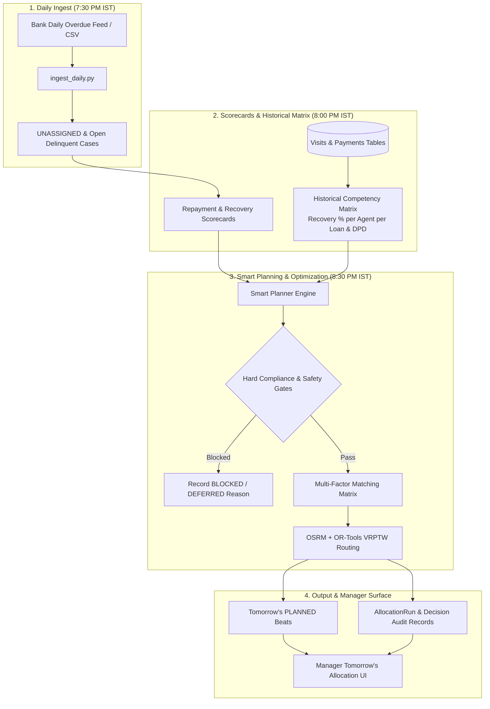
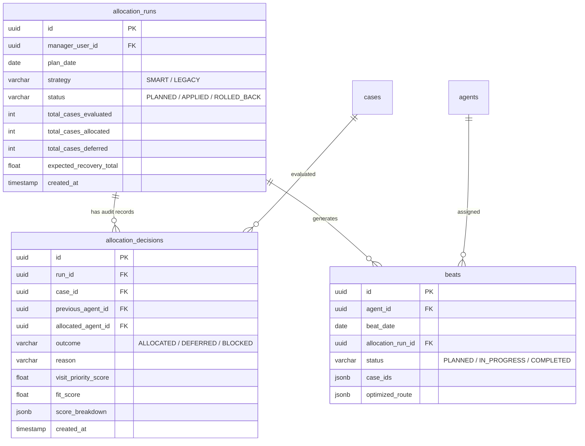
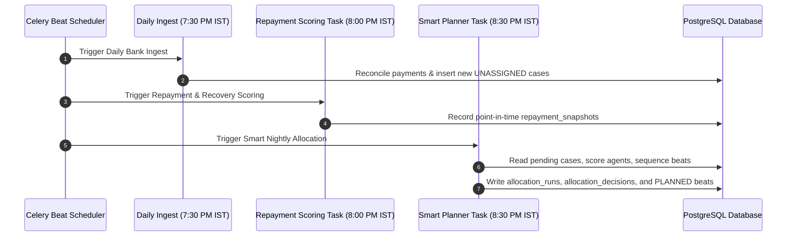

# Smart Nightly Case Allocation & Historical Matching Engine

## 1. Executive Summary

The **Smart Nightly Case Allocation & Historical Matching Engine** is the enterprise dispatch and workload distribution system for TIQCollect. It runs automatically every evening at **8:00 PM IST** to plan tomorrow's field collection beats across the agency.

### Core Objectives:
1. **Maximize Recovered Rupees**: Prioritizes cases with the highest expected recoverable value ($P(\text{recovery}) \times \text{rupees at stake}$).
2. **Historical Competency Matching**: Matches cases to agents based on their proven historical recovery rates on specific **loan product types** (Auto, Personal, Home, SME) and **DPD delinquency stages** (SMA-1, SMA-2, NPA).
3. **Route Proximity & Clustering**: Uses OSRM road networks and Google OR-Tools VRPTW (Vehicle Routing with Time Windows) to group cases into tight geographic loops, minimizing travel fatigue.
4. **Fair Workload Balancing**: Distributes pending field visits evenly so no single agent is overwhelmed while others are under-utilized.
5. **Strict Regulatory & Safety Compliance**: Enforces RBI contact hours (8 AM – 7 PM), Do-Not-Contact lists, customer female-agent preferences, and agency multi-tenancy isolation.
6. **Full Transparency & Rollback**: Persists an explainable decision audit log and gives agency managers one-click simulation, rollback, and strategy-switching controls.

---

## 2. End-to-End System Architecture



---

## 3. Mathematical Matching & Scoring Model

For each pending case $c$ and eligible agent $a$, the matching engine calculates a composite **Match Score**:

$$\text{MatchScore}(a, c) = w_{\text{history}} \cdot \text{Affinity}(a, c) + w_{\text{geo}} \cdot \text{Proximity}(a, c) + w_{\text{workload}} \cdot \text{CapacityScore}(a) + w_{\text{skills}} \cdot \text{SkillMatch}(a, c)$$

### Component Weights & Definitions:

| Component | Weight | Calculation / Source |
|---|:---:|---|
| **$\text{Affinity}(a, c)$** | **35%** | **Historical Product & NPA Track Record**: Based on verified collections by agent $a$ on loan product type $c.\text{loan\_type}$ and success rate in $c.\text{dpd\_bucket}$. |
| **$\text{Proximity}(a, c)$** | **30%** | **Geographic Cluster Distance**: Negative travel distance (in km) from agent $a$'s operational starting hub or active beat centroid to case $c$'s coordinates. |
| **$\text{CapacityScore}(a)$** | **20%** | **Workload Balancing**: Ratio of remaining open slots: $\frac{\text{max\_cases} - \text{assigned\_cases}}{\text{max\_cases}}$. Prioritizes least-loaded agents among similarly suitable candidates. |
| **$\text{SkillMatch}(a, c)$** | **15%** | **Demographic Fit**: Language match bonus (Hinglish, Punjabi, Haryanvi, Urdu) + explicit specialization tag match. |

### Hard Compliance Filters (Zero Tolerance):
Before calculating match scores, cases must pass all hard gates:
1. **RBI Contact Hours**: Stops are sequenced only between 08:00 AM and 07:00 PM.
2. **Do-Not-Contact (DNC)**: Hard exclusion for borrowers flagged with active DNC requests.
3. **Safety / Violent Flag**: High-risk hostile borrowers are withheld with an explicit safety notice.
4. **Gender Preference**: Borrowers with `requires_female_agent=True` are routed exclusively to female field agents.
5. **Daily Capacity Quota**: Hard limit at agent's `max_cases_per_day` (typically 8–12 cases/day).

---

## 4. Database Schema (Additive & Non-Destructive)



### Table Definitions:
1. **`allocation_runs`**:
   * Tracks each nightly run, target date, strategy used (`SMART` vs `LEGACY`), manager scoping, and summary statistics.
2. **`allocation_decisions`**:
   * Stores the granular "why" for every case decision: priority score, fit breakdown, previous agent, new agent, or blocked reason string.
3. **`beats` Update**:
   * Add `allocation_run_id` (ForeignKey to `allocation_runs.id`, nullable).
   * Add `UniqueConstraint("agent_id", "beat_date", name="uq_agent_beat_date")` to prevent duplicate beats for the same agent on the same day.

---

## 5. Celery Scheduling & Execution Sequence



### Calendar & Timezone Rules:
* **Timezone**: Explicitly pegged to **Indian Standard Time (IST, UTC+05:30)**.
* **Monday–Friday (8:30 PM IST)**: Plans tomorrow's work (Tuesday–Saturday).
* **Saturday (8:30 PM IST)**: Plans for **Monday** (Sunday is a scheduled rest day for field agents).
* **Sunday**: No planner execution.

---

## 6. Manager API Specification

| Method | Endpoint | Description |
|---|---|---|
| `GET` | `/api/v1/manager/allocation/latest` | Returns tomorrow's planned allocation run, summary counts, agent capacity bars, and decision explanations. |
| `POST` | `/api/v1/manager/allocation/simulate` | Dry-run simulation allowing managers to preview next-day shifts before committing. |
| `POST` | `/api/v1/manager/allocation/rollback` | Rolls back an untouched future `PLANNED` beat back to its prior state. |
| `PUT` | `/api/v1/manager/allocation/strategy` | Toggles between `SMART` and `LEGACY` strategy modes at runtime. |

---

## 7. Manager Explainability UI Card (Preview)

When an agency manager clicks on any case in the **Tomorrow's Allocation** dashboard, the system renders an explainable decision breakdown:

```
┌────────────────────────────────────────────────────────────────────────┐
│ Case Assignment Audit: #CASE-DEL-8921 → Suresh Verma                  │
├────────────────────────────────────────────────────────────────────────┤
│ Target Balance: ₹3,80,000  •  Loan: Auto Loan  •  DPD: 110 (NPA)       │
├────────────────────────────────────────────────────────────────────────┤
│ Decision: ALLOCATED (Strategy: SMART)                                  │
│                                                                        │
│ • Historical Track Record (35%):                                       │
│   Suresh has a 62% recovery rate on Auto Loans (Agency avg: 39%).      │
│   Resolved 9 NPA cases in this DPD band over the last 90 days.         │
│                                                                        │
│ • Geographic Proximity (30%):                                          │
│   Located 2.1 km from Suresh's 4th stop in Sector 44, Gurugram.        │
│                                                                        │
│ • Workload Balancing (20%):                                            │
│   Suresh has 3 open slots remaining (Allocated: 7/10).                 │
│                                                                        │
│ • Language Match (15%):                                                │
│   Customer speaks Haryanvi/Hindi (Exact match with agent profile).     │
└────────────────────────────────────────────────────────────────────────┘
```

---

## 8. Data Generation & Simulation Strategy (Zero Reseeding)

1. **Historical Data**: Extracted dynamically via read-only SQL queries from existing `payments`, `visits`, and `loans` tables.
2. **Future Case Feeds**: Generated on-demand using `python -m scripts.generate_bank_data` and ingested via `ingest_daily.py` (clean `INSERT` operations only; zero database drops).
3. **Agent Gender Cleanup**: Non-destructive SQL update to populate gender attributes (`M`/`F`) for the 18 seeded agents so female-agent cases can match.

---

## 9. Verification & Automated Test Suite

A comprehensive test suite [`test_planner_service.py`](file:///c:/Users/TransOrg/OneDrive/Desktop/TIQCollect-product/backend/tests/test_planner_service.py) will test:
1. **Competency Matching**: Higher historical recovery rates on matching loan products receive allocation preference.
2. **Safety & Compliance**: DNC, safety flags, and gender preferences are strictly enforced.
3. **Workload Balance**: No agent exceeds `max_cases_per_day`; workloads are balanced among eligible agents.
4. **Tenancy Isolation**: Manager A cannot view or allocate Manager B's cases or agents.
5. **Weekend Scheduling**: Saturday correctly plans for Monday; Sunday does not execute.
6. **Idempotency & Rollback**: Reruns replace only future `PLANNED` beats without duplicating records or altering historical beats.
