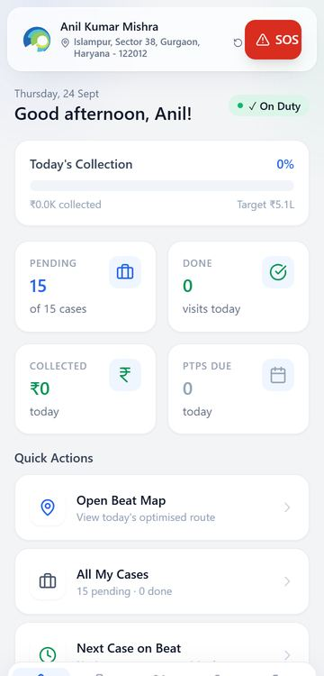
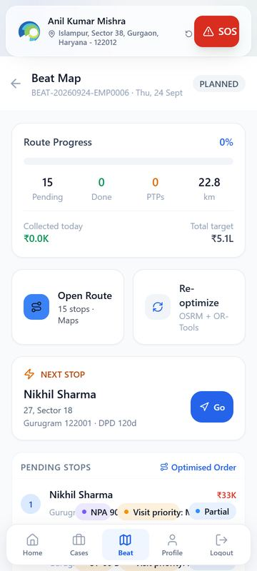
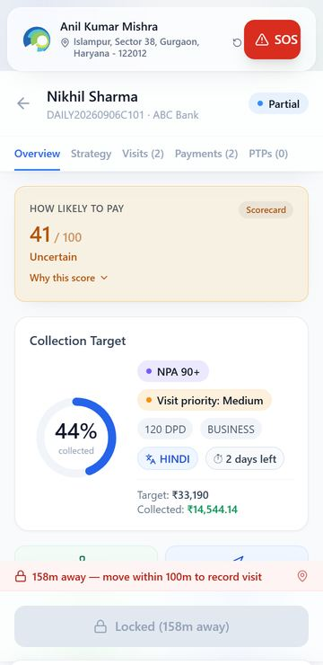
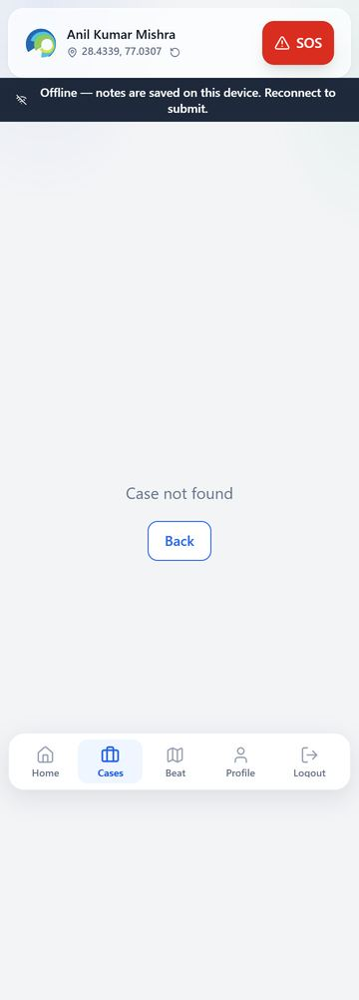
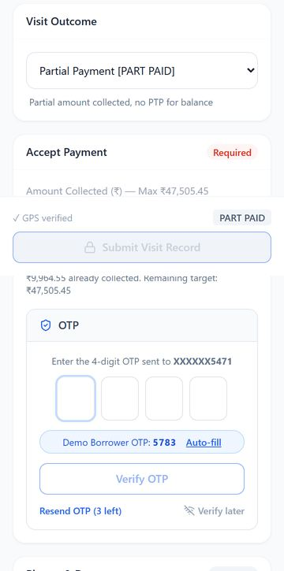
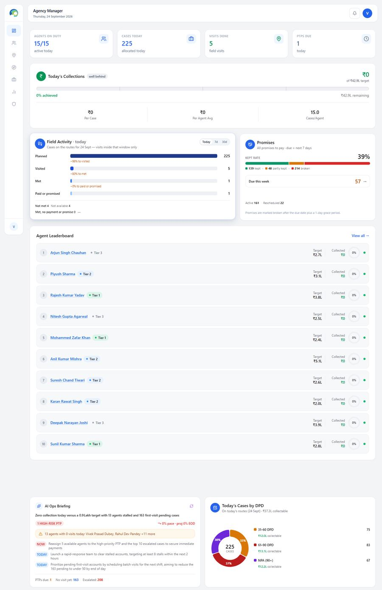
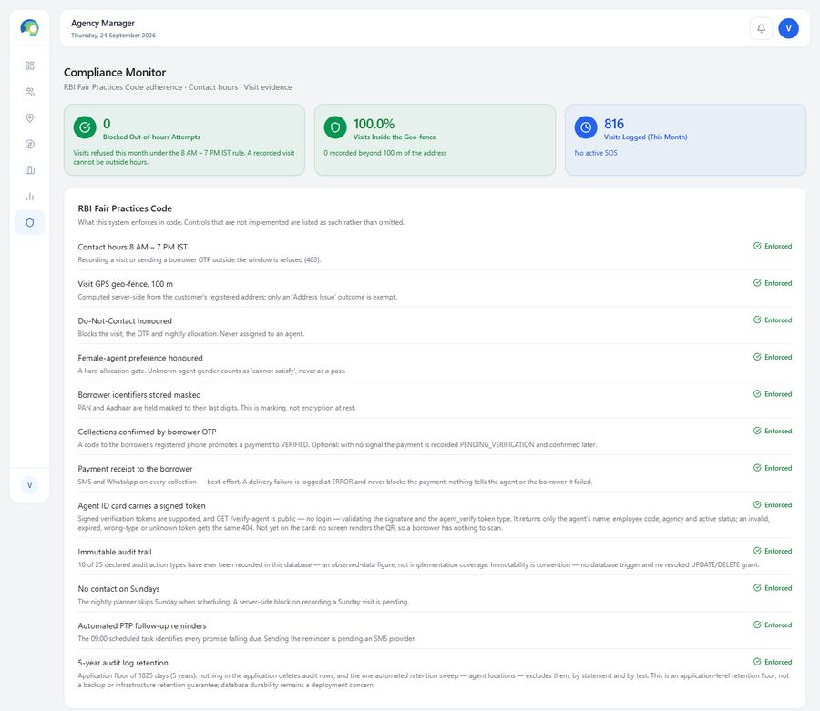
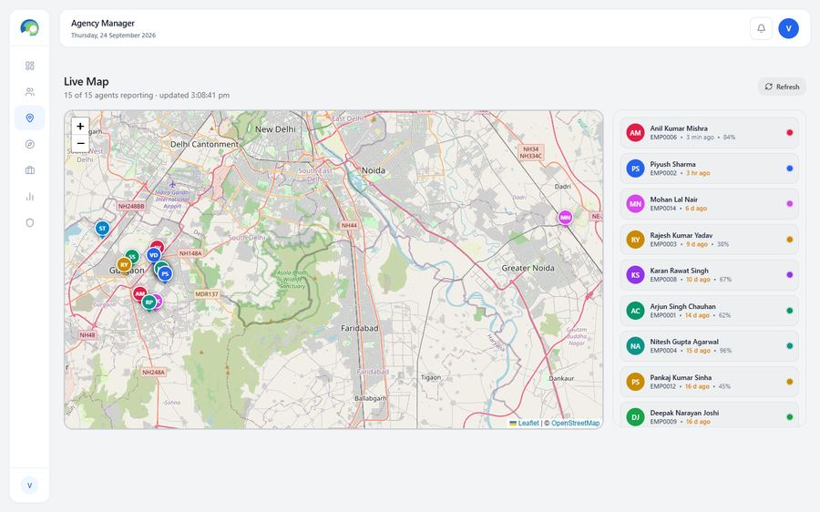
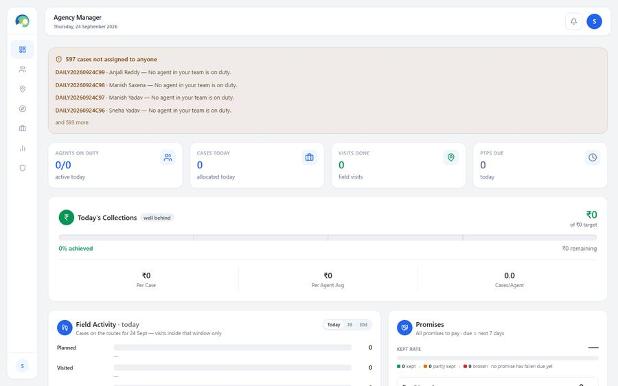
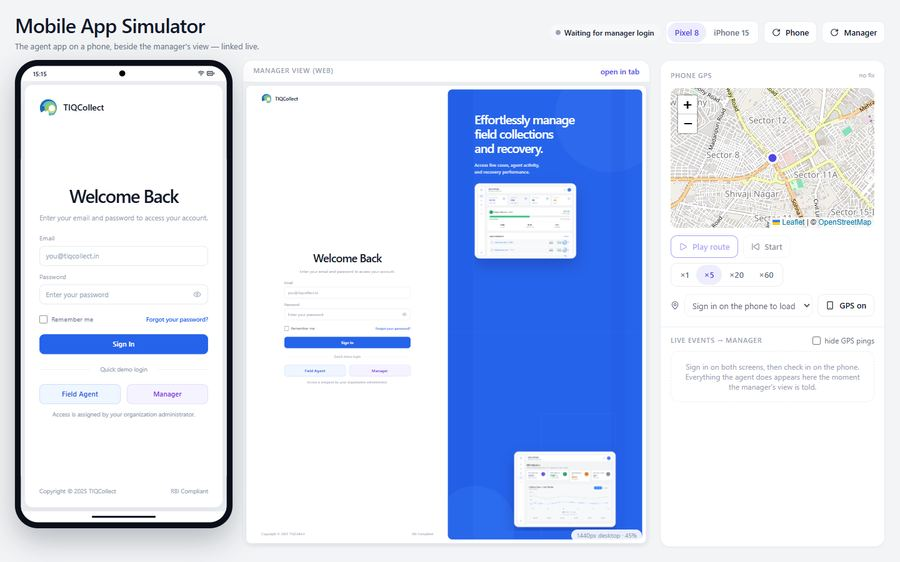

# Persona journeys, walked in the running app

*Business lead, 2026-09-24. Walked in the main tree's running app (`TIQCollect-app` @ `c75053a`, web :5473, API :8400) with a scripted Chrome. Agent screens ran on a low-end Android profile: 360×800, 4× CPU slowdown, throttled "4G" (60 ms, 4 Mbit/s). Manager screens ran on a 1440 px desktop.*

**How to read the timings.** The app is served by the Vite *development* server, so a first load pulls 3.9–6 MB of unbundled code. The production bundle will be much smaller, so first-load times are not quoted as product facts. API times are real, but the machine was running another session's full test suite, so treat them as upper bounds. Tap counts and screen counts are exact. Every number in the data is demo or synthetic.

**What was written to the demo database** (all labelled "business walkthrough"): one PTP visit (`5ae30392`) and one PTP of ₹10,000 due 2026-09-28 (`20b97a0e`) on case DAILY20260906C101, agent EMP0006. That submit also re-optimised EMP0006's beat automatically. The payment journey stopped before submit; nothing else was written.

Tags: **Critical** means a real user gives up, or a buyer walks away. **Important** means it costs time or trust every day. **Nice-to-have** is polish.

---

## 1. Field agent: one day on a phone

The agent is Anil Kumar Mishra (EMP0006), Gurugram. The plan gives him 15 stops, 22.8 km and about 4.5 h of driving and visiting. Across all 18 agents, today's beats are 15 stops each with 22.8–78.9 km planned (DB, 2026-09-24).

| Step | Taps / typing | Screens | Observed |
|---|---|---|---|
| Log in | 2 fields + 1 tap | 1 | Lands on Home. Location tracking starts **at login**, not at check-in (`AgentLayout.tsx:184`) |
| Check in | 3 taps (Check In, Capture Selfie, Confirm) | 1 modal | Not walked, because every agent was already On Duty. Read from code instead: the confirm card always says **"Location: Mumbai, Maharashtra"** and **"Liveness check: Passed"** (`AgentHomePage.tsx:242-244`, hardcoded), and the selfie is never uploaded |
| Open today's route | 1 (Beat tab) | 1 | 0.3–2.8 s. The map sits **below all 15 stops**, so the agent scrolls the whole list to see the day's shape |
| Pick the first stop | 2 (stop, then Detail) | 1 | Tapping a stop only expands it (Call / Navigate / Detail / Visit) |
| At the door | 1 (Record Visit) | 1 | Opens only within **100 m** of the geocoded address (see 1a) |
| Promise to pay | 16 taps + 2 typed fields + date picker | 1 long form (about **5 phone screens**) | Robot time 38 s end to end. A human with a borrower in front of him: about 1.5–2 min (estimate) |
| Submit | 1 | success sheet | About 13 s from tap to "Visit Recorded" on 4G. It chains a photo upload URL (6.7 s, then **failed**), the visit (4.6 s), the PTP (0.5 s) and an automatic route re-optimise (1.3 s) |
| Cash part-payment with borrower OTP | 15 taps + amount + 4 OTP digits | same form | OTP sent in 2.3 s, verified in 1.4 s. Then the borrower has to read the code off their own phone (not timed) |
| Not met | 3–4 taps | same form | Who met → "No One Available" → outcome → Submit. The one fast path, and the most common outcome in the field |

 

### 1a. What stops an agent

- **Critical: a wrong map pin locks the visit, and case detail offers no way out.** At 158 m from the pin, case detail shows a grey "Locked (158m away)" and nothing else (`AgentCaseDetailPage.tsx:1138-1159`). Indian addresses geocode badly ("behind Hanuman mandir"). The one outcome the agent needs in that situation, *Address Issue*, is exempt from the fence, but it is reachable only by a different route: Beat → stop → **Visit**. Case detail never mentions it. Inside the form, the banner says *"visit will be logged as unverified"* (`RecordVisitPage.tsx:1324`) while the server refuses the visit with a 403. An agent reads "locked", tries twice, and phones the manager.
  
- **Critical: no signal means no work.** With no network, opening any case the agent has not opened earlier today shows **"Case not found"** (the case exists; the network does not). The visit form cannot be reached. Reloading the app offline gives Chrome's "No internet" dinosaur page. Typed notes survive and come back when signal returns ("Your notes were restored…"). Photos, signature and recordings do not. Rural roads, basements and market lanes are exactly where this happens, and every competitor advertises offline mode.
  
- **Critical: the photo the agent took was silently lost.** On submit, the evidence-upload call failed (HTTP 500 after 6.7 s, root cause in storage presigning, now with the dev team). The screen still said "Visit Recorded". The visit row has no photo. Across the whole demo book, **0 of 2,404 visits carry a photo, signature or audio**. The evidence story, the product's best differentiator, cannot be shown today.
- **Critical: the UPI path shows "Payment received" by itself.** Ten seconds after the QR appears, the screen turns green with a chime and waives the transaction ID (`RecordVisitPage.tsx:922-934`). The server accepts UPI without a reference. The QR pays one hardcoded personal-format VPA under the name "ABC Bank", for every tenant. An agent can record a UPI collection that never happened, and the borrower gets a receipt for it. (Logged by the coordinator as PAY-1/PAY-2 and with the owner.)
- **Important: some of what the agent types is thrown away.** Verified in code, the submit sends only `notes`. The *required* escalation notes (at least 10 characters, on refused, dispute and broken-PTP visits), the witness details, the four "Documents Collected" uploads, the cheque photo and the check-in selfie are captured on the phone and never saved.
- **Important: a slow AI call can create duplicate visits.** The phone gives up after 15 s (`axios.ts:6`). The visit submit runs the AI visit report inline, with a 20 s timeout. On a slow day the agent sees an error for a visit that was saved, retries, and creates a second visit.
- **Important: the form is long for the common case.** A PTP visit scrolls through 4 optional investigation dropdowns, Tone, an 11-row "Reason for Default" list and 3 photo slots before Submit. Outcome is a native dropdown (`Promise to Pay [PTP]`), so the most frequent choice costs 2 taps plus reading tags.
- **Important: English only.** No i18n framework exists. The case shows a "HINDI" language chip, but no screen or borrower SMS is in Hindi. Borrower SMS also prints amounts as "Rs.14,56,045" and gives dates in UTC.
- **Important: numbers read like a spreadsheet.** "₹0.0K collected" beside "Target ₹5.1L". Paise everywhere: "₹14,56,045.3", "₹14,544.14". The home screen's day target is the sum of 15 monthly EMIs (₹5.1 lakh), so it reads "0%" all day. Date formats differ from screen to screen: 24 Sept, 10/11/2025, 6/9/2026, 2026-09-23 and 28-09-2026 all appear.
- **Nice-to-have.** "Re-optimize · OSRM + OR-Tools" is engineering jargon on an agent's button. Status chips overlap the city name in the stop list. When address lookup fails, the header shows raw coordinates.

### 1b. What works well

- **The borrower-OTP step is well built.** The amount locks once the OTP is sent, there are three resends, and a *Verify later* path requires a signature 
- **"Not met" takes 3–4 taps.**
- **Typed notes survive a crash or no-signal episode.**
- **The 100 m fence and contact hours are enforced on the server, not just on the phone.**
- **The case explains itself.** It shows "How likely to pay 41/100 · Scorecard", honestly labelled, and "Why this score" is one tap away.
- **SOS reaches the manager's bell in 0.5 s** (P0-08 measurement, not re-run here, to avoid texting a manager).

### 1c. Low-end Android and battery

GPS runs at high accuracy from login until logout. The phone posts its position every 15 s (about 1,900 posts per shift) and does a street-address lookup against OpenStreetMap every 40 m moved. That is about 1,250 lookups a day on a 50 km beat, and OSM's usage policy forbids it at scale. Data use is trivial; battery is the cost. Agents on ₹8–12k handsets kill apps that drain the battery, and tracking an agent before check-in is also a privacy question (see REVIEW.md).

---

## 2. Agency manager: morning and evening

Walked as manager1 on a 1440 px desktop, read-only: no plan generated and no case reassigned.

| Moment | What the manager does | Clicks | Observed |
|---|---|---|---|
| 09:30 open the day | Log in → Overview | 2 fields + 1 | Settles in **9–13 s**. **38 API calls** at landing. The slowest is the AI briefing at 5.8 s |
| Check the team | Live Map | 1 | "**15 of 15 agents reporting**", but 13 of the 15 last reported between 3 hours and 16 days ago. The map frames all of Delhi while the team is in Gurugram |
| Plan | Field Plan | 1 | Empty until someone presses **Generate Plan** (the nightly job runs at 20:00). No text explains that |
| An agent calls in sick | Cases → case → Reassign → agent → reason → Reassign | **5 clicks + a typed reason, per case** | **No bulk reassign.** Moving a sick agent's 15 stops is about 75 clicks and 15 reasons. (Approving *leave* does release planned cases automatically.) |
| SOS | Bell | 1 | Push, 0.5 s (P0-08) |
| 18:00 review | Analytics | 1 | Charts take 5–12 s to draw on this machine. Dimensions are agent, bucket and month only: **no branch, product or city** |
| Compliance check | Compliance | 1 | See below |

- **Important: the AI briefing contradicts the page it sits on.** The card says "₹0 of ₹42.9L target". The AI Ops Briefing below it says *"Zero collection today versus a 0.9 Lakh target"* and advises "launch a rapid-response team". A collections head who spots one invented number stops trusting all of them.
- **Important: the day's target makes every day "well behind".** The Today's Collections target is the sum of every planned case's EMI (₹42.9 lakh for 225 cases). No FOS team collects every EMI it visits in a day, so the badge is red every day and stops meaning anything.
- **Important: the Compliance page overclaims and contradicts itself.** "Enforced" appears beside *No contact on Sundays* ("server-side block … pending"), *Automated PTP reminders* ("sending … pending an SMS provider") and *Payment receipts* (best effort; "nothing tells the agent or the borrower it failed"). The footer says VISIT_RECORDED and PTP_SET are "never written", while the trail above it lists both. Audit rows show user UUIDs and Docker-internal IPs (172.19.0.4) rather than names and devices. "265 high" anomalies across 1,141 visits flags 23% of all visits. A compliance officer reads each of these as either false or noise.
  
- **Important: nothing on a manager screen is marked as synthetic.** Collection rate 55%, ₹135.3 lakh collected and the PTP keep rate carry no demo label. That breaks the repo's own SYNTHETIC_WARNING rule in front of a buyer.
- **Nice-to-have.** The header says "Agency Manager" (tracked in A14). Leaderboard rows all read 0% before 10 am. Reassign has no "reason" presets, so every move needs typing.

---

## 3. Agency admin: onboarding and managing agents

**The screens do not exist yet.** The admin logs into the manager view with a "Agency Manager" header, 0/0 agents and ₹0 of ₹0. Above it sits a red banner: **"597 cases not assigned to anyone"**, the global unassigned pool (one of the three cross-tenant leaks the plan closes in A03). There is no screen or API to create, edit, suspend or reset an agent or a user. Today an agency cannot add a new hire without a developer.

**The planned design (G01–G05, D01–D03), judged against an ordinary week.** FOS attrition runs at about 5–10% of agents a month *(assumption)*, so a 50-agent agency hires 3–5 people every month and loses as many. What the admin needs weekly:

1. **Add an agent in under 2 minutes.** G01/G02 cover this. Keep the create drawer to the fields a hire has on day one: name, mobile, base location, manager, languages. Gender is needed too: in the demo it is blank on all 18 agents, so the allocator blocks every "needs a female agent" case (926 blocked decisions). **Make gender and DRA certificate number + expiry required at creation.** DRA is not in the plan (see PRIORITIES.md).
2. **Suspend a leaver in one step and hand their open cases to someone.** Planned (reassign prompt).
3. **Reset a password or device over the phone.** Planned (A07/A09). This will be the most frequent support call.
4. **Bulk import.** Planned CSV with preview. Good; an agency's first load is 30–200 agents.
5. **Seat count against contract.** Planned.

The bank-side six-step onboarding wizard (D02) is sound but over-sized for a first pilot, where the vendor can onboard one or two agencies by hand.

---

## 4. Bank: month-end review and board pack

**Nothing exists yet.** There is no bank role, no bank portal and no bank login. The only exports today are two CSVs, the audit log and allocation decisions, both on manager screens.

**Judging the plan (P3/P4) against a collections head's month-end.** What a bank's collections head actually does in the first week of the month *(domain knowledge, not observed)*:

1. **Agency-wise MIS.** Allocation vs resolution, collection efficiency, bucket movement (roll-forward/back), PTP keep rate, cost (commission). Plan: C01/C04/D06. **Right, but it needs real DPD history (B05) to show roll rates**, and those accumulate only from go-live.
2. **Compliance exceptions by agency.** Out-of-hours attempts, complaints, DRA lapses, evidence gaps. Plan: Compliance tab plus alerts. Complaints and DRA are **missing** from the plan.
3. **Cash and deposit reconciliation.** Collected vs deposited vs posted to the LMS. **Missing from the plan entirely.**
4. **An Excel file for their own MIS team.** E09 gives XLSX. Banks re-cut every number in Excel. **Ship XLSX before PDF/PPTX.**
5. **A board pack.** Quarterly, owned by the risk team. Plan E10/H16. Useful later; nobody buys on it.

**What will not be used at this stage:** Monte Carlo with IFRS-9 staging (the bank's risk team already owns IFRS-9 models and will not take a vendor's), the Scenario Lab, and an AI agent studio inside a vendor's app (bank AI governance will not allow it). Details are in PRIORITIES.md.

---

## 5. The simulator (the M1 demo)

It works and it is a good sales tool: the phone and the manager's view side by side, with events arriving in under 2 s. Two things hurt it in a room. The manager frame renders at **45% scale**, which is unreadable on a projector: show it full-screen on a second display. And the login page it opens on carries the footer **"RBI Compliant"** and **"© 2025"**. RBI does not certify software, and a bank's legal team will ask what the claim rests on. Remove the claim.

